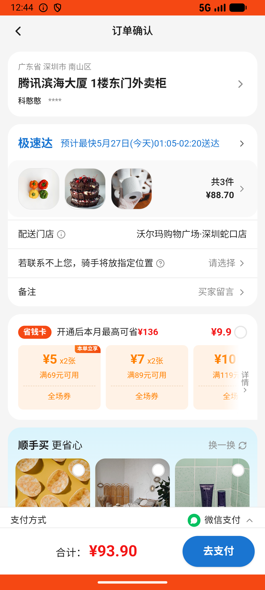

# checkout_v016_paper_cleaning_multi_tab_cart_edit_checkout  ⚠️

- **Brand**: `wogoumarket`
- **Class**: `WogoumarketCheckoutV016PaperCleaningMultiTabCartEditCheckoutTask`
- **Pass@3**: **2/3**  (score = 1.00)
- **Elapsed**: 706s (~11.8 min)
- **Model**: `doubao-seed-2-0-lite-260428`
- **Raw log**: [./raw_logs/WogoumarketCheckoutV016PaperCleaningMultiTabCartEditCheckoutTask.log](./raw_logs/WogoumarketCheckoutV016PaperCleaningMultiTabCartEditCheckoutTask.log)
- **Generated**: 2026-05-27T01:37:42+08:00

## Task Goal

> 【当前账户档案】账号：demo@rlbox.ai；昵称：张三；支付密码：123456；默认收货地址（JSON）：{"recipient": "科憨憨", "phone": "13100002345", "address": "腾讯滨海大厦 广东省 深圳市 南山区 1楼东门外卖柜"}。请基于以上档案打开 com.wogoumarket 并完成以下任务：在「纸品家清_纸品」分类下加购3件压缩毛巾，切到「纸品家清_衣物清洁」加购1件蓝月亮洗衣液，进购物车将毛巾改为1件，再去「纸品家清_个护用品」加购1件多芬沐浴露，最后勾选所有商品结算支付

## Attempts

| # | Outcome | Steps | Terminated | Reason | Start → End |
|---|---------|-------|------------|--------|-------------|
| 1 | ✅ passed | 29 | answer | – | 2026-05-27 00:32:35 → 2026-05-27 00:36:01 |
| 2 | ✅ passed | 30 | answer | – | 2026-05-27 00:36:01 → 2026-05-27 00:39:35 |
| 3 | ❌ failed | 22 | answer | – | 2026-05-27 00:39:35 → 2026-05-27 00:44:20 |

## Failure Details

### Episode 3 — ❌ failed

- steps_used: `22`
- terminated_reason: `answer`
- death shot: 
  - state: [`./death_shots/WogoumarketCheckoutV016PaperCleaningMultiTabCartEditCheckoutTask/episode_003/step_022.json`](./death_shots/WogoumarketCheckoutV016PaperCleaningMultiTabCartEditCheckoutTask/episode_003/step_022.json)
  - digest: [`episode_digest.md`](./death_shots/WogoumarketCheckoutV016PaperCleaningMultiTabCartEditCheckoutTask/episode_003/episode_digest.md)

---

> 本摘要由 `sengclaw/scripts/pipeline/log_summarizer.py` 自动生成。 原始完整 log 见上方 Raw log 链接（含每 step 的 messages / tool_call / screenshot 引用）。
