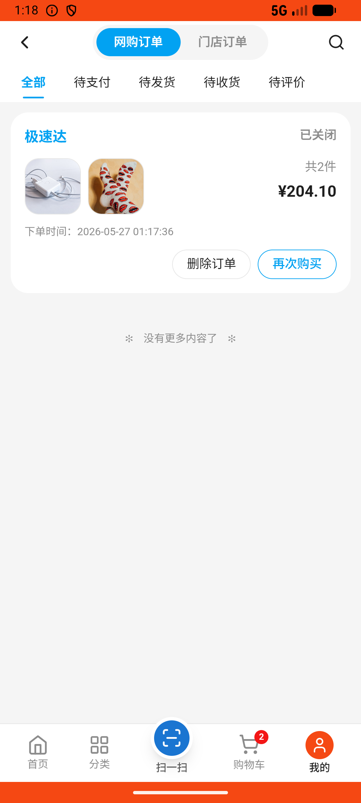

# common_v007_bedding_expensive_clothing_cheapest_checkout_cancel  ⚠️

- **Brand**: `wogoumarket`
- **Class**: `WogoumarketCommonV007BeddingExpensiveClothingCheapestCheckoutCancelTask`
- **Pass@3**: **2/3**  (score = 1.00)
- **Elapsed**: 671s (~11.2 min)
- **Model**: `doubao-seed-2-0-lite-260428`
- **Raw log**: [./raw_logs/WogoumarketCommonV007BeddingExpensiveClothingCheapestCheckoutCancelTask.log](./raw_logs/WogoumarketCommonV007BeddingExpensiveClothingCheapestCheckoutCancelTask.log)
- **Generated**: 2026-05-27T01:37:42+08:00

## Task Goal

> 【当前账户档案】账号：demo@rlbox.ai；昵称：张三；支付密码：123456；默认收货地址（JSON）：{"recipient": "科憨憨", "phone": "13100002345", "address": "腾讯滨海大厦 广东省 深圳市 南山区 1楼东门外卖柜"}。请基于以上档案打开 com.wogoumarket 并完成以下任务：在「床品服饰_床品」分类下找到价格最贵的商品并将其加购1件，切换到「床品服饰_服饰」分类下找到价格最低的商品将其加购1件，进入购物车完成结算和支付操作，在待收货订单页面将该订单取消

## Attempts

| # | Outcome | Steps | Terminated | Reason | Start → End |
|---|---------|-------|------------|--------|-------------|
| 1 | ❌ failed | 30 | answer | – | 2026-05-27 01:14:50 → 2026-05-27 01:18:44 |
| 2 | ✅ passed | 30 | answer | – | 2026-05-27 01:18:44 → 2026-05-27 01:22:34 |
| 3 | ✅ passed | 27 | answer | – | 2026-05-27 01:22:34 → 2026-05-27 01:26:00 |

## Failure Details

### Episode 1 — ❌ failed

- steps_used: `30`
- terminated_reason: `answer`
- death shot: 
  - state: [`./death_shots/WogoumarketCommonV007BeddingExpensiveClothingCheapestCheckoutCancelTask/episode_001/step_030.json`](./death_shots/WogoumarketCommonV007BeddingExpensiveClothingCheapestCheckoutCancelTask/episode_001/step_030.json)
  - digest: [`episode_digest.md`](./death_shots/WogoumarketCommonV007BeddingExpensiveClothingCheapestCheckoutCancelTask/episode_001/episode_digest.md)

---

> 本摘要由 `sengclaw/scripts/pipeline/log_summarizer.py` 自动生成。 原始完整 log 见上方 Raw log 链接（含每 step 的 messages / tool_call / screenshot 引用）。
