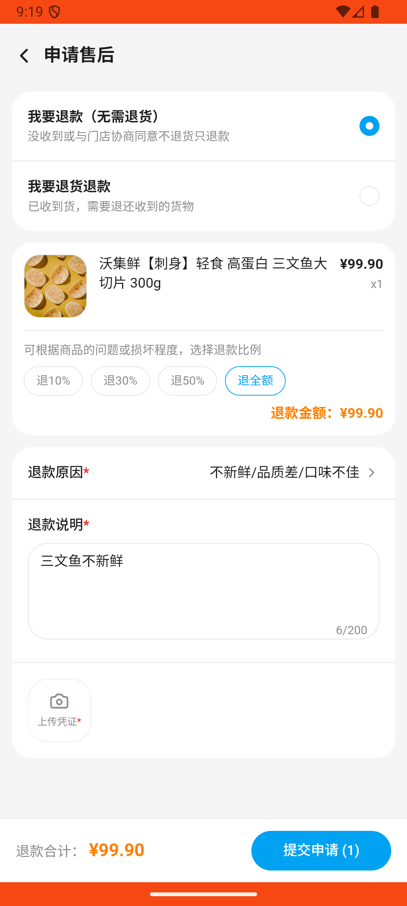

# order_v011_confirm_then_partial_refund  ❌

- **Brand**: `wogoumarket`
- **Class**: `WogoumarketOrderV011ConfirmThenPartialRefundTask`
- **Pass@3**: **0/3**  (score = 0.00)
- **Elapsed**: 639s (~10.7 min)
- **Model**: `doubao-seed-2-0-lite-260428`
- **Raw log**: [./raw_logs/WogoumarketOrderV011ConfirmThenPartialRefundTask.log](./raw_logs/WogoumarketOrderV011ConfirmThenPartialRefundTask.log)
- **Generated**: 2026-05-30T10:19:20+08:00

## Task Goal

> 【当前账户档案】账号：demo@rlbox.ai；昵称：张三；支付密码：123456，如需支付请使用此密码完成支付；默认收货地址（JSON）：{"recipient": "科憨憨", "phone": "13100002345", "address": "腾讯滨海大厦 广东省 深圳市 南山区 1楼东门外卖柜"}。请基于以上档案打开 com.wogoumarket 并完成以下任务：刚收到那个有两样东西的订单，我点击确认收货了，但是我现在看到三文鱼有点不新鲜，帮我把三文鱼那个商品申请退款

## Attempts

| # | Outcome | Steps | Terminated | Reason | Start → End |
|---|---------|-------|------------|--------|-------------|
| 1 | ❌ failed | 24 | answer | 订单已确认收货: 订单状态为 shipping，应为 delivered | 2026-05-30 09:12:51 → 2026-05-30 09:16:00 |
| 2 | ❌ failed | 22 | answer | 存在退款申请: 未找到退款申请 | 2026-05-30 09:16:00 → 2026-05-30 09:19:49 |
| 3 | ❌ failed | 21 | answer | 订单已确认收货: 订单状态为 shipping，应为 delivered | 2026-05-30 09:19:49 → 2026-05-30 09:23:30 |

## Failure Details

### Episode 1 — ❌ failed

- steps_used: `24`
- terminated_reason: `answer`
- reason:

  ```
  订单已确认收货: 订单状态为 shipping，应为 delivered
  ```
- death shot: 
  - state: [`./death_shots/WogoumarketOrderV011ConfirmThenPartialRefundTask/episode_001/step_024.json`](./death_shots/WogoumarketOrderV011ConfirmThenPartialRefundTask/episode_001/step_024.json)
  - digest: [`episode_digest.md`](./death_shots/WogoumarketOrderV011ConfirmThenPartialRefundTask/episode_001/episode_digest.md)

### Episode 2 — ❌ failed

- steps_used: `22`
- terminated_reason: `answer`
- reason:

  ```
  存在退款申请: 未找到退款申请
  ```
- death shot: 
  - state: [`./death_shots/WogoumarketOrderV011ConfirmThenPartialRefundTask/episode_002/step_022.json`](./death_shots/WogoumarketOrderV011ConfirmThenPartialRefundTask/episode_002/step_022.json)
  - digest: [`episode_digest.md`](./death_shots/WogoumarketOrderV011ConfirmThenPartialRefundTask/episode_002/episode_digest.md)

### Episode 3 — ❌ failed

- steps_used: `21`
- terminated_reason: `answer`
- reason:

  ```
  订单已确认收货: 订单状态为 shipping，应为 delivered
  ```
- death shot: 
  - state: [`./death_shots/WogoumarketOrderV011ConfirmThenPartialRefundTask/episode_003/step_021.json`](./death_shots/WogoumarketOrderV011ConfirmThenPartialRefundTask/episode_003/step_021.json)
  - digest: [`episode_digest.md`](./death_shots/WogoumarketOrderV011ConfirmThenPartialRefundTask/episode_003/episode_digest.md)

---

> 本摘要由 `sengclaw/scripts/pipeline/log_summarizer.py` 自动生成。 原始完整 log 见上方 Raw log 链接（含每 step 的 messages / tool_call / screenshot 引用）。
