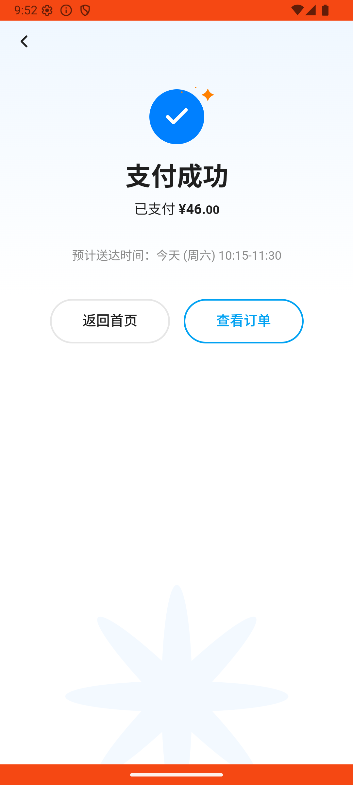

# search_v004_search_zongzi_two_brands  ⚠️

- **Brand**: `wogoumarket`
- **Class**: `WogoumarketSearchV004SearchZongziTwoBrandsTask`
- **Pass@3**: **1/3**  (score = 1.00)
- **Elapsed**: 1220s (~20.3 min)
- **Model**: `doubao-seed-2-0-lite-260428`
- **Raw log**: [./raw_logs/WogoumarketSearchV004SearchZongziTwoBrandsTask.log](./raw_logs/WogoumarketSearchV004SearchZongziTwoBrandsTask.log)
- **Generated**: 2026-05-30T10:19:20+08:00

## Task Goal

> 【当前账户档案】账号：demo@rlbox.ai；昵称：张三；支付密码：123456，如需支付请使用此密码完成支付；默认收货地址（JSON）：{"recipient": "科憨憨", "phone": "13100002345", "address": "腾讯滨海大厦 广东省 深圳市 南山区 1楼东门外卖柜"}。请基于以上档案打开 com.wogoumarket 并完成以下任务：搜"粽子"，帮我各买一份不同品牌的粽子，要两个品牌就行，总价不超过 35 块

## Attempts

| # | Outcome | Steps | Terminated | Reason | Start → End |
|---|---------|-------|------------|--------|-------------|
| 1 | ❌ failed | 19 | answer | 购物车中有至少 2 款粽子商品: 购物车中粽子商品数为 0，预期至少 2 款 | 2026-05-30 09:50:04 → 2026-05-30 09:52:38 |
| 2 | ✅ passed | 49 | answer | – | 2026-05-30 09:52:38 → 2026-05-30 10:01:45 |
| 3 | ❌ failed | 54 | answer | 购物车中有至少 2 款粽子商品: 购物车中粽子商品数为 0，预期至少 2 款 | 2026-05-30 10:01:45 → 2026-05-30 10:10:24 |

## Failure Details

### Episode 1 — ❌ failed

- steps_used: `19`
- terminated_reason: `answer`
- reason:

  ```
  购物车中有至少 2 款粽子商品: 购物车中粽子商品数为 0，预期至少 2 款
  ```
- death shot: 
  - state: [`./death_shots/WogoumarketSearchV004SearchZongziTwoBrandsTask/episode_001/step_019.json`](./death_shots/WogoumarketSearchV004SearchZongziTwoBrandsTask/episode_001/step_019.json)
  - digest: [`episode_digest.md`](./death_shots/WogoumarketSearchV004SearchZongziTwoBrandsTask/episode_001/episode_digest.md)

### Episode 3 — ❌ failed

- steps_used: `54`
- terminated_reason: `answer`
- reason:

  ```
  购物车中有至少 2 款粽子商品: 购物车中粽子商品数为 0，预期至少 2 款
  ```
- death shot: 
  - state: [`./death_shots/WogoumarketSearchV004SearchZongziTwoBrandsTask/episode_003/step_054.json`](./death_shots/WogoumarketSearchV004SearchZongziTwoBrandsTask/episode_003/step_054.json)
  - digest: [`episode_digest.md`](./death_shots/WogoumarketSearchV004SearchZongziTwoBrandsTask/episode_003/episode_digest.md)

---

> 本摘要由 `sengclaw/scripts/pipeline/log_summarizer.py` 自动生成。 原始完整 log 见上方 Raw log 链接（含每 step 的 messages / tool_call / screenshot 引用）。
