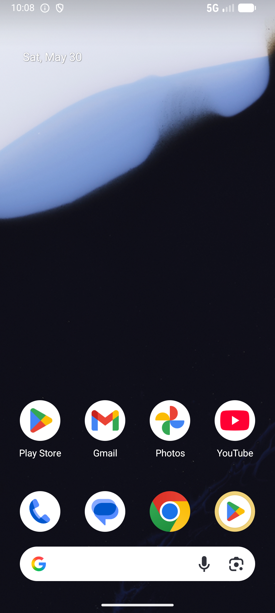

# catalog_v011_claim_coupon_from_detail  ⚠️

- **Brand**: `wogoumarket`
- **Class**: `WogoumarketCatalogV011ClaimCouponFromDetailTask`
- **Pass@3**: **2/3**  (score = 1.00)
- **Elapsed**: 203s (~3.4 min)
- **Model**: `doubao-seed-2-0-lite-260428`
- **Raw log**: [./raw_logs/WogoumarketCatalogV011ClaimCouponFromDetailTask.log](./raw_logs/WogoumarketCatalogV011ClaimCouponFromDetailTask.log)
- **Generated**: 2026-05-30T10:10:49+08:00

## Task Goal

> 【当前账户档案】账号：demo@rlbox.ai；昵称：张三；支付密码：123456，如需支付请使用此密码完成支付；默认收货地址（JSON）：{"recipient": "科憨憨", "phone": "13100002345", "address": "腾讯滨海大厦 广东省 深圳市 南山区 1楼东门外卖柜"}。请基于以上档案打开 com.wogoumarket 并完成以下任务：我想买国外的护肤品，帮我在全球好物中找到SK-II神仙水，看看商品详情页的介绍，好像有个优惠券可以领，给我领一张

## Attempts

| # | Outcome | Steps | Terminated | Reason | Start → End |
|---|---------|-------|------------|--------|-------------|
| 1 | ✅ passed | 9 | answer | – | 2026-05-30 10:07:26 → 2026-05-30 10:08:33 |
| 2 | ❌ failed | 1 | answer | 成功领取了优惠券: 未找到已领取的满500减50优惠券 | 2026-05-30 10:08:33 → 2026-05-30 10:08:45 |
| 3 | ✅ passed | 12 | answer | – | 2026-05-30 10:08:45 → 2026-05-30 10:10:49 |

## Failure Details

### Episode 2 — ❌ failed

- steps_used: `1`
- terminated_reason: `answer`
- reason:

  ```
  成功领取了优惠券: 未找到已领取的满500减50优惠券
  ```
- death shot: 
  - state: [`./death_shots/WogoumarketCatalogV011ClaimCouponFromDetailTask/episode_002/step_001.json`](./death_shots/WogoumarketCatalogV011ClaimCouponFromDetailTask/episode_002/step_001.json)
  - digest: [`episode_digest.md`](./death_shots/WogoumarketCatalogV011ClaimCouponFromDetailTask/episode_002/episode_digest.md)

---

> 本摘要由 `sengclaw/scripts/pipeline/log_summarizer.py` 自动生成。 原始完整 log 见上方 Raw log 链接（含每 step 的 messages / tool_call / screenshot 引用）。
