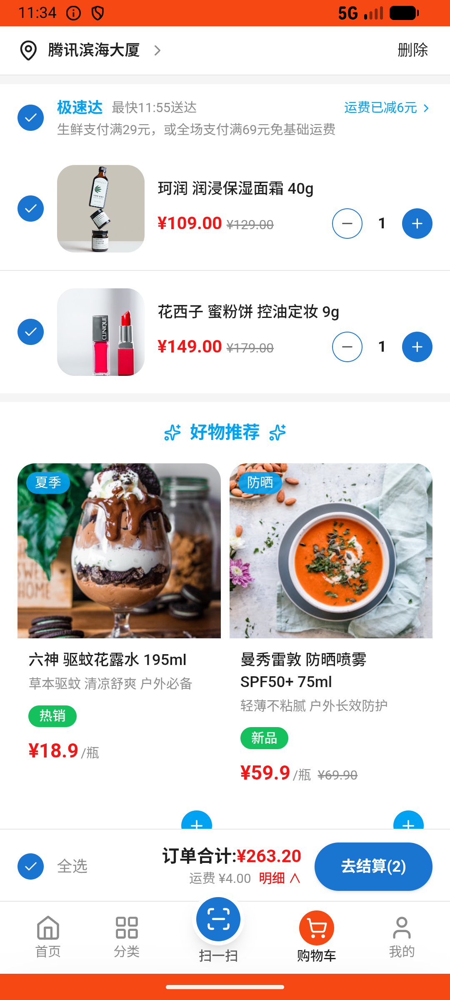

# common_v013_brand_low_beauty_multi  ⚠️

- **Brand**: `wogoumarket`
- **Class**: `WogoumarketCommonV013BrandLowBeautyMultiTask`
- **Pass@3**: **1/3**  (score = 1.00)
- **Elapsed**: 442s (~7.4 min)
- **Model**: `doubao-seed-2-0-lite-260428`
- **Raw log**: [./raw_logs/WogoumarketCommonV013BrandLowBeautyMultiTask.log](./raw_logs/WogoumarketCommonV013BrandLowBeautyMultiTask.log)
- **Generated**: 2026-05-30T11:34:31+08:00

## Task Goal

> 【当前账户档案】账号：demo@rlbox.ai；昵称：张三；支付密码：123456，如需支付请使用此密码完成支付；默认收货地址（JSON）：{"recipient": "科憨憨", "phone": "13100002345", "address": "腾讯滨海大厦 广东省 深圳市 南山区 1楼东门外卖柜"}。请基于以上档案打开 com.wogoumarket 并完成以下任务：想买点大牌的护肤品但不想花太多钱，去首页那个大牌低价里看看，生活美妆里帮我挑几个化妆品，总共300块以内

## Attempts

| # | Outcome | Steps | Terminated | Reason | Start → End |
|---|---------|-------|------------|--------|-------------|
| 1 | ❌ failed | 18 | answer | 已支付订单已创建: 未找到已支付订单 | 2026-05-30 11:27:09 → 2026-05-30 11:29:44 |
| 2 | ✅ passed | 23 | answer | – | 2026-05-30 11:29:44 → 2026-05-30 11:32:48 |
| 3 | ❌ failed | 14 | answer | 已支付订单已创建: 未找到已支付订单 | 2026-05-30 11:32:48 → 2026-05-30 11:34:30 |

## Failure Details

### Episode 1 — ❌ failed

- steps_used: `18`
- terminated_reason: `answer`
- reason:

  ```
  已支付订单已创建: 未找到已支付订单
  ```
- death shot: 
  - state: [`./death_shots/WogoumarketCommonV013BrandLowBeautyMultiTask/episode_001/step_018.json`](./death_shots/WogoumarketCommonV013BrandLowBeautyMultiTask/episode_001/step_018.json)
  - digest: [`episode_digest.md`](./death_shots/WogoumarketCommonV013BrandLowBeautyMultiTask/episode_001/episode_digest.md)

### Episode 3 — ❌ failed

- steps_used: `14`
- terminated_reason: `answer`
- reason:

  ```
  已支付订单已创建: 未找到已支付订单
  ```
- death shot: 
  - state: [`./death_shots/WogoumarketCommonV013BrandLowBeautyMultiTask/episode_003/step_014.json`](./death_shots/WogoumarketCommonV013BrandLowBeautyMultiTask/episode_003/step_014.json)
  - digest: [`episode_digest.md`](./death_shots/WogoumarketCommonV013BrandLowBeautyMultiTask/episode_003/episode_digest.md)

---

> 本摘要由 `sengclaw/scripts/pipeline/log_summarizer.py` 自动生成。 原始完整 log 见上方 Raw log 链接（含每 step 的 messages / tool_call / screenshot 引用）。
