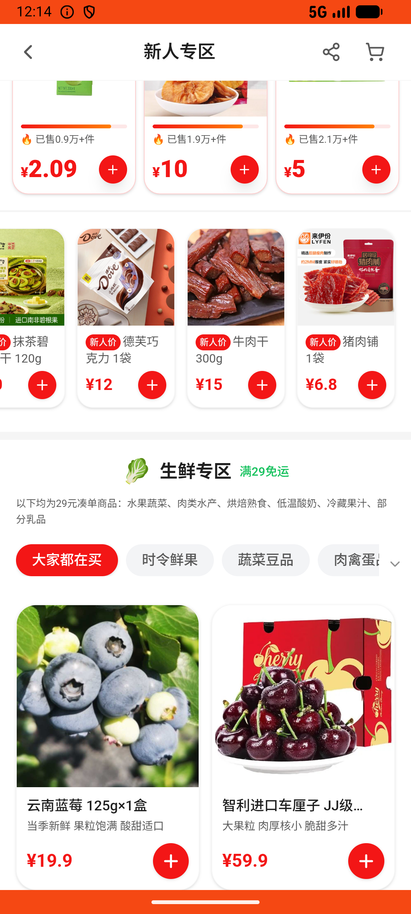

# newcomer_zone_v007_fresh_seafood_add_second  ⚠️

- **Brand**: `wogoumarket`
- **Class**: `WogoumarketNewcomerZoneV007FreshSeafoodAddSecondTask`
- **Pass@3**: **2/3**  (score = 1.00)
- **Elapsed**: 173s (~2.9 min)
- **Model**: `doubao-seed-2-0-lite-260428`
- **Raw log**: [./raw_logs/WogoumarketNewcomerZoneV007FreshSeafoodAddSecondTask.log](./raw_logs/WogoumarketNewcomerZoneV007FreshSeafoodAddSecondTask.log)
- **Generated**: 2026-05-30T12:14:23+08:00

## Task Goal

> 【当前账户档案】账号：demo@rlbox.ai；昵称：张三；支付密码：123456，如需支付请使用此密码完成支付；默认收货地址（JSON）：{"recipient": "科憨憨", "phone": "13100002345", "address": "腾讯滨海大厦 广东省 深圳市 南山区 1楼东门外卖柜"}。请基于以上档案打开 com.wogoumarket 并完成以下任务：新人专区里有没有虾？帮我加一个到购物车

## Attempts

| # | Outcome | Steps | Terminated | Reason | Start → End |
|---|---------|-------|------------|--------|-------------|
| 1 | ✅ passed | 7 | answer | – | 2026-05-30 12:11:30 → 2026-05-30 12:12:24 |
| 2 | ✅ passed | 7 | answer | – | 2026-05-30 12:12:24 → 2026-05-30 12:13:22 |
| 3 | ❌ failed | 7 | answer | 购物车中存在虾类商品: 购物车中没有任何商品 | 2026-05-30 12:13:22 → 2026-05-30 12:14:23 |

## Failure Details

### Episode 3 — ❌ failed

- steps_used: `7`
- terminated_reason: `answer`
- reason:

  ```
  购物车中存在虾类商品: 购物车中没有任何商品
  ```
- death shot: 
  - state: [`./death_shots/WogoumarketNewcomerZoneV007FreshSeafoodAddSecondTask/episode_003/step_007.json`](./death_shots/WogoumarketNewcomerZoneV007FreshSeafoodAddSecondTask/episode_003/step_007.json)
  - digest: [`episode_digest.md`](./death_shots/WogoumarketNewcomerZoneV007FreshSeafoodAddSecondTask/episode_003/episode_digest.md)

---

> 本摘要由 `sengclaw/scripts/pipeline/log_summarizer.py` 自动生成。 原始完整 log 见上方 Raw log 链接（含每 step 的 messages / tool_call / screenshot 引用）。
