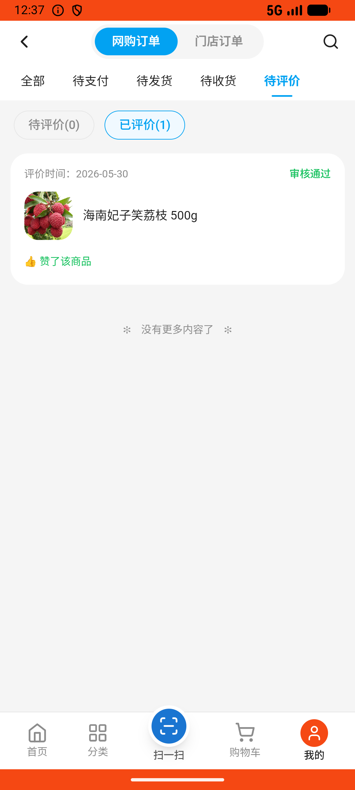
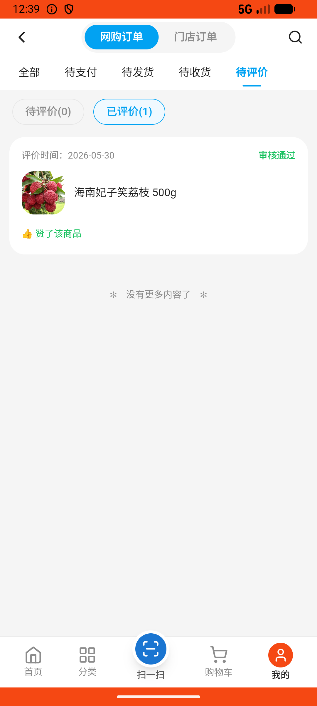

# order_v008_review_order_for_coupon  ❌

- **Brand**: `wogoumarket`
- **Class**: `WogoumarketOrderV008ReviewOrderForCouponTask`
- **Pass@3**: **0/3**  (score = 0.00)
- **Elapsed**: 242s (~4.0 min)
- **Model**: `doubao-seed-2-0-lite-260428`
- **Raw log**: [./raw_logs/WogoumarketOrderV008ReviewOrderForCouponTask.log](./raw_logs/WogoumarketOrderV008ReviewOrderForCouponTask.log)
- **Generated**: 2026-05-30T12:39:12+08:00

## Task Goal

> 【当前账户档案】账号：demo@rlbox.ai；昵称：张三；支付密码：123456，如需支付请使用此密码完成支付；默认收货地址（JSON）：{"recipient": "科憨憨", "phone": "13100002345", "address": "腾讯滨海大厦 广东省 深圳市 南山区 1楼东门外卖柜"}。请基于以上档案打开 com.wogoumarket 并完成以下任务：上次买的妃子笑荔枝挺新鲜的，帮我给个好评写几句话，争取拿个优惠券

## Attempts

| # | Outcome | Steps | Terminated | Reason | Start → End |
|---|---------|-------|------------|--------|-------------|
| 1 | ❌ failed | 12 | answer | 评价包含图片: 评价未上传图片，images=[] Diff: @@ -1 +1 @@ -true +false ; 获得优惠券奖励: 未获得评价奖励优惠券 | 2026-05-30 12:35:10 → 2026-05-30 12:36:30 |
| 2 | ❌ failed | 12 | answer | 评价包含图片: 评价未上传图片，images=[] Diff: @@ -1 +1 @@ -true +false ; 获得优惠券奖励: 未获得评价奖励优惠券 | 2026-05-30 12:36:30 → 2026-05-30 12:37:45 |
| 3 | ❌ failed | 12 | answer | 评价包含图片: 评价未上传图片，images=[] Diff: @@ -1 +1 @@ -true +false ; 获得优惠券奖励: 未获得评价奖励优惠券 | 2026-05-30 12:37:45 → 2026-05-30 12:39:12 |

## Failure Details

### Episode 1 — ❌ failed

- steps_used: `12`
- terminated_reason: `answer`
- reason:

  ```
  评价包含图片: 评价未上传图片，images=[]
  Diff:
  @@ -1 +1 @@
  -true
  +false
  ; 获得优惠券奖励: 未获得评价奖励优惠券
  ```
- death shot: 
  - state: [`./death_shots/WogoumarketOrderV008ReviewOrderForCouponTask/episode_001/step_012.json`](./death_shots/WogoumarketOrderV008ReviewOrderForCouponTask/episode_001/step_012.json)
  - digest: [`episode_digest.md`](./death_shots/WogoumarketOrderV008ReviewOrderForCouponTask/episode_001/episode_digest.md)

### Episode 2 — ❌ failed

- steps_used: `12`
- terminated_reason: `answer`
- reason:

  ```
  评价包含图片: 评价未上传图片，images=[]
  Diff:
  @@ -1 +1 @@
  -true
  +false
  ; 获得优惠券奖励: 未获得评价奖励优惠券
  ```
- death shot: 
  - state: [`./death_shots/WogoumarketOrderV008ReviewOrderForCouponTask/episode_002/step_012.json`](./death_shots/WogoumarketOrderV008ReviewOrderForCouponTask/episode_002/step_012.json)
  - digest: [`episode_digest.md`](./death_shots/WogoumarketOrderV008ReviewOrderForCouponTask/episode_002/episode_digest.md)

### Episode 3 — ❌ failed

- steps_used: `12`
- terminated_reason: `answer`
- reason:

  ```
  评价包含图片: 评价未上传图片，images=[]
  Diff:
  @@ -1 +1 @@
  -true
  +false
  ; 获得优惠券奖励: 未获得评价奖励优惠券
  ```
- death shot: 
  - state: [`./death_shots/WogoumarketOrderV008ReviewOrderForCouponTask/episode_003/step_012.json`](./death_shots/WogoumarketOrderV008ReviewOrderForCouponTask/episode_003/step_012.json)
  - digest: [`episode_digest.md`](./death_shots/WogoumarketOrderV008ReviewOrderForCouponTask/episode_003/episode_digest.md)

---

> 本摘要由 `sengclaw/scripts/pipeline/log_summarizer.py` 自动生成。 原始完整 log 见上方 Raw log 链接（含每 step 的 messages / tool_call / screenshot 引用）。
