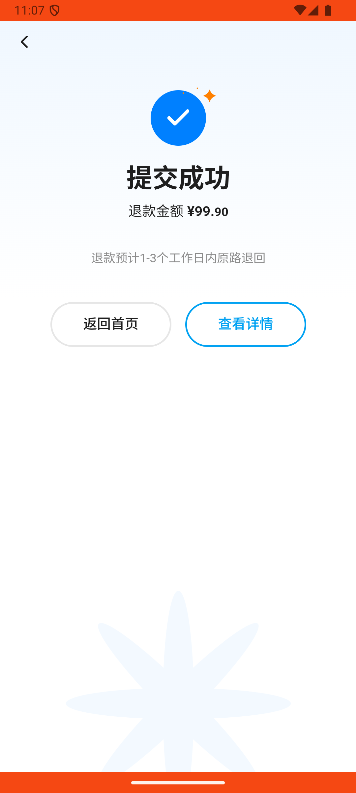
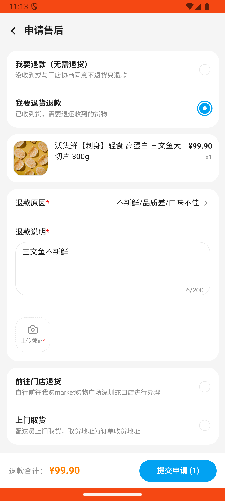

# order_v011_confirm_then_partial_refund  ⚠️

- **Brand**: `wogoumarket`
- **Class**: `WogoumarketOrderV011ConfirmThenPartialRefundTask`
- **Pass@3**: **1/3**  (score = 1.00)
- **Elapsed**: 514s (~8.6 min)
- **Model**: `doubao-seed-2-0-lite-260428`
- **Raw log**: [./raw_logs/WogoumarketOrderV011ConfirmThenPartialRefundTask.log](./raw_logs/WogoumarketOrderV011ConfirmThenPartialRefundTask.log)
- **Generated**: 2026-05-30T23:13:04+08:00

## Task Goal

> 【当前账户档案】账号：demo@rlbox.ai；昵称：张三；支付密码：123456，如需支付请使用此密码完成支付；默认收货地址（JSON）：{"recipient": "科憨憨", "phone": "13100002345", "address": "腾讯滨海大厦 广东省 深圳市 南山区 1楼东门外卖柜"}。请基于以上档案打开 com.wogoumarket 并完成以下任务：刚收到那个有两样东西的订单，我点击确认收货了，但是我现在看到三文鱼有点不新鲜，帮我把三文鱼那个商品申请退款

## Attempts

| # | Outcome | Steps | Terminated | Reason | Start → End |
|---|---------|-------|------------|--------|-------------|
| 1 | ❌ failed | 20 | answer | 订单已确认收货: 订单状态为 shipping，应为 delivered | 2026-05-30 23:04:30 → 2026-05-30 23:07:20 |
| 2 | ✅ passed | 25 | answer | – | 2026-05-30 23:07:20 → 2026-05-30 23:10:20 |
| 3 | ❌ failed | 18 | answer | 订单已确认收货: 订单状态为 shipping，应为 delivered | 2026-05-30 23:10:20 → 2026-05-30 23:13:04 |

## Failure Details

### Episode 1 — ❌ failed

- steps_used: `20`
- terminated_reason: `answer`
- reason:

  ```
  订单已确认收货: 订单状态为 shipping，应为 delivered
  ```
- death shot: 
  - state: [`./death_shots/WogoumarketOrderV011ConfirmThenPartialRefundTask/episode_001/step_020.json`](./death_shots/WogoumarketOrderV011ConfirmThenPartialRefundTask/episode_001/step_020.json)
  - digest: [`episode_digest.md`](./death_shots/WogoumarketOrderV011ConfirmThenPartialRefundTask/episode_001/episode_digest.md)

### Episode 3 — ❌ failed

- steps_used: `18`
- terminated_reason: `answer`
- reason:

  ```
  订单已确认收货: 订单状态为 shipping，应为 delivered
  ```
- death shot: 
  - state: [`./death_shots/WogoumarketOrderV011ConfirmThenPartialRefundTask/episode_003/step_018.json`](./death_shots/WogoumarketOrderV011ConfirmThenPartialRefundTask/episode_003/step_018.json)
  - digest: [`episode_digest.md`](./death_shots/WogoumarketOrderV011ConfirmThenPartialRefundTask/episode_003/episode_digest.md)

---

> 本摘要由 `sengclaw/scripts/pipeline/log_summarizer.py` 自动生成。 原始完整 log 见上方 Raw log 链接（含每 step 的 messages / tool_call / screenshot 引用）。
