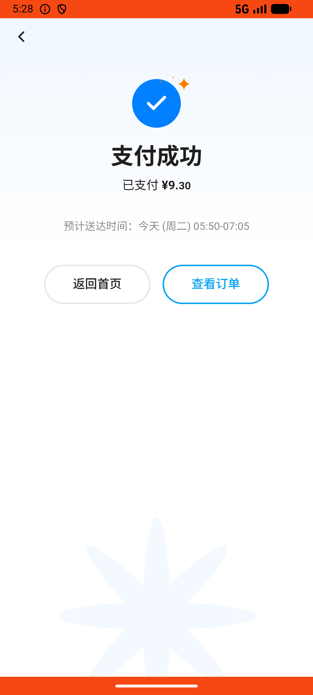
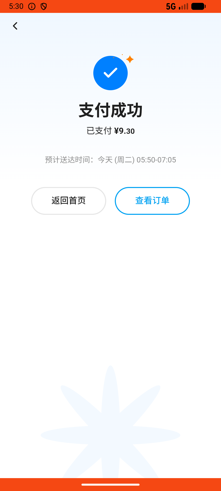

# checkout_v011_search_location_then_select_saved_address  ❌

- **Brand**: `wogoumarket`
- **Class**: `WogoumarketCheckoutV011SearchLocationThenSelectSavedAddressTask`
- **Pass@3**: **0/3**  (score = 0.00)
- **Elapsed**: 365s (~6.1 min)
- **Model**: `doubao-seed-2-0-lite-260428`
- **Raw log**: [./raw_logs/WogoumarketCheckoutV011SearchLocationThenSelectSavedAddressTask.log](./raw_logs/WogoumarketCheckoutV011SearchLocationThenSelectSavedAddressTask.log)
- **Generated**: 2026-06-02T07:22:59+08:00

## Task Goal

> 【当前账户档案】账号：demo@rlbox.ai；昵称：张三；支付密码：123456，如需支付请使用此密码完成支付；默认收货地址（JSON）：{"recipient": "科憨憨", "phone": "13100002345", "address": "腾讯滨海大厦 广东省 深圳市 南山区 1楼东门外卖柜"}。请基于以上档案打开 com.wogoumarket 并完成以下任务：帮我把定位切到京基100大厦，然后把购物车的东西下单，收货地址选我公司那个「腾讯滨海大厦」

## Attempts

| # | Outcome | Steps | Terminated | Reason | Start → End |
|---|---------|-------|------------|--------|-------------|
| 1 | ❌ failed | 19 | answer | 搜索过京基: 未找到搜索「京基」的记录 | 2026-06-02 05:26:06 → 2026-06-02 05:28:17 |
| 2 | ❌ failed | 18 | answer | 搜索过京基: 未找到搜索「京基」的记录 | 2026-06-02 05:28:17 → 2026-06-02 05:30:07 |
| 3 | ❌ failed | 18 | answer | 搜索过京基: 未找到搜索「京基」的记录 | 2026-06-02 05:30:07 → 2026-06-02 05:32:10 |

## Failure Details

### Episode 1 — ❌ failed

- steps_used: `19`
- terminated_reason: `answer`
- reason:

  ```
  搜索过京基: 未找到搜索「京基」的记录
  ```
- death shot: 
  - state: [`./death_shots/WogoumarketCheckoutV011SearchLocationThenSelectSavedAddressTask/episode_001/step_019.json`](./death_shots/WogoumarketCheckoutV011SearchLocationThenSelectSavedAddressTask/episode_001/step_019.json)
  - digest: [`episode_digest.md`](./death_shots/WogoumarketCheckoutV011SearchLocationThenSelectSavedAddressTask/episode_001/episode_digest.md)

### Episode 2 — ❌ failed

- steps_used: `18`
- terminated_reason: `answer`
- reason:

  ```
  搜索过京基: 未找到搜索「京基」的记录
  ```
- death shot: 
  - state: [`./death_shots/WogoumarketCheckoutV011SearchLocationThenSelectSavedAddressTask/episode_002/step_018.json`](./death_shots/WogoumarketCheckoutV011SearchLocationThenSelectSavedAddressTask/episode_002/step_018.json)
  - digest: [`episode_digest.md`](./death_shots/WogoumarketCheckoutV011SearchLocationThenSelectSavedAddressTask/episode_002/episode_digest.md)

### Episode 3 — ❌ failed

- steps_used: `18`
- terminated_reason: `answer`
- reason:

  ```
  搜索过京基: 未找到搜索「京基」的记录
  ```
- death shot: 
  - state: [`./death_shots/WogoumarketCheckoutV011SearchLocationThenSelectSavedAddressTask/episode_003/step_018.json`](./death_shots/WogoumarketCheckoutV011SearchLocationThenSelectSavedAddressTask/episode_003/step_018.json)
  - digest: [`episode_digest.md`](./death_shots/WogoumarketCheckoutV011SearchLocationThenSelectSavedAddressTask/episode_003/episode_digest.md)

---

> 本摘要由 `sengclaw/scripts/pipeline/log_summarizer.py` 自动生成。 原始完整 log 见上方 Raw log 链接（含每 step 的 messages / tool_call / screenshot 引用）。
