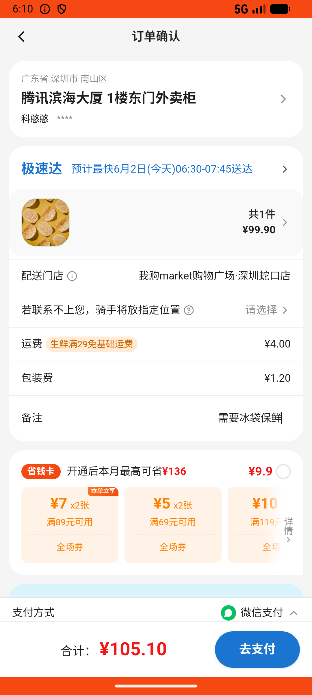

# common_v011_fresh_meat_most_expensive_with_remark  ❌

- **Brand**: `wogoumarket`
- **Class**: `WogoumarketCommonV011FreshMeatMostExpensiveWithRemarkTask`
- **Pass@3**: **0/3**  (score = 0.00)
- **Elapsed**: 358s (~6.0 min)
- **Model**: `doubao-seed-2-0-lite-260428`
- **Raw log**: [./raw_logs/WogoumarketCommonV011FreshMeatMostExpensiveWithRemarkTask.log](./raw_logs/WogoumarketCommonV011FreshMeatMostExpensiveWithRemarkTask.log)
- **Generated**: 2026-06-02T07:23:00+08:00

## Task Goal

> 【当前账户档案】账号：demo@rlbox.ai；昵称：张三；支付密码：123456，如需支付请使用此密码完成支付；默认收货地址（JSON）：{"recipient": "科憨憨", "phone": "13100002345", "address": "腾讯滨海大厦 广东省 深圳市 南山区 1楼东门外卖柜"}。请基于以上档案打开 com.wogoumarket 并完成以下任务：我想吃三文鱼了，去首页质选生鲜里看看，找最贵的三文鱼，加一份到购物车，结算时备注写"需要冰袋保鲜"

## Attempts

| # | Outcome | Steps | Terminated | Reason | Start → End |
|---|---------|-------|------------|--------|-------------|
| 1 | ❌ failed | 15 | answer | 成功下单: 未找到新订单 | 2026-06-02 06:04:39 → 2026-06-02 06:06:39 |
| 2 | ❌ failed | 15 | answer | 成功下单: 未找到新订单 | 2026-06-02 06:06:39 → 2026-06-02 06:08:39 |
| 3 | ❌ failed | 15 | answer | 成功下单: 未找到新订单 | 2026-06-02 06:08:39 → 2026-06-02 06:10:37 |

## Failure Details

### Episode 1 — ❌ failed

- steps_used: `15`
- terminated_reason: `answer`
- reason:

  ```
  成功下单: 未找到新订单
  ```
- death shot: 
  - state: [`./death_shots/WogoumarketCommonV011FreshMeatMostExpensiveWithRemarkTask/episode_001/step_015.json`](./death_shots/WogoumarketCommonV011FreshMeatMostExpensiveWithRemarkTask/episode_001/step_015.json)
  - digest: [`episode_digest.md`](./death_shots/WogoumarketCommonV011FreshMeatMostExpensiveWithRemarkTask/episode_001/episode_digest.md)

### Episode 2 — ❌ failed

- steps_used: `15`
- terminated_reason: `answer`
- reason:

  ```
  成功下单: 未找到新订单
  ```
- death shot: 
  - state: [`./death_shots/WogoumarketCommonV011FreshMeatMostExpensiveWithRemarkTask/episode_002/step_015.json`](./death_shots/WogoumarketCommonV011FreshMeatMostExpensiveWithRemarkTask/episode_002/step_015.json)
  - digest: [`episode_digest.md`](./death_shots/WogoumarketCommonV011FreshMeatMostExpensiveWithRemarkTask/episode_002/episode_digest.md)

### Episode 3 — ❌ failed

- steps_used: `15`
- terminated_reason: `answer`
- reason:

  ```
  成功下单: 未找到新订单
  ```
- death shot: 
  - state: [`./death_shots/WogoumarketCommonV011FreshMeatMostExpensiveWithRemarkTask/episode_003/step_015.json`](./death_shots/WogoumarketCommonV011FreshMeatMostExpensiveWithRemarkTask/episode_003/step_015.json)
  - digest: [`episode_digest.md`](./death_shots/WogoumarketCommonV011FreshMeatMostExpensiveWithRemarkTask/episode_003/episode_digest.md)

---

> 本摘要由 `sengclaw/scripts/pipeline/log_summarizer.py` 自动生成。 原始完整 log 见上方 Raw log 链接（含每 step 的 messages / tool_call / screenshot 引用）。
