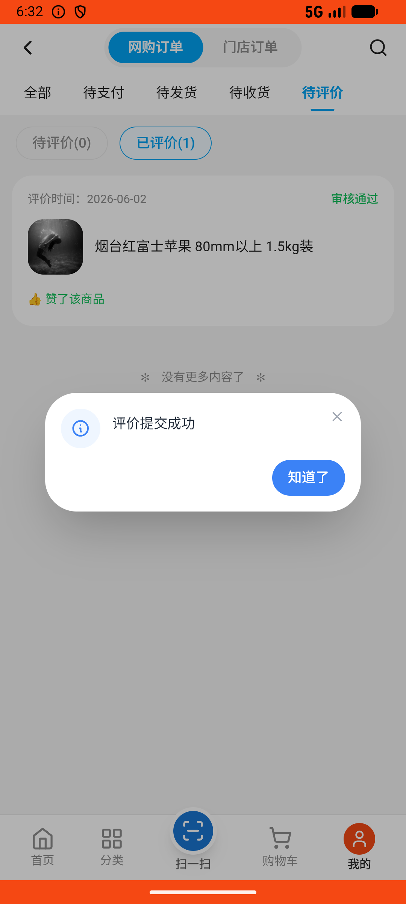
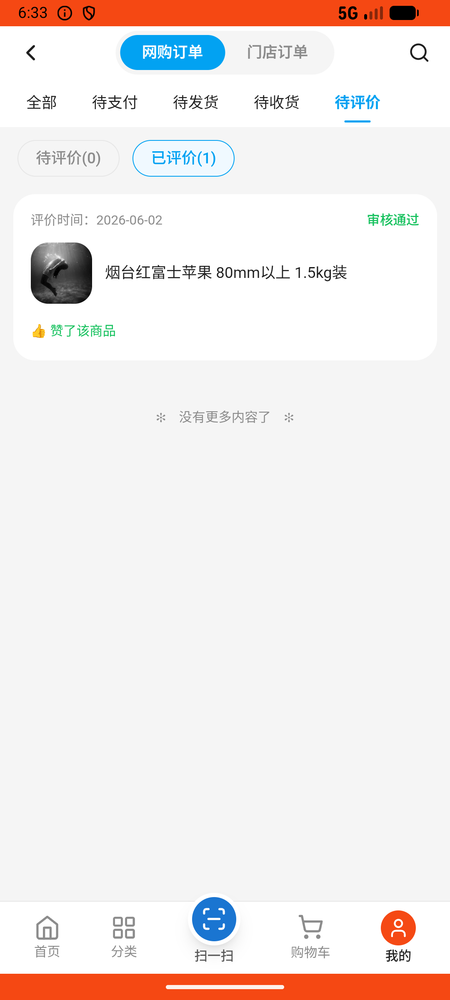

# notification_v002_review_after_receipt_notification  ❌

- **Brand**: `wogoumarket`
- **Class**: `WogoumarketNotificationV002ReviewAfterReceiptNotificationTask`
- **Pass@3**: **0/3**  (score = 0.00)
- **Elapsed**: 252s (~4.2 min)
- **Model**: `doubao-seed-2-0-lite-260428`
- **Raw log**: [./raw_logs/WogoumarketNotificationV002ReviewAfterReceiptNotificationTask.log](./raw_logs/WogoumarketNotificationV002ReviewAfterReceiptNotificationTask.log)
- **Generated**: 2026-06-02T07:23:00+08:00

## Task Goal

> 【当前账户档案】账号：demo@rlbox.ai；昵称：张三；支付密码：123456，如需支付请使用此密码完成支付；默认收货地址（JSON）：{"recipient": "科憨憨", "phone": "13100002345", "address": "腾讯滨海大厦 广东省 深圳市 南山区 1楼东门外卖柜"}。请基于以上档案打开 com.wogoumarket 并完成以下任务：我看到消息通知说订单已签收可以评价拿奖励，帮我去写个好评争取拿到优惠券

## Attempts

| # | Outcome | Steps | Terminated | Reason | Start → End |
|---|---------|-------|------------|--------|-------------|
| 1 | ❌ failed | 13 | answer | 获得优惠券奖励: 未找到评价奖励优惠券 | 2026-06-02 06:29:45 → 2026-06-02 06:31:23 |
| 2 | ❌ failed | 12 | answer | 获得优惠券奖励: 未找到评价奖励优惠券 | 2026-06-02 06:31:23 → 2026-06-02 06:32:47 |
| 3 | ❌ failed | 11 | answer | 评价内容 >= 12 字: 评价内容长度 0，需要 >=12 字; 获得优惠券奖励: 未找到评价奖励优惠券 | 2026-06-02 06:32:48 → 2026-06-02 06:33:57 |

## Failure Details

### Episode 1 — ❌ failed

- steps_used: `13`
- terminated_reason: `answer`
- reason:

  ```
  获得优惠券奖励: 未找到评价奖励优惠券
  ```
- death shot: 
  - state: [`./death_shots/WogoumarketNotificationV002ReviewAfterReceiptNotificationTask/episode_001/step_013.json`](./death_shots/WogoumarketNotificationV002ReviewAfterReceiptNotificationTask/episode_001/step_013.json)
  - digest: [`episode_digest.md`](./death_shots/WogoumarketNotificationV002ReviewAfterReceiptNotificationTask/episode_001/episode_digest.md)

### Episode 2 — ❌ failed

- steps_used: `12`
- terminated_reason: `answer`
- reason:

  ```
  获得优惠券奖励: 未找到评价奖励优惠券
  ```
- death shot: 
  - state: [`./death_shots/WogoumarketNotificationV002ReviewAfterReceiptNotificationTask/episode_002/step_012.json`](./death_shots/WogoumarketNotificationV002ReviewAfterReceiptNotificationTask/episode_002/step_012.json)
  - digest: [`episode_digest.md`](./death_shots/WogoumarketNotificationV002ReviewAfterReceiptNotificationTask/episode_002/episode_digest.md)

### Episode 3 — ❌ failed

- steps_used: `11`
- terminated_reason: `answer`
- reason:

  ```
  评价内容 >= 12 字: 评价内容长度 0，需要 >=12 字; 获得优惠券奖励: 未找到评价奖励优惠券
  ```
- death shot: 
  - state: [`./death_shots/WogoumarketNotificationV002ReviewAfterReceiptNotificationTask/episode_003/step_011.json`](./death_shots/WogoumarketNotificationV002ReviewAfterReceiptNotificationTask/episode_003/step_011.json)
  - digest: [`episode_digest.md`](./death_shots/WogoumarketNotificationV002ReviewAfterReceiptNotificationTask/episode_003/episode_digest.md)

---

> 本摘要由 `sengclaw/scripts/pipeline/log_summarizer.py` 自动生成。 原始完整 log 见上方 Raw log 链接（含每 step 的 messages / tool_call / screenshot 引用）。
