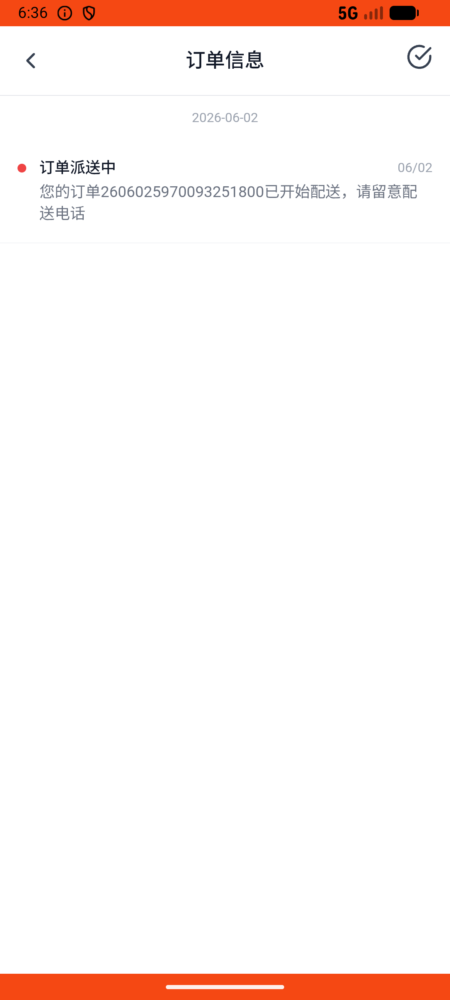

# notification_v004_confirm_receipt_after_shipping_notification  ⚠️

- **Brand**: `wogoumarket`
- **Class**: `WogoumarketNotificationV004ConfirmReceiptAfterShippingNotificationTask`
- **Pass@3**: **2/3**  (score = 1.00)
- **Elapsed**: 94s (~1.6 min)
- **Model**: `doubao-seed-2-0-lite-260428`
- **Raw log**: [./raw_logs/WogoumarketNotificationV004ConfirmReceiptAfterShippingNotificationTask.log](./raw_logs/WogoumarketNotificationV004ConfirmReceiptAfterShippingNotificationTask.log)
- **Generated**: 2026-06-02T07:23:00+08:00

## Task Goal

> 【当前账户档案】账号：demo@rlbox.ai；昵称：张三；支付密码：123456，如需支付请使用此密码完成支付；默认收货地址（JSON）：{"recipient": "科憨憨", "phone": "13100002345", "address": "腾讯滨海大厦 广东省 深圳市 南山区 1楼东门外卖柜"}。请基于以上档案打开 com.wogoumarket 并完成以下任务：我看到有个消息通知说我的订单在派送了，帮我在消息通知里的订单信息查看一下详细信息

## Attempts

| # | Outcome | Steps | Terminated | Reason | Start → End |
|---|---------|-------|------------|--------|-------------|
| 1 | ✅ passed | 5 | answer | – | 2026-06-02 06:34:40 → 2026-06-02 06:35:10 |
| 2 | ✅ passed | 5 | answer | – | 2026-06-02 06:35:10 → 2026-06-02 06:35:47 |
| 3 | ❌ failed | 4 | answer | 派送通知已阅读: 派送通知未被阅读，Agent 未点击查看详情 | 2026-06-02 06:35:47 → 2026-06-02 06:36:14 |

## Failure Details

### Episode 3 — ❌ failed

- steps_used: `4`
- terminated_reason: `answer`
- reason:

  ```
  派送通知已阅读: 派送通知未被阅读，Agent 未点击查看详情
  ```
- death shot: 
  - state: [`./death_shots/WogoumarketNotificationV004ConfirmReceiptAfterShippingNotificationTask/episode_003/step_004.json`](./death_shots/WogoumarketNotificationV004ConfirmReceiptAfterShippingNotificationTask/episode_003/step_004.json)
  - digest: [`episode_digest.md`](./death_shots/WogoumarketNotificationV004ConfirmReceiptAfterShippingNotificationTask/episode_003/episode_digest.md)

---

> 本摘要由 `sengclaw/scripts/pipeline/log_summarizer.py` 自动生成。 原始完整 log 见上方 Raw log 链接（含每 step 的 messages / tool_call / screenshot 引用）。
