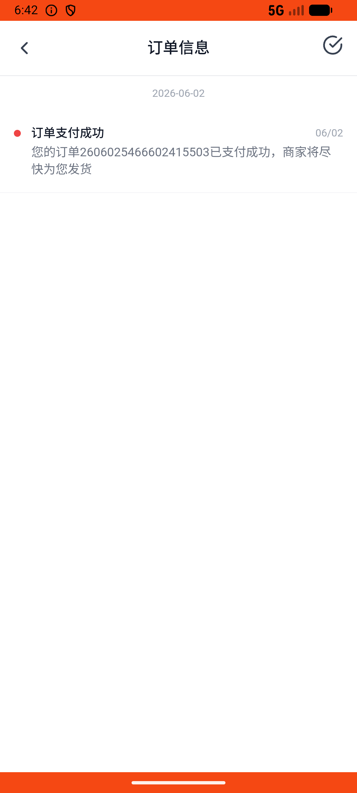
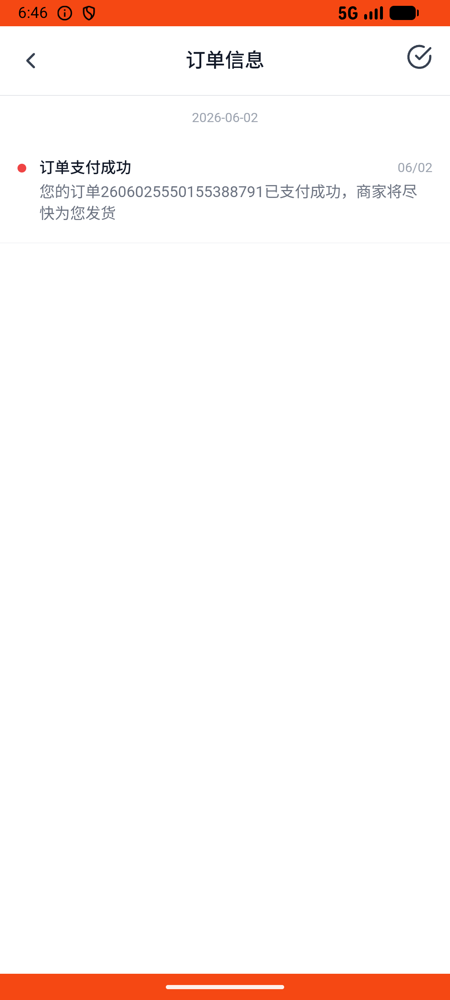

# notification_v006_pay_then_check_notification  ❌

- **Brand**: `wogoumarket`
- **Class**: `WogoumarketNotificationV006PayThenCheckNotificationTask`
- **Pass@3**: **0/3**  (score = 0.00)
- **Elapsed**: 326s (~5.4 min)
- **Model**: `doubao-seed-2-0-lite-260428`
- **Raw log**: [./raw_logs/WogoumarketNotificationV006PayThenCheckNotificationTask.log](./raw_logs/WogoumarketNotificationV006PayThenCheckNotificationTask.log)
- **Generated**: 2026-06-02T07:23:00+08:00

## Task Goal

> 【当前账户档案】账号：demo@rlbox.ai；昵称：张三；支付密码：123456，如需支付请使用此密码完成支付；默认收货地址（JSON）：{"recipient": "科憨憨", "phone": "13100002345", "address": "腾讯滨海大厦 广东省 深圳市 南山区 1楼东门外卖柜"}。请基于以上档案打开 com.wogoumarket 并完成以下任务：帮我把那个待付款订单付了，然后去消息通知里确认一下有没有收到支付成功的提醒

## Attempts

| # | Outcome | Steps | Terminated | Reason | Start → End |
|---|---------|-------|------------|--------|-------------|
| 1 | ❌ failed | 16 | answer | 通知已被阅读: 支付成功通知未被阅读（Agent 没有打开通知确认） | 2026-06-02 06:40:48 → 2026-06-02 06:42:27 |
| 2 | ❌ failed | 16 | answer | 通知已被阅读: 支付成功通知未被阅读（Agent 没有打开通知确认） | 2026-06-02 06:42:27 → 2026-06-02 06:44:18 |
| 3 | ❌ failed | 16 | answer | 通知已被阅读: 支付成功通知未被阅读（Agent 没有打开通知确认） | 2026-06-02 06:44:18 → 2026-06-02 06:46:14 |

## Failure Details

### Episode 1 — ❌ failed

- steps_used: `16`
- terminated_reason: `answer`
- reason:

  ```
  通知已被阅读: 支付成功通知未被阅读（Agent 没有打开通知确认）
  ```
- death shot: 
  - state: [`./death_shots/WogoumarketNotificationV006PayThenCheckNotificationTask/episode_001/step_016.json`](./death_shots/WogoumarketNotificationV006PayThenCheckNotificationTask/episode_001/step_016.json)
  - digest: [`episode_digest.md`](./death_shots/WogoumarketNotificationV006PayThenCheckNotificationTask/episode_001/episode_digest.md)

### Episode 2 — ❌ failed

- steps_used: `16`
- terminated_reason: `answer`
- reason:

  ```
  通知已被阅读: 支付成功通知未被阅读（Agent 没有打开通知确认）
  ```
- death shot: 
  - state: [`./death_shots/WogoumarketNotificationV006PayThenCheckNotificationTask/episode_002/step_016.json`](./death_shots/WogoumarketNotificationV006PayThenCheckNotificationTask/episode_002/step_016.json)
  - digest: [`episode_digest.md`](./death_shots/WogoumarketNotificationV006PayThenCheckNotificationTask/episode_002/episode_digest.md)

### Episode 3 — ❌ failed

- steps_used: `16`
- terminated_reason: `answer`
- reason:

  ```
  通知已被阅读: 支付成功通知未被阅读（Agent 没有打开通知确认）
  ```
- death shot: 
  - state: [`./death_shots/WogoumarketNotificationV006PayThenCheckNotificationTask/episode_003/step_016.json`](./death_shots/WogoumarketNotificationV006PayThenCheckNotificationTask/episode_003/step_016.json)
  - digest: [`episode_digest.md`](./death_shots/WogoumarketNotificationV006PayThenCheckNotificationTask/episode_003/episode_digest.md)

---

> 本摘要由 `sengclaw/scripts/pipeline/log_summarizer.py` 自动生成。 原始完整 log 见上方 Raw log 链接（含每 step 的 messages / tool_call / screenshot 引用）。
