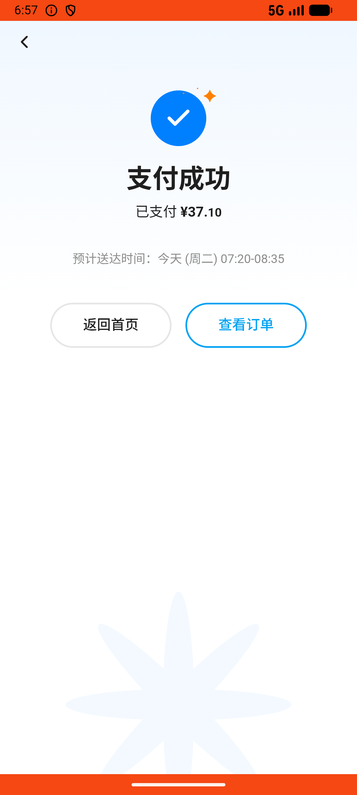
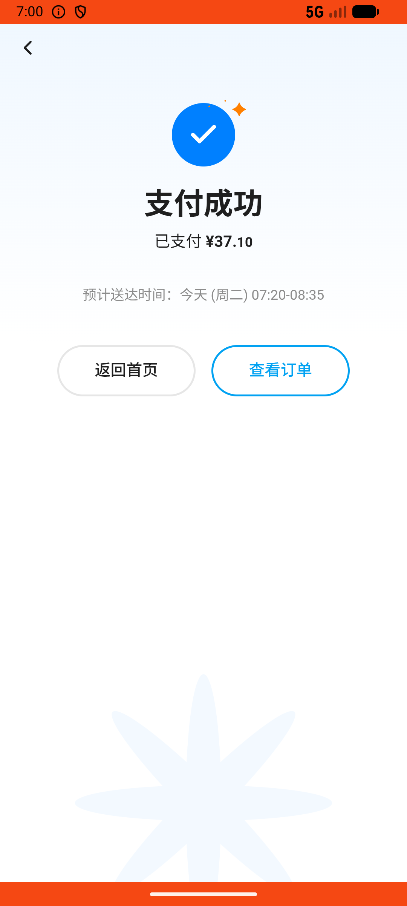

# notification_v011_reorder_from_payment_timeout_notification  ❌

- **Brand**: `wogoumarket`
- **Class**: `WogoumarketNotificationV011ReorderFromPaymentTimeoutNotificationTask`
- **Pass@3**: **0/3**  (score = 0.00)
- **Elapsed**: 445s (~7.4 min)
- **Model**: `doubao-seed-2-0-lite-260428`
- **Raw log**: [./raw_logs/WogoumarketNotificationV011ReorderFromPaymentTimeoutNotificationTask.log](./raw_logs/WogoumarketNotificationV011ReorderFromPaymentTimeoutNotificationTask.log)
- **Generated**: 2026-06-02T07:23:00+08:00

## Task Goal

> 【当前账户档案】账号：demo@rlbox.ai；昵称：张三；支付密码：123456，如需支付请使用此密码完成支付；默认收货地址（JSON）：{"recipient": "科憨憨", "phone": "13100002345", "address": "腾讯滨海大厦 广东省 深圳市 南山区 1楼东门外卖柜"}。请基于以上档案打开 com.wogoumarket 并完成以下任务：消息通知里说我有个订单因超时未支付被关闭了，我之前忘记付款了，帮我看看是哪个，里面的东西我还想要，重新下一单并完成支付

## Attempts

| # | Outcome | Steps | Terminated | Reason | Start → End |
|---|---------|-------|------------|--------|-------------|
| 1 | ❌ failed | 20 | answer | 超时关闭通知已阅读: 通知未被阅读 | 2026-06-02 06:55:28 → 2026-06-02 06:57:51 |
| 2 | ❌ failed | 21 | answer | 超时关闭通知已阅读: 通知未被阅读 | 2026-06-02 06:57:51 → 2026-06-02 07:00:26 |
| 3 | ❌ failed | 21 | answer | 超时关闭通知已阅读: 通知未被阅读 | 2026-06-02 07:00:26 → 2026-06-02 07:02:53 |

## Failure Details

### Episode 1 — ❌ failed

- steps_used: `20`
- terminated_reason: `answer`
- reason:

  ```
  超时关闭通知已阅读: 通知未被阅读
  ```
- death shot: 
  - state: [`./death_shots/WogoumarketNotificationV011ReorderFromPaymentTimeoutNotificationTask/episode_001/step_020.json`](./death_shots/WogoumarketNotificationV011ReorderFromPaymentTimeoutNotificationTask/episode_001/step_020.json)
  - digest: [`episode_digest.md`](./death_shots/WogoumarketNotificationV011ReorderFromPaymentTimeoutNotificationTask/episode_001/episode_digest.md)

### Episode 2 — ❌ failed

- steps_used: `21`
- terminated_reason: `answer`
- reason:

  ```
  超时关闭通知已阅读: 通知未被阅读
  ```
- death shot: 
  - state: [`./death_shots/WogoumarketNotificationV011ReorderFromPaymentTimeoutNotificationTask/episode_002/step_021.json`](./death_shots/WogoumarketNotificationV011ReorderFromPaymentTimeoutNotificationTask/episode_002/step_021.json)
  - digest: [`episode_digest.md`](./death_shots/WogoumarketNotificationV011ReorderFromPaymentTimeoutNotificationTask/episode_002/episode_digest.md)

### Episode 3 — ❌ failed

- steps_used: `21`
- terminated_reason: `answer`
- reason:

  ```
  超时关闭通知已阅读: 通知未被阅读
  ```
- death shot: 
  - state: [`./death_shots/WogoumarketNotificationV011ReorderFromPaymentTimeoutNotificationTask/episode_003/step_021.json`](./death_shots/WogoumarketNotificationV011ReorderFromPaymentTimeoutNotificationTask/episode_003/step_021.json)
  - digest: [`episode_digest.md`](./death_shots/WogoumarketNotificationV011ReorderFromPaymentTimeoutNotificationTask/episode_003/episode_digest.md)

---

> 本摘要由 `sengclaw/scripts/pipeline/log_summarizer.py` 自动生成。 原始完整 log 见上方 Raw log 链接（含每 step 的 messages / tool_call / screenshot 引用）。
