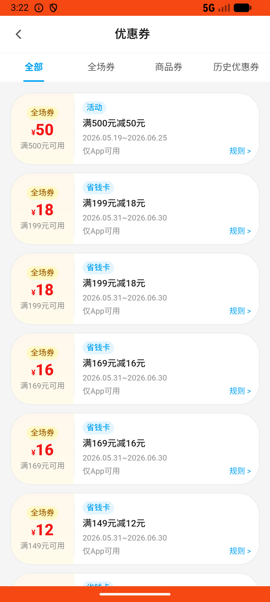

# notification_v013_check_coupon_with_saving_card_notification  ❌

- **Brand**: `wogoumarket`
- **Class**: `WogoumarketNotificationV013CheckCouponWithSavingCardNotificationTask`
- **Pass@3**: **0/3**  (score = 0.00)
- **Elapsed**: 462s (~7.7 min)
- **Model**: `doubao-seed-2-0-lite-260428`
- **Raw log**: [./raw_logs/WogoumarketNotificationV013CheckCouponWithSavingCardNotificationTask.log](./raw_logs/WogoumarketNotificationV013CheckCouponWithSavingCardNotificationTask.log)
- **Generated**: 2026-06-03T06:07:56+08:00

## Task Goal

> 【当前账户档案】账号：demo@rlbox.ai；昵称：张三；支付密码：123456，如需支付请使用此密码完成支付；默认收货地址（JSON）：{"recipient": "科憨憨", "phone": "13100002345", "address": "腾讯滨海大厦 广东省 深圳市 南山区 1楼东门外卖柜"}。请基于以上档案打开 com.wogoumarket 并完成以下任务：我已经开通了省钱卡，看到一些消息通知，帮我进我的资产里看看什么情况

## Attempts

| # | Outcome | Steps | Terminated | Reason | Start → End |
|---|---------|-------|------------|--------|-------------|
| 1 | ❌ failed | 16 | answer | 我的资产通知已阅读: 我的资产分类下的通知均未被阅读（共 2 条），Agent 未查看通知 | 2026-06-03 03:18:25 → 2026-06-03 03:20:50 |
| 2 | ❌ failed | 14 | answer | 我的资产通知已阅读: 我的资产分类下的通知均未被阅读（共 2 条），Agent 未查看通知 | 2026-06-03 03:20:50 → 2026-06-03 03:22:59 |
| 3 | ❌ failed | 20 | answer | 我的资产通知已阅读: 我的资产分类下的通知均未被阅读（共 2 条），Agent 未查看通知 | 2026-06-03 03:23:00 → 2026-06-03 03:26:07 |

## Failure Details

### Episode 1 — ❌ failed

- steps_used: `16`
- terminated_reason: `answer`
- reason:

  ```
  我的资产通知已阅读: 我的资产分类下的通知均未被阅读（共 2 条），Agent 未查看通知
  ```
- death shot: 
  - state: [`./death_shots/WogoumarketNotificationV013CheckCouponWithSavingCardNotificationTask/episode_001/step_016.json`](./death_shots/WogoumarketNotificationV013CheckCouponWithSavingCardNotificationTask/episode_001/step_016.json)
  - digest: [`episode_digest.md`](./death_shots/WogoumarketNotificationV013CheckCouponWithSavingCardNotificationTask/episode_001/episode_digest.md)

### Episode 2 — ❌ failed

- steps_used: `14`
- terminated_reason: `answer`
- reason:

  ```
  我的资产通知已阅读: 我的资产分类下的通知均未被阅读（共 2 条），Agent 未查看通知
  ```
- death shot: 
  - state: [`./death_shots/WogoumarketNotificationV013CheckCouponWithSavingCardNotificationTask/episode_002/step_014.json`](./death_shots/WogoumarketNotificationV013CheckCouponWithSavingCardNotificationTask/episode_002/step_014.json)
  - digest: [`episode_digest.md`](./death_shots/WogoumarketNotificationV013CheckCouponWithSavingCardNotificationTask/episode_002/episode_digest.md)

### Episode 3 — ❌ failed

- steps_used: `20`
- terminated_reason: `answer`
- reason:

  ```
  我的资产通知已阅读: 我的资产分类下的通知均未被阅读（共 2 条），Agent 未查看通知
  ```
- death shot: 
  - state: [`./death_shots/WogoumarketNotificationV013CheckCouponWithSavingCardNotificationTask/episode_003/step_020.json`](./death_shots/WogoumarketNotificationV013CheckCouponWithSavingCardNotificationTask/episode_003/step_020.json)
  - digest: [`episode_digest.md`](./death_shots/WogoumarketNotificationV013CheckCouponWithSavingCardNotificationTask/episode_003/episode_digest.md)

---

> 本摘要由 `sengclaw/scripts/pipeline/log_summarizer.py` 自动生成。 原始完整 log 见上方 Raw log 链接（含每 step 的 messages / tool_call / screenshot 引用）。
