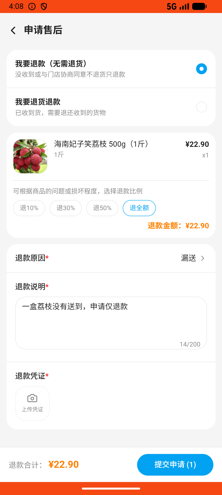
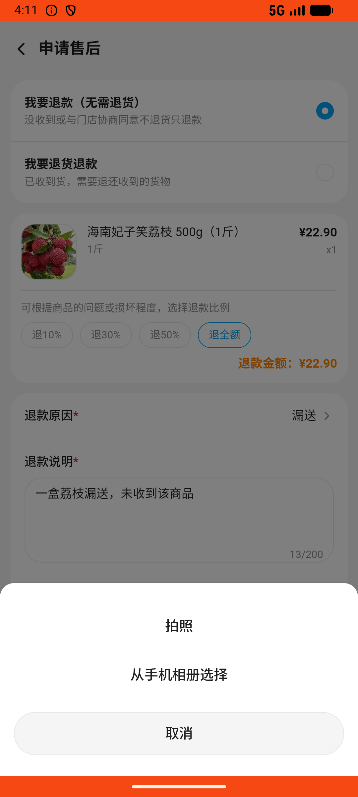

# order_v018_refund_only_missing_item  ⚠️

- **Brand**: `wogoumarket`
- **Class**: `WogoumarketOrderV018RefundOnlyMissingItemTask`
- **Pass@3**: **1/3**  (score = 1.00)
- **Elapsed**: 490s (~8.2 min)
- **Model**: `doubao-seed-2-0-lite-260428`
- **Raw log**: [./raw_logs/WogoumarketOrderV018RefundOnlyMissingItemTask.log](./raw_logs/WogoumarketOrderV018RefundOnlyMissingItemTask.log)
- **Generated**: 2026-06-03T06:07:56+08:00

## Task Goal

> 【当前账户档案】账号：demo@rlbox.ai；昵称：张三；支付密码：123456，如需支付请使用此密码完成支付；默认收货地址（JSON）：{"recipient": "科憨憨", "phone": "13100002345", "address": "腾讯滨海大厦 广东省 深圳市 南山区 1楼东门外卖柜"}。请基于以上档案打开 com.wogoumarket 并完成以下任务：我的订单到了，但是一盒荔枝没有送到，帮我把漏送的商品申请仅退款，退款原因选漏送

## Attempts

| # | Outcome | Steps | Terminated | Reason | Start → End |
|---|---------|-------|------------|--------|-------------|
| 1 | ❌ failed | 18 | answer | 退款单已创建: 未找到退款申请记录 | 2026-06-03 04:05:30 → 2026-06-03 04:08:22 |
| 2 | ❌ failed | 17 | answer | 退款单已创建: 未找到退款申请记录 | 2026-06-03 04:08:22 → 2026-06-03 04:11:03 |
| 3 | ✅ passed | 19 | answer | – | 2026-06-03 04:11:03 → 2026-06-03 04:13:40 |

## Failure Details

### Episode 1 — ❌ failed

- steps_used: `18`
- terminated_reason: `answer`
- reason:

  ```
  退款单已创建: 未找到退款申请记录
  ```
- death shot: 
  - state: [`./death_shots/WogoumarketOrderV018RefundOnlyMissingItemTask/episode_001/step_018.json`](./death_shots/WogoumarketOrderV018RefundOnlyMissingItemTask/episode_001/step_018.json)
  - digest: [`episode_digest.md`](./death_shots/WogoumarketOrderV018RefundOnlyMissingItemTask/episode_001/episode_digest.md)

### Episode 2 — ❌ failed

- steps_used: `17`
- terminated_reason: `answer`
- reason:

  ```
  退款单已创建: 未找到退款申请记录
  ```
- death shot: 
  - state: [`./death_shots/WogoumarketOrderV018RefundOnlyMissingItemTask/episode_002/step_017.json`](./death_shots/WogoumarketOrderV018RefundOnlyMissingItemTask/episode_002/step_017.json)
  - digest: [`episode_digest.md`](./death_shots/WogoumarketOrderV018RefundOnlyMissingItemTask/episode_002/episode_digest.md)

---

> 本摘要由 `sengclaw/scripts/pipeline/log_summarizer.py` 自动生成。 原始完整 log 见上方 Raw log 链接（含每 step 的 messages / tool_call / screenshot 引用）。
