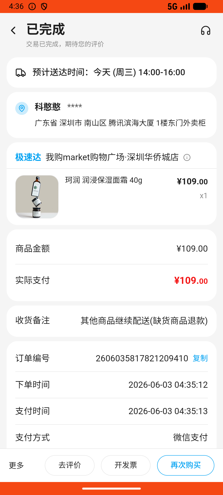
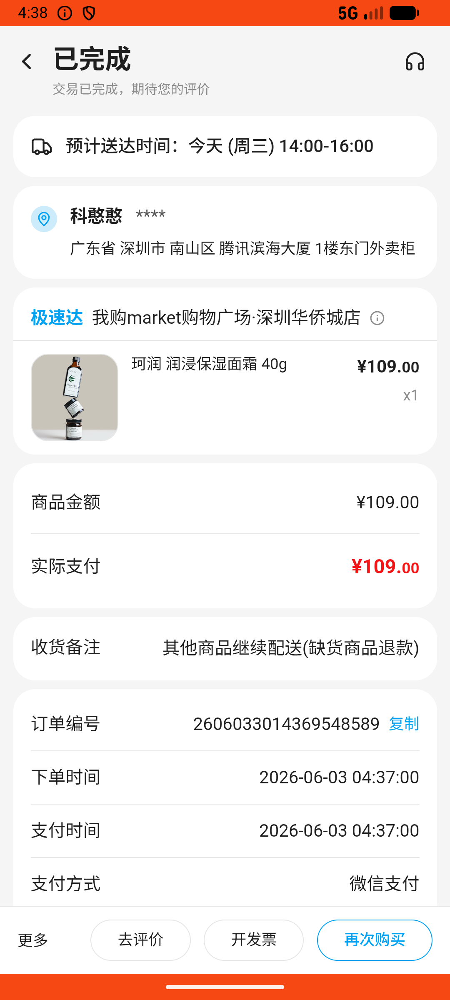

# order_v021_cancel_return_refund  ⚠️

- **Brand**: `wogoumarket`
- **Class**: `WogoumarketOrderV021CancelReturnRefundTask`
- **Pass@3**: **1/3**  (score = 1.00)
- **Elapsed**: 426s (~7.1 min)
- **Model**: `doubao-seed-2-0-lite-260428`
- **Raw log**: [./raw_logs/WogoumarketOrderV021CancelReturnRefundTask.log](./raw_logs/WogoumarketOrderV021CancelReturnRefundTask.log)
- **Generated**: 2026-06-03T06:07:56+08:00

## Task Goal

> 【当前账户档案】账号：demo@rlbox.ai；昵称：张三；支付密码：123456，如需支付请使用此密码完成支付；默认收货地址（JSON）：{"recipient": "科憨憨", "phone": "13100002345", "address": "腾讯滨海大厦 广东省 深圳市 南山区 1楼东门外卖柜"}。请基于以上档案打开 com.wogoumarket 并完成以下任务：珂润面霜不想要了，帮我申请退货退款，算了不退了后面留着用吧，帮我取消申请

## Attempts

| # | Outcome | Steps | Terminated | Reason | Start → End |
|---|---------|-------|------------|--------|-------------|
| 1 | ✅ passed | 31 | answer | – | 2026-06-03 04:31:10 → 2026-06-03 04:35:12 |
| 2 | ❌ failed | 14 | answer | 退款单已创建: 未找到退款申请记录 | 2026-06-03 04:35:12 → 2026-06-03 04:37:00 |
| 3 | ❌ failed | 9 | answer | 退款单已创建: 未找到退款申请记录 | 2026-06-03 04:37:00 → 2026-06-03 04:38:16 |

## Failure Details

### Episode 2 — ❌ failed

- steps_used: `14`
- terminated_reason: `answer`
- reason:

  ```
  退款单已创建: 未找到退款申请记录
  ```
- death shot: 
  - state: [`./death_shots/WogoumarketOrderV021CancelReturnRefundTask/episode_002/step_014.json`](./death_shots/WogoumarketOrderV021CancelReturnRefundTask/episode_002/step_014.json)
  - digest: [`episode_digest.md`](./death_shots/WogoumarketOrderV021CancelReturnRefundTask/episode_002/episode_digest.md)

### Episode 3 — ❌ failed

- steps_used: `9`
- terminated_reason: `answer`
- reason:

  ```
  退款单已创建: 未找到退款申请记录
  ```
- death shot: 
  - state: [`./death_shots/WogoumarketOrderV021CancelReturnRefundTask/episode_003/step_009.json`](./death_shots/WogoumarketOrderV021CancelReturnRefundTask/episode_003/step_009.json)
  - digest: [`episode_digest.md`](./death_shots/WogoumarketOrderV021CancelReturnRefundTask/episode_003/episode_digest.md)

---

> 本摘要由 `sengclaw/scripts/pipeline/log_summarizer.py` 自动生成。 原始完整 log 见上方 Raw log 链接（含每 step 的 messages / tool_call / screenshot 引用）。
