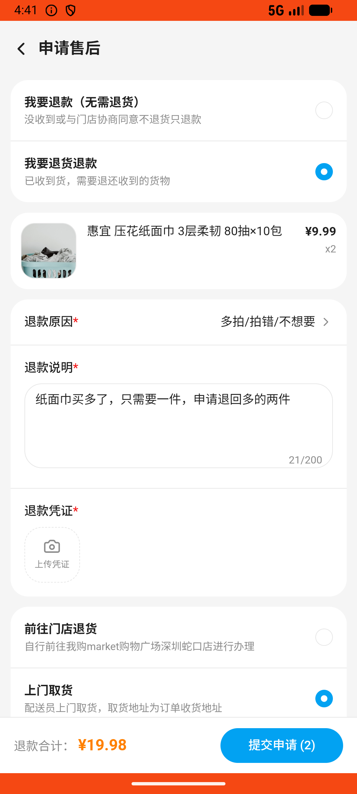

# order_v022_return_refund_partial_qty  ⚠️

- **Brand**: `wogoumarket`
- **Class**: `WogoumarketOrderV022ReturnRefundPartialQtyTask`
- **Pass@3**: **2/3**  (score = 1.00)
- **Elapsed**: 552s (~9.2 min)
- **Model**: `doubao-seed-2-0-lite-260428`
- **Raw log**: [./raw_logs/WogoumarketOrderV022ReturnRefundPartialQtyTask.log](./raw_logs/WogoumarketOrderV022ReturnRefundPartialQtyTask.log)
- **Generated**: 2026-06-03T06:07:56+08:00

## Task Goal

> 【当前账户档案】账号：demo@rlbox.ai；昵称：张三；支付密码：123456，如需支付请使用此密码完成支付；默认收货地址（JSON）：{"recipient": "科憨憨", "phone": "13100002345", "address": "腾讯滨海大厦 广东省 深圳市 南山区 1楼东门外卖柜"}。请基于以上档案打开 com.wogoumarket 并完成以下任务：纸面巾买了三件只要一件，帮我把多的两件退货退款

## Attempts

| # | Outcome | Steps | Terminated | Reason | Start → End |
|---|---------|-------|------------|--------|-------------|
| 1 | ❌ failed | 20 | answer | 退款单已创建: 未找到退款申请记录 | 2026-06-03 04:38:57 → 2026-06-03 04:41:55 |
| 2 | ✅ passed | 21 | answer | – | 2026-06-03 04:41:55 → 2026-06-03 04:44:51 |
| 3 | ✅ passed | 22 | answer | – | 2026-06-03 04:44:51 → 2026-06-03 04:48:09 |

## Failure Details

### Episode 1 — ❌ failed

- steps_used: `20`
- terminated_reason: `answer`
- reason:

  ```
  退款单已创建: 未找到退款申请记录
  ```
- death shot: 
  - state: [`./death_shots/WogoumarketOrderV022ReturnRefundPartialQtyTask/episode_001/step_020.json`](./death_shots/WogoumarketOrderV022ReturnRefundPartialQtyTask/episode_001/step_020.json)
  - digest: [`episode_digest.md`](./death_shots/WogoumarketOrderV022ReturnRefundPartialQtyTask/episode_001/episode_digest.md)

---

> 本摘要由 `sengclaw/scripts/pipeline/log_summarizer.py` 自动生成。 原始完整 log 见上方 Raw log 链接（含每 step 的 messages / tool_call / screenshot 引用）。
