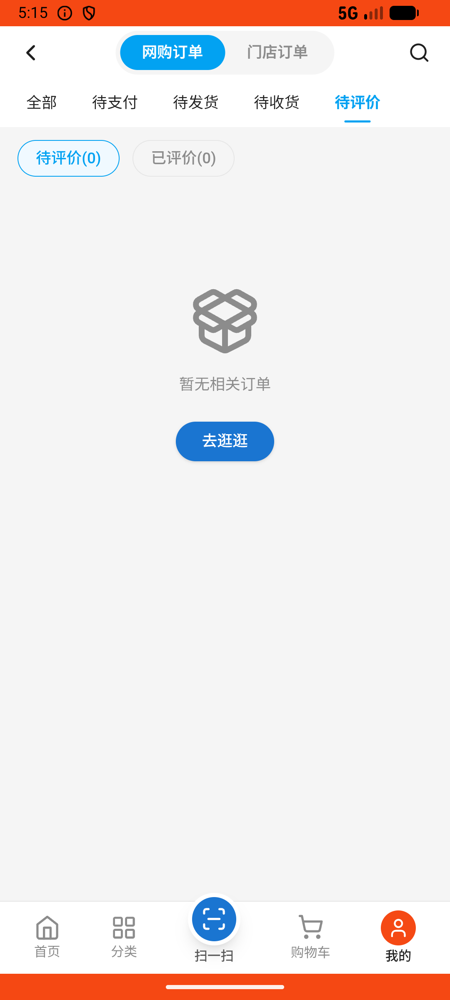

# order_v027_confirm_receipt_and_review  ⚠️

- **Brand**: `wogoumarket`
- **Class**: `WogoumarketOrderV027ConfirmReceiptAndReviewTask`
- **Pass@3**: **1/3**  (score = 1.00)
- **Elapsed**: 237s (~4.0 min)
- **Model**: `doubao-seed-2-0-lite-260428`
- **Raw log**: [./raw_logs/WogoumarketOrderV027ConfirmReceiptAndReviewTask.log](./raw_logs/WogoumarketOrderV027ConfirmReceiptAndReviewTask.log)
- **Generated**: 2026-06-03T06:07:56+08:00

## Task Goal

> 【当前账户档案】账号：demo@rlbox.ai；昵称：张三；支付密码：123456，如需支付请使用此密码完成支付；默认收货地址（JSON）：{"recipient": "科憨憨", "phone": "13100002345", "address": "腾讯滨海大厦 广东省 深圳市 南山区 1楼东门外卖柜"}。请基于以上档案打开 com.wogoumarket 并完成以下任务：前几天买的水星家纺夏季空调被感觉质量很好，帮我确认收货后给个好评，服务评分都给5星

## Attempts

| # | Outcome | Steps | Terminated | Reason | Start → End |
|---|---------|-------|------------|--------|-------------|
| 1 | ❌ failed | 10 | answer | 订单已确认收货并完成评价: 预期订单状态为 completed，实际为 shipping; 商品评价已创建且为好评: 未找到评价记录; 服务评分三项均为5星: 未找到服务评分数据 | 2026-06-03 05:14:38 → 2026-06-03 05:15:47 |
| 2 | ❌ failed | 10 | answer | 订单已确认收货并完成评价: 预期订单状态为 completed，实际为 shipping; 商品评价已创建且为好评: 未找到评价记录; 服务评分三项均为5星: 未找到服务评分数据 | 2026-06-03 05:15:47 → 2026-06-03 05:16:59 |
| 3 | ✅ passed | 14 | answer | – | 2026-06-03 05:16:59 → 2026-06-03 05:18:35 |

## Failure Details

### Episode 1 — ❌ failed

- steps_used: `10`
- terminated_reason: `answer`
- reason:

  ```
  订单已确认收货并完成评价: 预期订单状态为 completed，实际为 shipping; 商品评价已创建且为好评: 未找到评价记录; 服务评分三项均为5星: 未找到服务评分数据
  ```
- death shot: 
  - state: [`./death_shots/WogoumarketOrderV027ConfirmReceiptAndReviewTask/episode_001/step_010.json`](./death_shots/WogoumarketOrderV027ConfirmReceiptAndReviewTask/episode_001/step_010.json)
  - digest: [`episode_digest.md`](./death_shots/WogoumarketOrderV027ConfirmReceiptAndReviewTask/episode_001/episode_digest.md)

### Episode 2 — ❌ failed

- steps_used: `10`
- terminated_reason: `answer`
- reason:

  ```
  订单已确认收货并完成评价: 预期订单状态为 completed，实际为 shipping; 商品评价已创建且为好评: 未找到评价记录; 服务评分三项均为5星: 未找到服务评分数据
  ```
- death shot: 
  - state: [`./death_shots/WogoumarketOrderV027ConfirmReceiptAndReviewTask/episode_002/step_010.json`](./death_shots/WogoumarketOrderV027ConfirmReceiptAndReviewTask/episode_002/step_010.json)
  - digest: [`episode_digest.md`](./death_shots/WogoumarketOrderV027ConfirmReceiptAndReviewTask/episode_002/episode_digest.md)

---

> 本摘要由 `sengclaw/scripts/pipeline/log_summarizer.py` 自动生成。 原始完整 log 见上方 Raw log 链接（含每 step 的 messages / tool_call / screenshot 引用）。
