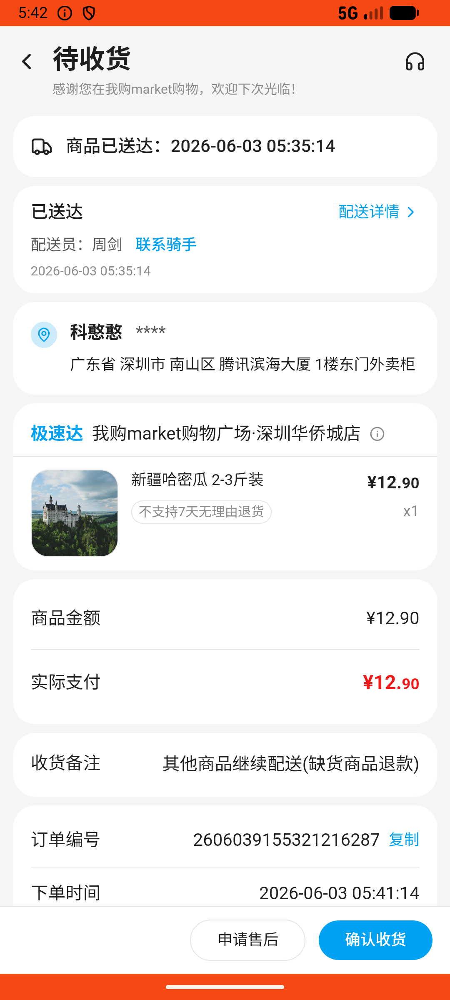

# order_v032_check_logistics_then_confirm  ⚠️

- **Brand**: `wogoumarket`
- **Class**: `WogoumarketOrderV032CheckLogisticsThenConfirmTask`
- **Pass@3**: **2/3**  (score = 1.00)
- **Elapsed**: 181s (~3.0 min)
- **Model**: `doubao-seed-2-0-lite-260428`
- **Raw log**: [./raw_logs/WogoumarketOrderV032CheckLogisticsThenConfirmTask.log](./raw_logs/WogoumarketOrderV032CheckLogisticsThenConfirmTask.log)
- **Generated**: 2026-06-03T06:07:56+08:00

## Task Goal

> 【当前账户档案】账号：demo@rlbox.ai；昵称：张三；支付密码：123456，如需支付请使用此密码完成支付；默认收货地址（JSON）：{"recipient": "科憨憨", "phone": "13100002345", "address": "腾讯滨海大厦 广东省 深圳市 南山区 1楼东门外卖柜"}。请基于以上档案打开 com.wogoumarket 并完成以下任务：半小时前下了个哈密瓜的单，帮我去待收货里看看订单详情和物流配送情况

## Attempts

| # | Outcome | Steps | Terminated | Reason | Start → End |
|---|---------|-------|------------|--------|-------------|
| 1 | ❌ failed | 11 | answer | 查看了物流详情: 未检测到查看物流详情的记录 | 2026-06-03 05:41:14 → 2026-06-03 05:42:37 |
| 2 | ✅ passed | 6 | answer | – | 2026-06-03 05:42:37 → 2026-06-03 05:43:23 |
| 3 | ✅ passed | 6 | answer | – | 2026-06-03 05:43:23 → 2026-06-03 05:44:15 |

## Failure Details

### Episode 1 — ❌ failed

- steps_used: `11`
- terminated_reason: `answer`
- reason:

  ```
  查看了物流详情: 未检测到查看物流详情的记录
  ```
- death shot: 
  - state: [`./death_shots/WogoumarketOrderV032CheckLogisticsThenConfirmTask/episode_001/step_011.json`](./death_shots/WogoumarketOrderV032CheckLogisticsThenConfirmTask/episode_001/step_011.json)
  - digest: [`episode_digest.md`](./death_shots/WogoumarketOrderV032CheckLogisticsThenConfirmTask/episode_001/episode_digest.md)

---

> 本摘要由 `sengclaw/scripts/pipeline/log_summarizer.py` 自动生成。 原始完整 log 见上方 Raw log 链接（含每 step 的 messages / tool_call / screenshot 引用）。
