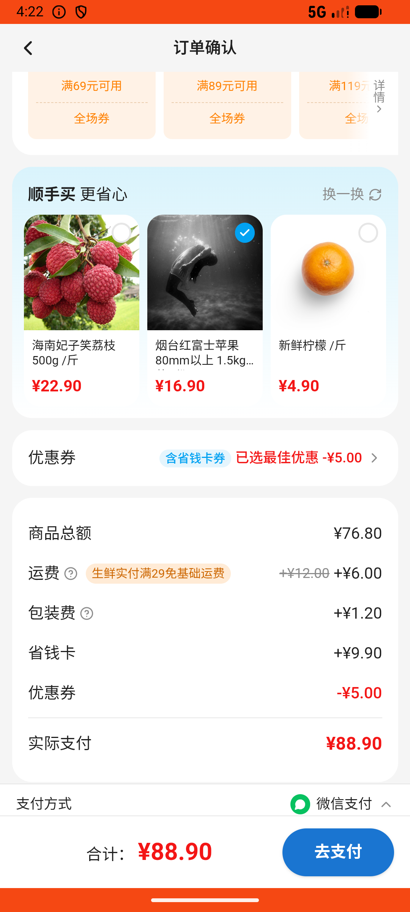
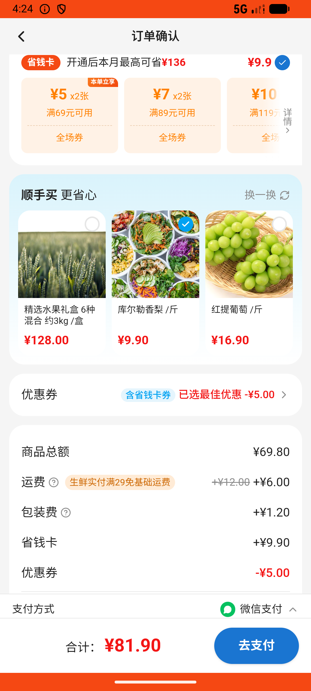
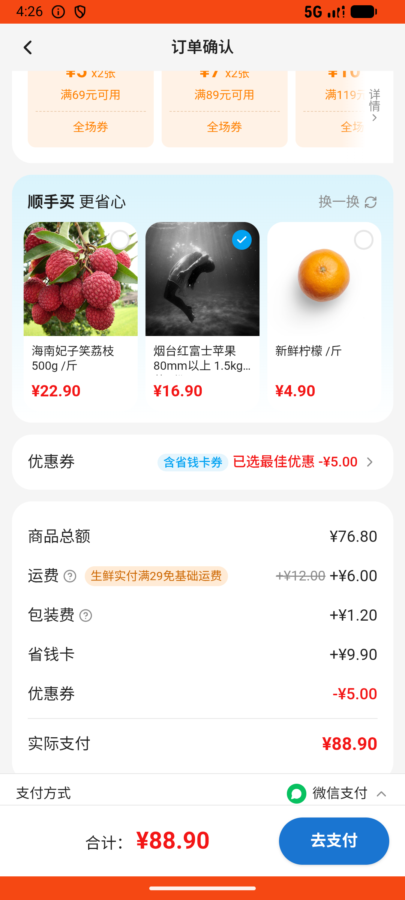

# checkout_v022_saving_card_addon_coupon  ❌

- **Brand**: `wogoumarket`
- **Class**: `WogoumarketCheckoutV022SavingCardAddonCouponTask`
- **Pass@3**: **0/3**  (score = 0.00)
- **Elapsed**: 326s (~5.4 min)
- **Model**: `doubao-seed-2-0-lite-260428`
- **Raw log**: [./raw_logs/WogoumarketCheckoutV022SavingCardAddonCouponTask.log](./raw_logs/WogoumarketCheckoutV022SavingCardAddonCouponTask.log)
- **Generated**: 2026-06-04T19:08:50+08:00

## Task Goal

> 【当前账户档案】账号：demo@rlbox.ai；昵称：张三；支付密码：123456，如需支付请使用此密码完成支付；默认收货地址（JSON）：{"recipient": "科憨憨", "phone": "13100002345", "address": "腾讯滨海大厦 广东省 深圳市 南山区 1楼东门外卖柜"}。请基于以上档案打开 com.wogoumarket 并完成以下任务：结算订单时，我勾选了省钱卡，但是一张优惠券都没满足条件，我想从顺手买里凑点单使用一张优惠券

## Attempts

| # | Outcome | Steps | Terminated | Reason | Start → End |
|---|---------|-------|------------|--------|-------------|
| 1 | ❌ failed | 8 | answer | 产生已支付订单: 未找到已支付的订单 | 2026-06-04 16:21:05 → 2026-06-04 16:22:29 |
| 2 | ❌ failed | 12 | answer | 产生已支付订单: 未找到已支付的订单 | 2026-06-04 16:22:29 → 2026-06-04 16:25:01 |
| 3 | ❌ failed | 8 | answer | 产生已支付订单: 未找到已支付的订单 | 2026-06-04 16:25:01 → 2026-06-04 16:26:31 |

## Failure Details

### Episode 1 — ❌ failed

- steps_used: `8`
- terminated_reason: `answer`
- reason:

  ```
  产生已支付订单: 未找到已支付的订单
  ```
- death shot: 
  - state: [`./death_shots/WogoumarketCheckoutV022SavingCardAddonCouponTask/episode_001/step_008.json`](./death_shots/WogoumarketCheckoutV022SavingCardAddonCouponTask/episode_001/step_008.json)
  - digest: [`episode_digest.md`](./death_shots/WogoumarketCheckoutV022SavingCardAddonCouponTask/episode_001/episode_digest.md)

### Episode 2 — ❌ failed

- steps_used: `12`
- terminated_reason: `answer`
- reason:

  ```
  产生已支付订单: 未找到已支付的订单
  ```
- death shot: 
  - state: [`./death_shots/WogoumarketCheckoutV022SavingCardAddonCouponTask/episode_002/step_012.json`](./death_shots/WogoumarketCheckoutV022SavingCardAddonCouponTask/episode_002/step_012.json)
  - digest: [`episode_digest.md`](./death_shots/WogoumarketCheckoutV022SavingCardAddonCouponTask/episode_002/episode_digest.md)

### Episode 3 — ❌ failed

- steps_used: `8`
- terminated_reason: `answer`
- reason:

  ```
  产生已支付订单: 未找到已支付的订单
  ```
- death shot: 
  - state: [`./death_shots/WogoumarketCheckoutV022SavingCardAddonCouponTask/episode_003/step_008.json`](./death_shots/WogoumarketCheckoutV022SavingCardAddonCouponTask/episode_003/step_008.json)
  - digest: [`episode_digest.md`](./death_shots/WogoumarketCheckoutV022SavingCardAddonCouponTask/episode_003/episode_digest.md)

---

> 本摘要由 `sengclaw/scripts/pipeline/log_summarizer.py` 自动生成。 原始完整 log 见上方 Raw log 链接（含每 step 的 messages / tool_call / screenshot 引用）。
