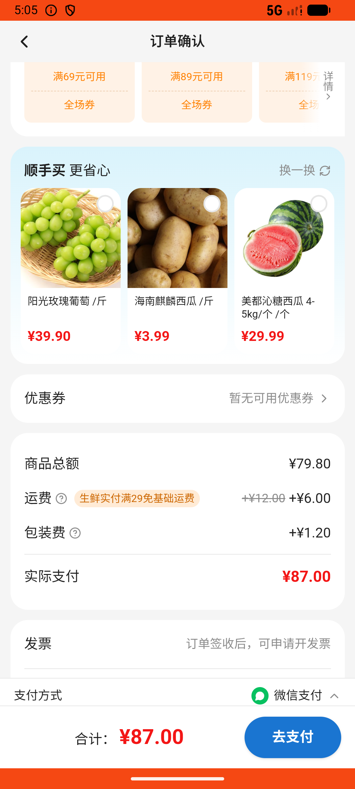
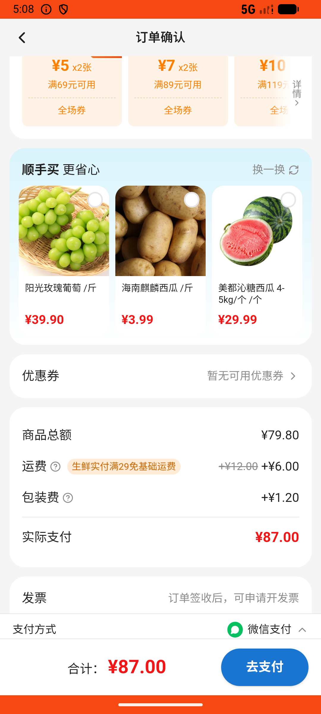
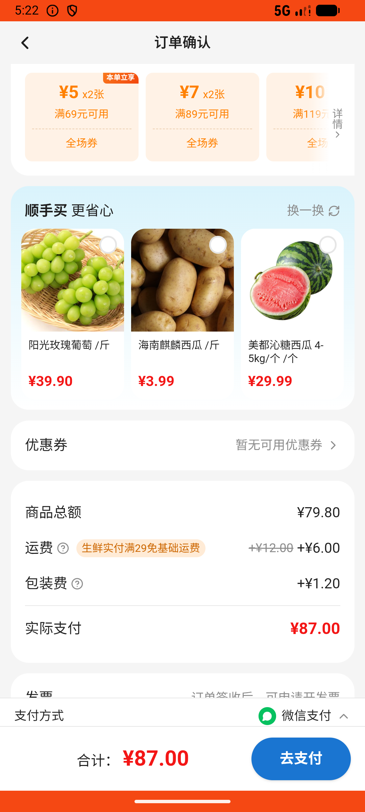

# checkout_v026_recommendation_refresh_then_pay  ❌

- **Brand**: `wogoumarket`
- **Class**: `WogoumarketCheckoutV026RecommendationRefreshThenPayTask`
- **Pass@3**: **0/3**  (score = 0.00)
- **Elapsed**: 1488s (~24.8 min)
- **Model**: `doubao-seed-2-0-lite-260428`
- **Raw log**: [./raw_logs/WogoumarketCheckoutV026RecommendationRefreshThenPayTask.log](./raw_logs/WogoumarketCheckoutV026RecommendationRefreshThenPayTask.log)
- **Generated**: 2026-06-04T19:08:50+08:00

## Task Goal

> 【当前账户档案】账号：demo@rlbox.ai；昵称：张三；支付密码：123456，如需支付请使用此密码完成支付；默认收货地址（JSON）：{"recipient": "科憨憨", "phone": "13100002345", "address": "腾讯滨海大厦 广东省 深圳市 南山区 1楼东门外卖柜"}。请基于以上档案打开 com.wogoumarket 并完成以下任务：帮我结算购物车，到订单确认页看看顺手买有啥好东西，点一下换一换看看别的，算了没啥想要的，直接付款吧

## Attempts

| # | Outcome | Steps | Terminated | Reason | Start → End |
|---|---------|-------|------------|--------|-------------|
| 1 | ❌ failed | 45 | answer | 点击了换一换（埋点记录存在）: 未找到换一换的埋点记录; 订单已创建并支付: 未找到已支付的订单 | 2026-06-04 16:57:48 → 2026-06-04 17:05:33 |
| 2 | ❌ failed | 17 | answer | 点击了换一换（埋点记录存在）: 未找到换一换的埋点记录; 订单已创建并支付: 未找到已支付的订单 | 2026-06-04 17:05:33 → 2026-06-04 17:08:26 |
| 3 | ⏰ timeout | 80 | max_steps | 点击了换一换（埋点记录存在）: 未找到换一换的埋点记录; 订单已创建并支付: 未找到已支付的订单 | 2026-06-04 17:08:26 → 2026-06-04 17:22:36 |

## Failure Details

### Episode 1 — ❌ failed

- steps_used: `45`
- terminated_reason: `answer`
- reason:

  ```
  点击了换一换（埋点记录存在）: 未找到换一换的埋点记录; 订单已创建并支付: 未找到已支付的订单
  ```
- death shot: 
  - state: [`./death_shots/WogoumarketCheckoutV026RecommendationRefreshThenPayTask/episode_001/step_045.json`](./death_shots/WogoumarketCheckoutV026RecommendationRefreshThenPayTask/episode_001/step_045.json)
  - digest: [`episode_digest.md`](./death_shots/WogoumarketCheckoutV026RecommendationRefreshThenPayTask/episode_001/episode_digest.md)

### Episode 2 — ❌ failed

- steps_used: `17`
- terminated_reason: `answer`
- reason:

  ```
  点击了换一换（埋点记录存在）: 未找到换一换的埋点记录; 订单已创建并支付: 未找到已支付的订单
  ```
- death shot: 
  - state: [`./death_shots/WogoumarketCheckoutV026RecommendationRefreshThenPayTask/episode_002/step_017.json`](./death_shots/WogoumarketCheckoutV026RecommendationRefreshThenPayTask/episode_002/step_017.json)
  - digest: [`episode_digest.md`](./death_shots/WogoumarketCheckoutV026RecommendationRefreshThenPayTask/episode_002/episode_digest.md)

### Episode 3 — ⏰ timeout

- steps_used: `80`
- terminated_reason: `max_steps`
- reason:

  ```
  点击了换一换（埋点记录存在）: 未找到换一换的埋点记录; 订单已创建并支付: 未找到已支付的订单
  ```
- death shot: 
  - state: [`./death_shots/WogoumarketCheckoutV026RecommendationRefreshThenPayTask/episode_003/step_080.json`](./death_shots/WogoumarketCheckoutV026RecommendationRefreshThenPayTask/episode_003/step_080.json)
  - digest: [`episode_digest.md`](./death_shots/WogoumarketCheckoutV026RecommendationRefreshThenPayTask/episode_003/episode_digest.md)

---

> 本摘要由 `sengclaw/scripts/pipeline/log_summarizer.py` 自动生成。 原始完整 log 见上方 Raw log 链接（含每 step 的 messages / tool_call / screenshot 引用）。
