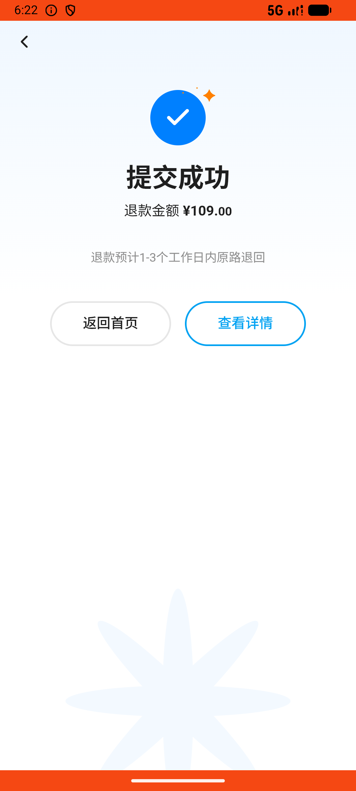
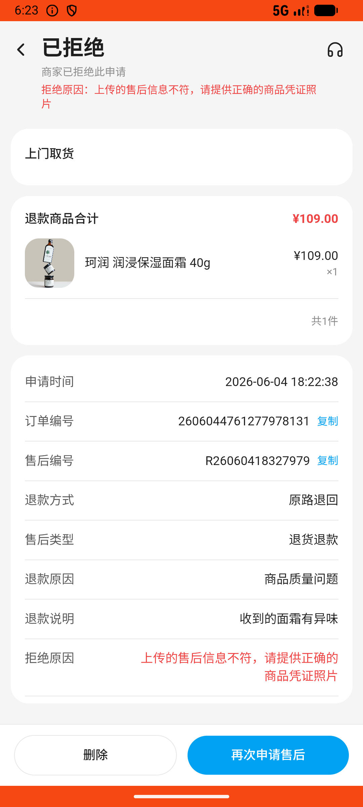
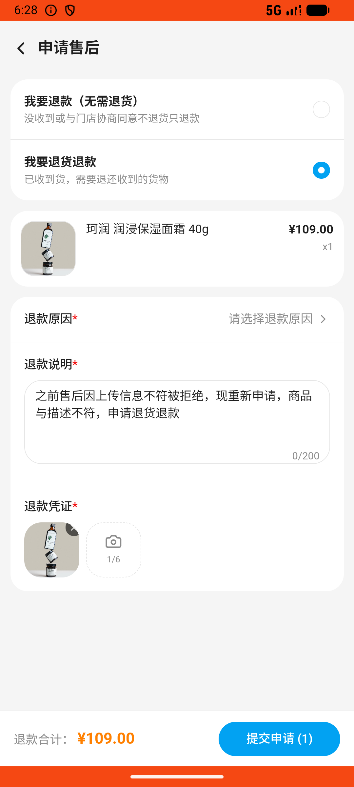

# order_v041_refund_rejected_reapply  ❌

- **Brand**: `wogoumarket`
- **Class**: `WogoumarketOrderV041RefundRejectedReapplyTask`
- **Pass@3**: **0/3**  (score = 0.00)
- **Elapsed**: 490s (~8.2 min)
- **Model**: `doubao-seed-2-0-lite-260428`
- **Raw log**: [./raw_logs/WogoumarketOrderV041RefundRejectedReapplyTask.log](./raw_logs/WogoumarketOrderV041RefundRejectedReapplyTask.log)
- **Generated**: 2026-06-04T19:08:50+08:00

## Task Goal

> 【当前账户档案】账号：demo@rlbox.ai；昵称：张三；支付密码：123456，如需支付请使用此密码完成支付；默认收货地址（JSON）：{"recipient": "科憨憨", "phone": "13100002345", "address": "腾讯滨海大厦 广东省 深圳市 南山区 1楼东门外卖柜"}。请基于以上档案打开 com.wogoumarket 并完成以下任务：刚看到有个消息说我订单退款失败了，好像是上传的售后信息不符被拒绝了，去看看啥情况，然后重新申请售后

## Attempts

| # | Outcome | Steps | Terminated | Reason | Start → End |
|---|---------|-------|------------|--------|-------------|
| 1 | ❌ failed | 19 | answer | 通知已读: 通知未被标记为已读 | 2026-06-04 18:20:11 → 2026-06-04 18:22:38 |
| 2 | ❌ failed | 6 | answer | 通知已读: 通知未被标记为已读; 新退款单已创建: 未找到新的退款申请 | 2026-06-04 18:22:38 → 2026-06-04 18:23:20 |
| 3 | ❌ failed | 38 | answer | 通知已读: 通知未被标记为已读; 新退款单已创建: 未找到新的退款申请 | 2026-06-04 18:23:20 → 2026-06-04 18:28:21 |

## Failure Details

### Episode 1 — ❌ failed

- steps_used: `19`
- terminated_reason: `answer`
- reason:

  ```
  通知已读: 通知未被标记为已读
  ```
- death shot: 
  - state: [`./death_shots/WogoumarketOrderV041RefundRejectedReapplyTask/episode_001/step_019.json`](./death_shots/WogoumarketOrderV041RefundRejectedReapplyTask/episode_001/step_019.json)
  - digest: [`episode_digest.md`](./death_shots/WogoumarketOrderV041RefundRejectedReapplyTask/episode_001/episode_digest.md)

### Episode 2 — ❌ failed

- steps_used: `6`
- terminated_reason: `answer`
- reason:

  ```
  通知已读: 通知未被标记为已读; 新退款单已创建: 未找到新的退款申请
  ```
- death shot: 
  - state: [`./death_shots/WogoumarketOrderV041RefundRejectedReapplyTask/episode_002/step_006.json`](./death_shots/WogoumarketOrderV041RefundRejectedReapplyTask/episode_002/step_006.json)
  - digest: [`episode_digest.md`](./death_shots/WogoumarketOrderV041RefundRejectedReapplyTask/episode_002/episode_digest.md)

### Episode 3 — ❌ failed

- steps_used: `38`
- terminated_reason: `answer`
- reason:

  ```
  通知已读: 通知未被标记为已读; 新退款单已创建: 未找到新的退款申请
  ```
- death shot: 
  - state: [`./death_shots/WogoumarketOrderV041RefundRejectedReapplyTask/episode_003/step_038.json`](./death_shots/WogoumarketOrderV041RefundRejectedReapplyTask/episode_003/step_038.json)
  - digest: [`episode_digest.md`](./death_shots/WogoumarketOrderV041RefundRejectedReapplyTask/episode_003/episode_digest.md)

---

> 本摘要由 `sengclaw/scripts/pipeline/log_summarizer.py` 自动生成。 原始完整 log 见上方 Raw log 链接（含每 step 的 messages / tool_call / screenshot 引用）。
