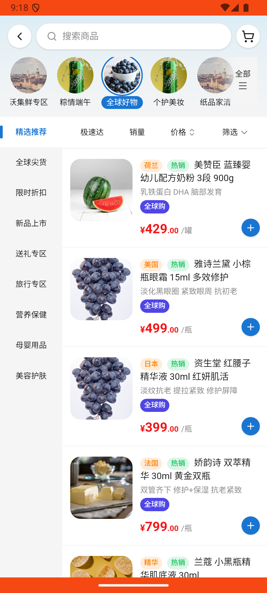

# catalog_v015_global_goods_skincare_find_and_cart  ❌

- **Brand**: `wogoumarket`
- **Class**: `WogoumarketCatalogV015GlobalGoodsSkincareFindAndCartTask`
- **Pass@3**: **0/3**  (score = 0.00)
- **Elapsed**: 456s (~7.6 min)
- **Model**: `doubao-seed-2-0-lite-260428`
- **Raw log**: [./raw_logs/WogoumarketCatalogV015GlobalGoodsSkincareFindAndCartTask.log](./raw_logs/WogoumarketCatalogV015GlobalGoodsSkincareFindAndCartTask.log)
- **Generated**: 2026-06-08T17:01:53+08:00

## Task Goal

> 看看全球好物分类中有没有护肤品，全球尖货里有神仙水爽肤水，帮我加入购物车吧

## System Prompt

<details>
<summary>展开查看完整 System Prompt</summary>


> You are provided with a task description, a history of previous actions, and corresponding screenshots. Your goal is to perform the next action to complete the task. Please note that if performing the same action multiple times results in a static screen with no changes, you should attempt a modified or alternative action.
> 
> ---
> 
> ## Function Definition
> 
> - `clarify` — Ask the user for more information to complete the task.
> - `click` — Mouse left single click action.
> - `double_click` — Mouse left double click action.
> - `drag` — Perform a drag action from the start point to the end point. Typically used for swiping or selecting elements.
> - `long_press` — Perform a long press action at the specified coordinates.
> - `open_app` — Open the specified application.
> - `press_back` — Press the back button.
> - `press_enter` — Press the enter key.
> - `press_home` — Press the home button.
> - `take_notes` — Take notes and report the result in the specified content.
> - `type` — Type the specified content. You should manually delete any text from the input box that you want to remove.
> - `wait` — Wait for a certain period of time.

</details>

## User Query

> 请在 com.wogoumarket 里面完成以下任务：
> 看看全球好物分类中有没有护肤品，全球尖货里有神仙水爽肤水，帮我加入购物车吧

## Attempts

| # | Outcome | Steps | Terminated | Reason | Start → End |
|---|---------|-------|------------|--------|-------------|
| 1 | ❌ failed | 18 | answer | 浏览了全球好物分类页的美容护肤或全球尖货子分类: 未检测到浏览「美容护肤」或「全球尖货」子分类的记录，实际浏览: [] Diff: @@ -1 +1 @@ -true +false ; 购物车中有 SK-II 神仙水爽肤水: 未找到「SK-II 神仙水爽肤水 75ml 护肤... | 2026-06-08 09:13:12 → 2026-06-08 09:18:47 |
| 2 | 💥 error | 0 | exception | exception: 500 Internal Server Error for url: http://localhost:6800/task/init \\| detail: init_task('WogoumarketCatalogV015GlobalGoodsSki... | 2026-06-08 09:18:47 → 2026-06-08 09:19:48 |
| 3 | 💥 error | 0 | exception | exception: 500 Internal Server Error for url: http://localhost:6800/task/init \\| detail: init_task('WogoumarketCatalogV015GlobalGoodsSki... | 2026-06-08 09:19:48 → 2026-06-08 09:20:48 |

## Failure Details

### Episode 1 — ❌ failed

- steps_used: `18`
- terminated_reason: `answer`
- reason:

  ```
  浏览了全球好物分类页的美容护肤或全球尖货子分类: 未检测到浏览「美容护肤」或「全球尖货」子分类的记录，实际浏览: []
  Diff:
  @@ -1 +1 @@
  -true
  +false
  ; 购物车中有 SK-II 神仙水爽肤水: 未找到「SK-II 神仙水爽肤水 75ml 护肤精华水」的购物车条目; 加购数量至少为1: 购物车条目不存在
  ```
- death shot: 
  - state: [`./death_shots/WogoumarketCatalogV015GlobalGoodsSkincareFindAndCartTask/episode_001/step_018.json`](./death_shots/WogoumarketCatalogV015GlobalGoodsSkincareFindAndCartTask/episode_001/step_018.json)
  - digest: [`episode_digest.md`](./death_shots/WogoumarketCatalogV015GlobalGoodsSkincareFindAndCartTask/episode_001/episode_digest.md)

### Episode 2 — 💥 error

- steps_used: `0`
- terminated_reason: `exception`
- reason:

  ```
  exception: 500 Internal Server Error for url: http://localhost:6800/task/init | detail: init_task('WogoumarketCatalogV015GlobalGoodsSkincareFindAndCartTask') failed: Task 'WogoumarketCatalogV015GlobalGoodsSkincareFindAndCartTask' failed during initialize_task()
  ```

### Episode 3 — 💥 error

- steps_used: `0`
- terminated_reason: `exception`
- reason:

  ```
  exception: 500 Internal Server Error for url: http://localhost:6800/task/init | detail: init_task('WogoumarketCatalogV015GlobalGoodsSkincareFindAndCartTask') failed: Task 'WogoumarketCatalogV015GlobalGoodsSkincareFindAndCartTask' failed during initialize_task()
  ```

---

> 本摘要由 `sengclaw/scripts/pipeline/log_summarizer.py` 自动生成。 原始完整 log 见上方 Raw log 链接（含每 step 的 messages / tool_call / screenshot 引用）。
