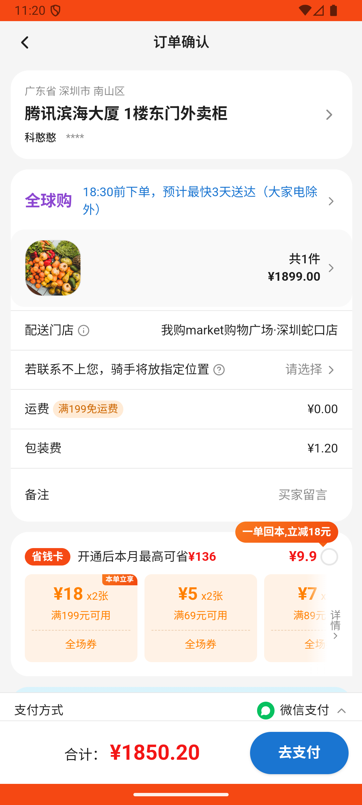

# common_v020_search_augustinus_coupon_checkout  ❌

- **Brand**: `wogoumarket`
- **Class**: `WogoumarketCommonV020SearchAugustinusCouponCheckoutTask`
- **Pass@3**: **0/3**  (score = 0.00)
- **Elapsed**: 398s (~6.6 min)
- **Model**: `doubao-seed-2-0-lite-260428`
- **Raw log**: [./raw_logs/WogoumarketCommonV020SearchAugustinusCouponCheckoutTask.log](./raw_logs/WogoumarketCommonV020SearchAugustinusCouponCheckoutTask.log)
- **Generated**: 2026-06-08T17:01:53+08:00

## Task Goal

> 最近我的脸有点敏感，我有个朋友推荐我用Augustinus Bader 焕肤修护面霜，搜一下找到它并看看商品详情，有个满500减50的券帮我领了，然后把面霜加入购物车，并使用优惠券进行支付

## System Prompt

<details>
<summary>展开查看完整 System Prompt</summary>


> You are provided with a task description, a history of previous actions, and corresponding screenshots. Your goal is to perform the next action to complete the task. Please note that if performing the same action multiple times results in a static screen with no changes, you should attempt a modified or alternative action.
> 
> ---
> 
> ## Function Definition
> 
> - `clarify` — Ask the user for more information to complete the task.
> - `click` — Mouse left single click action.
> - `double_click` — Mouse left double click action.
> - `drag` — Perform a drag action from the start point to the end point. Typically used for swiping or selecting elements.
> - `long_press` — Perform a long press action at the specified coordinates.
> - `open_app` — Open the specified application.
> - `press_back` — Press the back button.
> - `press_enter` — Press the enter key.
> - `press_home` — Press the home button.
> - `take_notes` — Take notes and report the result in the specified content.
> - `type` — Type the specified content. You should manually delete any text from the input box that you want to remove.
> - `wait` — Wait for a certain period of time.

</details>

## User Query

> 请在 com.wogoumarket 里面完成以下任务：
> 最近我的脸有点敏感，我有个朋友推荐我用Augustinus Bader 焕肤修护面霜，搜一下找到它并看看商品详情，有个满500减50的券帮我领了，然后把面霜加入购物车，并使用优惠券进行支付

## Attempts

| # | Outcome | Steps | Terminated | Reason | Start → End |
|---|---------|-------|------------|--------|-------------|
| 1 | ❌ failed | 14 | answer | 查看了 Augustinus Bader 焕肤修护面霜的商品详情: 未检测到查看「Augustinus Bader 焕肤修护面霜」商品详情的记录; 订单已创建并支付: 未找到已支付的订单 | 2026-06-08 11:15:31 → 2026-06-08 11:20:08 |
| 2 | 💥 error | 0 | exception | exception: 500 Internal Server Error for url: http://localhost:6800/task/init \\| detail: init_task('WogoumarketCommonV020SearchAugustinu... | 2026-06-08 11:20:08 → 2026-06-08 11:21:08 |
| 3 | 💥 error | 0 | exception | exception: 500 Internal Server Error for url: http://localhost:6800/task/init \\| detail: init_task('WogoumarketCommonV020SearchAugustinu... | 2026-06-08 11:21:08 → 2026-06-08 11:22:08 |

## Failure Details

### Episode 1 — ❌ failed

- steps_used: `14`
- terminated_reason: `answer`
- reason:

  ```
  查看了 Augustinus Bader 焕肤修护面霜的商品详情: 未检测到查看「Augustinus Bader 焕肤修护面霜」商品详情的记录; 订单已创建并支付: 未找到已支付的订单
  ```
- death shot: 
  - state: [`./death_shots/WogoumarketCommonV020SearchAugustinusCouponCheckoutTask/episode_001/step_014.json`](./death_shots/WogoumarketCommonV020SearchAugustinusCouponCheckoutTask/episode_001/step_014.json)
  - digest: [`episode_digest.md`](./death_shots/WogoumarketCommonV020SearchAugustinusCouponCheckoutTask/episode_001/episode_digest.md)

### Episode 2 — 💥 error

- steps_used: `0`
- terminated_reason: `exception`
- reason:

  ```
  exception: 500 Internal Server Error for url: http://localhost:6800/task/init | detail: init_task('WogoumarketCommonV020SearchAugustinusCouponCheckoutTask') failed: Task 'WogoumarketCommonV020SearchAugustinusCouponCheckoutTask' failed during initialize_task()
  ```

### Episode 3 — 💥 error

- steps_used: `0`
- terminated_reason: `exception`
- reason:

  ```
  exception: 500 Internal Server Error for url: http://localhost:6800/task/init | detail: init_task('WogoumarketCommonV020SearchAugustinusCouponCheckoutTask') failed: Task 'WogoumarketCommonV020SearchAugustinusCouponCheckoutTask' failed during initialize_task()
  ```

---

> 本摘要由 `sengclaw/scripts/pipeline/log_summarizer.py` 自动生成。 原始完整 log 见上方 Raw log 链接（含每 step 的 messages / tool_call / screenshot 引用）。
