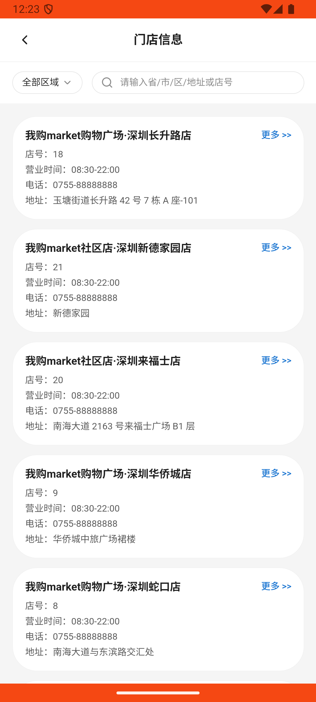

# customer_service_v006_ask_store_info  ❌

- **Brand**: `wogoumarket`
- **Class**: `WogoumarketCustomerServiceV006AskStoreInfoTask`
- **Pass@3**: **0/3**  (score = 0.00)
- **Elapsed**: 301s (~5.0 min)
- **Model**: `doubao-seed-2-0-lite-260428`
- **Raw log**: [./raw_logs/WogoumarketCustomerServiceV006AskStoreInfoTask.log](./raw_logs/WogoumarketCustomerServiceV006AskStoreInfoTask.log)
- **Generated**: 2026-06-08T17:01:53+08:00

## Task Goal

> 我想知道距离我最近的门店营业时间，帮我问一下在线客服

## System Prompt

<details>
<summary>展开查看完整 System Prompt</summary>


> You are provided with a task description, a history of previous actions, and corresponding screenshots. Your goal is to perform the next action to complete the task. Please note that if performing the same action multiple times results in a static screen with no changes, you should attempt a modified or alternative action.
> 
> ---
> 
> ## Function Definition
> 
> - `clarify` — Ask the user for more information to complete the task.
> - `click` — Mouse left single click action.
> - `double_click` — Mouse left double click action.
> - `drag` — Perform a drag action from the start point to the end point. Typically used for swiping or selecting elements.
> - `long_press` — Perform a long press action at the specified coordinates.
> - `open_app` — Open the specified application.
> - `press_back` — Press the back button.
> - `press_enter` — Press the enter key.
> - `press_home` — Press the home button.
> - `take_notes` — Take notes and report the result in the specified content.
> - `type` — Type the specified content. You should manually delete any text from the input box that you want to remove.
> - `wait` — Wait for a certain period of time.

</details>

## User Query

> 请在 com.wogoumarket 里面完成以下任务：
> 我想知道距离我最近的门店营业时间，帮我问一下在线客服

## Attempts

| # | Outcome | Steps | Terminated | Reason | Start → End |
|---|---------|-------|------------|--------|-------------|
| 1 | ❌ failed | 12 | answer | 用户发送了门店相关消息: 未找到用户询问门店信息的消息; 机器人回复了门店营业时间: 未找到机器人回复的门店营业时间; 回复包含具体营业时间: 回复中未包含具体营业时间（如 08:30-22:00） | 2026-06-08 12:20:36 → 2026-06-08 12:23:36 |
| 2 | 💥 error | 0 | exception | exception: 500 Internal Server Error for url: http://localhost:6800/task/init \\| detail: init_task('WogoumarketCustomerServiceV006AskSto... | 2026-06-08 12:23:36 → 2026-06-08 12:24:36 |
| 3 | 💥 error | 0 | exception | exception: 500 Internal Server Error for url: http://localhost:6800/task/init \\| detail: init_task('WogoumarketCustomerServiceV006AskSto... | 2026-06-08 12:24:36 → 2026-06-08 12:25:36 |

## Failure Details

### Episode 1 — ❌ failed

- steps_used: `12`
- terminated_reason: `answer`
- reason:

  ```
  用户发送了门店相关消息: 未找到用户询问门店信息的消息; 机器人回复了门店营业时间: 未找到机器人回复的门店营业时间; 回复包含具体营业时间: 回复中未包含具体营业时间（如 08:30-22:00）
  ```
- death shot: 
  - state: [`./death_shots/WogoumarketCustomerServiceV006AskStoreInfoTask/episode_001/step_012.json`](./death_shots/WogoumarketCustomerServiceV006AskStoreInfoTask/episode_001/step_012.json)
  - digest: [`episode_digest.md`](./death_shots/WogoumarketCustomerServiceV006AskStoreInfoTask/episode_001/episode_digest.md)

### Episode 2 — 💥 error

- steps_used: `0`
- terminated_reason: `exception`
- reason:

  ```
  exception: 500 Internal Server Error for url: http://localhost:6800/task/init | detail: init_task('WogoumarketCustomerServiceV006AskStoreInfoTask') failed: Task 'WogoumarketCustomerServiceV006AskStoreInfoTask' failed during initialize_task()
  ```

### Episode 3 — 💥 error

- steps_used: `0`
- terminated_reason: `exception`
- reason:

  ```
  exception: 500 Internal Server Error for url: http://localhost:6800/task/init | detail: init_task('WogoumarketCustomerServiceV006AskStoreInfoTask') failed: Task 'WogoumarketCustomerServiceV006AskStoreInfoTask' failed during initialize_task()
  ```

---

> 本摘要由 `sengclaw/scripts/pipeline/log_summarizer.py` 自动生成。 原始完整 log 见上方 Raw log 链接（含每 step 的 messages / tool_call / screenshot 引用）。
