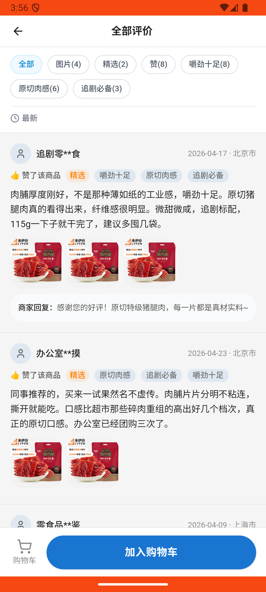

# common_v009_search_check_reviews_then_checkout  ❌

- **Brand**: `wogoumarket`
- **Class**: `WogoumarketCommonV009SearchCheckReviewsThenCheckoutTask`
- **Pass@3**: **0/3**  (score = 0.00)
- **Elapsed**: 390s (~6.5 min)
- **Model**: `doubao-seed-2-0-lite-260428`
- **Raw log**: [./raw_logs/WogoumarketCommonV009SearchCheckReviewsThenCheckoutTask.log](./raw_logs/WogoumarketCommonV009SearchCheckReviewsThenCheckoutTask.log)
- **Generated**: 2026-06-10T06:53:54+08:00

## Task Goal

> 【当前账户档案】账号：demo@rlbox.ai；昵称：张三；支付密码：123456，如需支付请使用此密码完成支付；默认收货地址（JSON）：{"recipient":"科憨憨","phone":"13100002345","address":"广东省 深圳市 南山区 腾讯滨海大厦 1楼东门外卖柜"}。今天是2026年06月10日。请基于以上档案完成以下任务：搜索「猪肉脯」，找到原切猪肉脯点进详情页看看评价，然后点底部「加入购物车」按钮加购，去购物车结算付款

## System Prompt

<details>
<summary>展开查看完整 System Prompt</summary>


> You are provided with a task description, a history of previous actions, and corresponding screenshots. Your goal is to perform the next action to complete the task. Please note that if performing the same action multiple times results in a static screen with no changes, you should attempt a modified or alternative action.
> 
> ---
> 
> ## Function Definition
> 
> - `clarify` — Ask the user for more information to complete the task.
> - `click` — Mouse left single click action.
> - `double_click` — Mouse left double click action.
> - `drag` — Perform a drag action from the start point to the end point. Typically used for swiping or selecting elements.
> - `long_press` — Perform a long press action at the specified coordinates.
> - `open_app` — Open the specified application.
> - `press_back` — Press the back button.
> - `press_enter` — Press the enter key.
> - `press_home` — Press the home button.
> - `take_notes` — Take notes and report the result in the specified content.
> - `type` — Type the specified content. You should manually delete any text from the input box that you want to remove.
> - `wait` — Wait for a certain period of time.

</details>

## User Query

> 请在 com.wogoumarket 里面完成以下任务：
> 【当前账户档案】账号：demo@rlbox.ai；昵称：张三；支付密码：123456，如需支付请使用此密码完成支付；默认收货地址（JSON）：{"recipient":"科憨憨","phone":"13100002345","address":"广东省 深圳市 南山区 腾讯滨海大厦 1楼东门外卖柜"}。今天是2026年06月10日。请基于以上档案完成以下任务：搜索「猪肉脯」，找到原切猪肉脯点进详情页看看评价，然后点底部「加入购物车」按钮加购，去购物车结算付款

## Attempts

| # | Outcome | Steps | Terminated | Reason | Start → End |
|---|---------|-------|------------|--------|-------------|
| 1 | ❌ failed | 18 | answer | 已支付订单已创建: 未找到已支付的订单 | 2026-06-10 03:52:57 → 2026-06-10 03:56:12 |
| 2 | 💥 error | 0 | exception | exception: 500 Internal Server Error for url: http://localhost:6800/task/init \\| detail: init_task('WogoumarketCommonV009SearchCheckRevi... | 2026-06-10 03:56:12 → 2026-06-10 03:57:49 |
| 3 | 💥 error | 0 | exception | exception: 500 Internal Server Error for url: http://localhost:6800/task/init \\| detail: init_task('WogoumarketCommonV009SearchCheckRevi... | 2026-06-10 03:57:49 → 2026-06-10 03:59:26 |

## Failure Details

### Episode 1 — ❌ failed

- steps_used: `18`
- terminated_reason: `answer`
- reason:

  ```
  已支付订单已创建: 未找到已支付的订单
  ```
- death shot: 
  - state: [`./death_shots/WogoumarketCommonV009SearchCheckReviewsThenCheckoutTask/episode_001/step_018.json`](./death_shots/WogoumarketCommonV009SearchCheckReviewsThenCheckoutTask/episode_001/step_018.json)
  - digest: [`episode_digest.md`](./death_shots/WogoumarketCommonV009SearchCheckReviewsThenCheckoutTask/episode_001/episode_digest.md)

### Episode 2 — 💥 error

- steps_used: `0`
- terminated_reason: `exception`
- reason:

  ```
  exception: 500 Internal Server Error for url: http://localhost:6800/task/init | detail: init_task('WogoumarketCommonV009SearchCheckReviewsThenCheckoutTask') failed: Task 'WogoumarketCommonV009SearchCheckReviewsThenCheckoutTask' failed during initialize_task()
  ```

### Episode 3 — 💥 error

- steps_used: `0`
- terminated_reason: `exception`
- reason:

  ```
  exception: 500 Internal Server Error for url: http://localhost:6800/task/init | detail: init_task('WogoumarketCommonV009SearchCheckReviewsThenCheckoutTask') failed: Task 'WogoumarketCommonV009SearchCheckReviewsThenCheckoutTask' failed during initialize_task()
  ```

---

> 本摘要由 `sengclaw/scripts/pipeline/log_summarizer.py` 自动生成。 原始完整 log 见上方 Raw log 链接（含每 step 的 messages / tool_call / screenshot 引用）。
