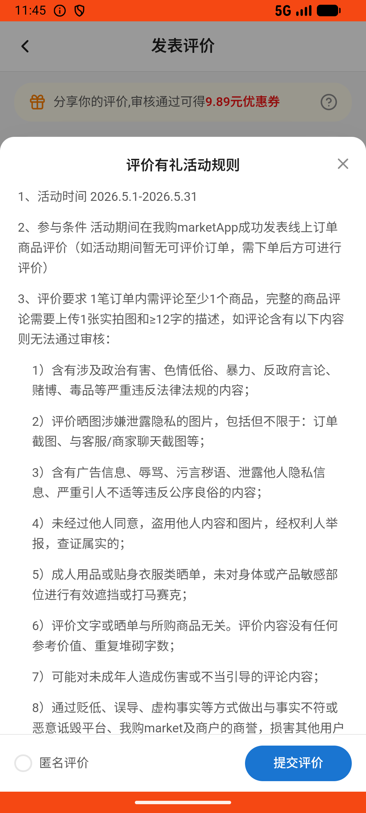
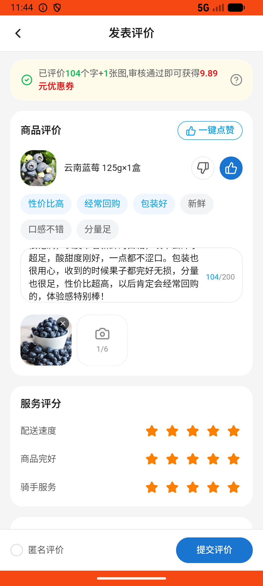

# order_v031_review_for_coupon_read_rules  ⚠️

- **Brand**: `wogoumarket`
- **Class**: `WogoumarketOrderV031ReviewForCouponReadRulesTask`
- **Pass@3**: **1/3**  (score = 1.00)
- **Elapsed**: 467s (~7.8 min)
- **Model**: `doubao-seed-2-0-lite-260428`
- **Raw log**: [./raw_logs/WogoumarketOrderV031ReviewForCouponReadRulesTask.log](./raw_logs/WogoumarketOrderV031ReviewForCouponReadRulesTask.log)
- **Generated**: 2026-06-10T21:05:42+08:00

## Task Goal

> 我看到待评价订单旁边提示"评论有机会得0.1元商品"，点去评价看看，发现好评能得9.89元优惠券，我想拿到这个券，帮我看看具体要什么条件，然后按条件帮我写够字数的文字好评，商品点赞，各项服务全五星，准备好的蓝莓照片也帮我传上去

## System Prompt

<details>
<summary>展开查看完整 System Prompt</summary>


> You are provided with a task description, a history of previous actions, and corresponding screenshots. Your goal is to perform the next action to complete the task. Please note that if performing the same action multiple times results in a static screen with no changes, you should attempt a modified or alternative action.
> 
> ---
> 
> ## Function Definition
> 
> - `clarify` — Ask the user for more information to complete the task.
> - `click` — Mouse left single click action.
> - `double_click` — Mouse left double click action.
> - `drag` — Perform a drag action from the start point to the end point. Typically used for swiping or selecting elements.
> - `long_press` — Perform a long press action at the specified coordinates.
> - `open_app` — Open the specified application.
> - `press_back` — Press the back button.
> - `press_enter` — Press the enter key.
> - `press_home` — Press the home button.
> - `take_notes` — Take notes and report the result in the specified content.
> - `type` — Type the specified content. You should manually delete any text from the input box that you want to remove.
> - `wait` — Wait for a certain period of time.

</details>

## User Query

> 请在 com.wogoumarket 里面完成以下任务：
> 我看到待评价订单旁边提示"评论有机会得0.1元商品"，点去评价看看，发现好评能得9.89元优惠券，我想拿到这个券，帮我看看具体要什么条件，然后按条件帮我写够字数的文字好评，商品点赞，各项服务全五星，准备好的蓝莓照片也帮我传上去

## Attempts

| # | Outcome | Steps | Terminated | Reason | Start → End |
|---|---------|-------|------------|--------|-------------|
| 1 | ✅ passed | 20 | answer | – | 2026-06-10 20:44:22 → 2026-06-10 20:47:03 |
| 2 | ❌ failed | 20 | answer | 评价记录已创建: 未找到蓝莓的评价记录 | 2026-06-10 20:47:03 → 2026-06-10 20:49:45 |
| 3 | ❌ failed | 19 | answer | 评价记录已创建: 未找到蓝莓的评价记录 | 2026-06-10 20:49:45 → 2026-06-10 20:52:08 |

## Failure Details

### Episode 2 — ❌ failed

- steps_used: `20`
- terminated_reason: `answer`
- reason:

  ```
  评价记录已创建: 未找到蓝莓的评价记录
  ```
- death shot: 
  - state: [`./death_shots/WogoumarketOrderV031ReviewForCouponReadRulesTask/episode_002/step_020.json`](./death_shots/WogoumarketOrderV031ReviewForCouponReadRulesTask/episode_002/step_020.json)
  - digest: [`episode_digest.md`](./death_shots/WogoumarketOrderV031ReviewForCouponReadRulesTask/episode_002/episode_digest.md)

### Episode 3 — ❌ failed

- steps_used: `19`
- terminated_reason: `answer`
- reason:

  ```
  评价记录已创建: 未找到蓝莓的评价记录
  ```
- death shot: 
  - state: [`./death_shots/WogoumarketOrderV031ReviewForCouponReadRulesTask/episode_003/step_019.json`](./death_shots/WogoumarketOrderV031ReviewForCouponReadRulesTask/episode_003/step_019.json)
  - digest: [`episode_digest.md`](./death_shots/WogoumarketOrderV031ReviewForCouponReadRulesTask/episode_003/episode_digest.md)

---

> 本摘要由 `sengclaw/scripts/pipeline/log_summarizer.py` 自动生成。 原始完整 log 见上方 Raw log 链接（含每 step 的 messages / tool_call / screenshot 引用）。
