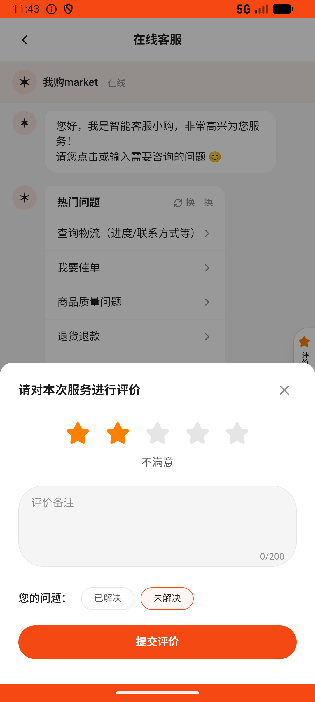

# customer_service_v015_rate_three_star_unresolved  ⚠️

- **Brand**: `wogoumarket`
- **Class**: `WogoumarketCustomerServiceV015RateThreeStarUnresolvedTask`
- **Pass@3**: **2/3**  (score = 1.00)
- **Elapsed**: 239s (~4.0 min)
- **Model**: `doubao-seed-2-0-lite-260428`
- **Raw log**: [./raw_logs/WogoumarketCustomerServiceV015RateThreeStarUnresolvedTask.log](./raw_logs/WogoumarketCustomerServiceV015RateThreeStarUnresolvedTask.log)
- **Generated**: 2026-06-11T21:37:57+08:00

## Task Goal

> 给客服打 2 星，标记问题未解决，写评价：服务一般，问题没解决，好无语

## System Prompt

<details>
<summary>展开查看完整 System Prompt</summary>


> You are provided with a task description, a history of previous actions, and corresponding screenshots. Your goal is to perform the next action to complete the task. Please note that if performing the same action multiple times results in a static screen with no changes, you should attempt a modified or alternative action.
> 
> ---
> 
> ## Function Definition
> 
> - `clarify` — Ask the user for more information to complete the task.
> - `click` — Mouse left single click action.
> - `double_click` — Mouse left double click action.
> - `drag` — Perform a drag action from the start point to the end point. Typically used for swiping or selecting elements.
> - `long_press` — Perform a long press action at the specified coordinates.
> - `open_app` — Open the specified application.
> - `press_back` — Press the back button.
> - `press_enter` — Press the enter key.
> - `press_home` — Press the home button.
> - `take_notes` — Take notes and report the result in the specified content.
> - `type` — Type the specified content. You should manually delete any text from the input box that you want to remove.
> - `wait` — Wait for a certain period of time.

</details>

## User Query

> 请在 com.wogoumarket 里面完成以下任务：
> 给客服打 2 星，标记问题未解决，写评价：服务一般，问题没解决，好无语

## Attempts

| # | Outcome | Steps | Terminated | Reason | Start → End |
|---|---------|-------|------------|--------|-------------|
| 1 | ❌ failed | 8 | answer | 会话已评分为 2 星: 评分应为 2 星，实际为 nil; 问题标记为未解决: resolved 应为 false（未解决），实际为 nil; 评价内容包含指定文字: 评价内容应为「服务一般，问题没解决，好无语」，实际为 nil | 2026-06-11 19:11:37 → 2026-06-11 19:12:48 |
| 2 | ✅ passed | 11 | answer | – | 2026-06-11 19:12:48 → 2026-06-11 19:14:08 |
| 3 | ✅ passed | 11 | answer | – | 2026-06-11 19:14:08 → 2026-06-11 19:15:36 |

## Failure Details

### Episode 1 — ❌ failed

- steps_used: `8`
- terminated_reason: `answer`
- reason:

  ```
  会话已评分为 2 星: 评分应为 2 星，实际为 nil; 问题标记为未解决: resolved 应为 false（未解决），实际为 nil; 评价内容包含指定文字: 评价内容应为「服务一般，问题没解决，好无语」，实际为 nil
  ```
- death shot: 
  - state: [`./death_shots/WogoumarketCustomerServiceV015RateThreeStarUnresolvedTask/episode_001/step_008.json`](./death_shots/WogoumarketCustomerServiceV015RateThreeStarUnresolvedTask/episode_001/step_008.json)
  - digest: [`episode_digest.md`](./death_shots/WogoumarketCustomerServiceV015RateThreeStarUnresolvedTask/episode_001/episode_digest.md)

---

> 本摘要由 `sengclaw/scripts/pipeline/log_summarizer.py` 自动生成。 原始完整 log 见上方 Raw log 链接（含每 step 的 messages / tool_call / screenshot 引用）。
