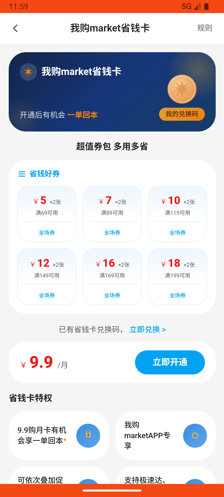

# account_v002_view_rules_then_purchase_saving_card  ❌

- **Brand**: `wogoumarket`
- **Class**: `WogoumarketAccountV002ViewRulesThenPurchaseSavingCardTask`
- **Pass@3**: **0/3**  (score = 0.00)
- **Elapsed**: 601s (~10.0 min)
- **Model**: `doubao-seed-2-0-pro-260215`
- **Raw log**: [./raw_logs/WogoumarketAccountV002ViewRulesThenPurchaseSavingCardTask.log](./raw_logs/WogoumarketAccountV002ViewRulesThenPurchaseSavingCardTask.log)
- **Generated**: 2026-07-10T14:16:40+08:00

## Task Goal

> 在我的页面有个省钱卡，帮我看看规则，帮我用微信支付开通省钱卡

> 🔴 **基建重试记录**：本 task 发生 1 次基建重试（原因：ep3:adb），重试后仍全部失败，**建议排查 infra 而非 Agent 能力**。

## Attempts

| # | Outcome | Steps | Terminated | Reason | Start → End |
|---|---------|-------|------------|--------|-------------|
| 1 | 💥 error | 0 | exception | exception: 500 Internal Server Error for url: http://localhost:6800/task/init \\| detail: init_task('WogoumarketAccountV002ViewRulesThenP... | 2026-07-10 11:48:27 → 2026-07-10 11:50:05 |
| 2 | 💥 error | 0 | exception | exception: 500 Internal Server Error for url: http://localhost:6800/task/init \\| detail: init_task('WogoumarketAccountV002ViewRulesThenP... | 2026-07-10 11:50:05 → 2026-07-10 11:51:18 |
| 3 | ❌ failed | 26 | answer | 省钱卡购买记录已创建: 未找到省钱卡购买记录 | 2026-07-10 11:51:18 → 2026-07-10 11:51:23 |

## Failure Details

### Episode 1 — 💥 error

- steps_used: `0`
- terminated_reason: `exception`
- reason:

  ```
  exception: 500 Internal Server Error for url: http://localhost:6800/task/init | detail: init_task('WogoumarketAccountV002ViewRulesThenPurchaseSavingCardTask') failed: Task 'WogoumarketAccountV002ViewRulesThenPurchaseSavingCardTask' failed during initialize_task()
  ```

### Episode 2 — 💥 error

- steps_used: `0`
- terminated_reason: `exception`
- reason:

  ```
  exception: 500 Internal Server Error for url: http://localhost:6800/task/init | detail: init_task('WogoumarketAccountV002ViewRulesThenPurchaseSavingCardTask') failed: Task 'WogoumarketAccountV002ViewRulesThenPurchaseSavingCardTask' failed during initialize_task(): Command 'adb -s emulator-5554 shell settings get global airplane_mode_on' timed out after 5 seconds
  ```

### Episode 3 — ❌ failed

- steps_used: `26`
- terminated_reason: `answer`
- reason:

  ```
  省钱卡购买记录已创建: 未找到省钱卡购买记录
  ```
- death shot: 
  - state: [`./screenshots/WogoumarketAccountV002ViewRulesThenPurchaseSavingCardTask/episode_003/step_026.json`](./screenshots/WogoumarketAccountV002ViewRulesThenPurchaseSavingCardTask/episode_003/step_026.json)
  - digest: [`episode_digest.md`](./screenshots/WogoumarketAccountV002ViewRulesThenPurchaseSavingCardTask/episode_003/episode_digest.md)

---

> 本摘要由 `sengclaw/scripts/pipeline/log_summarizer.py` 自动生成。 原始完整 log 见上方 Raw log 链接（含每 step 的 messages / tool_call / screenshot 引用）。
