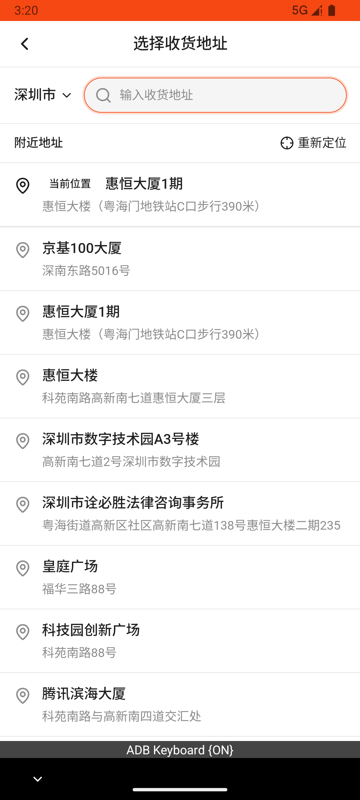
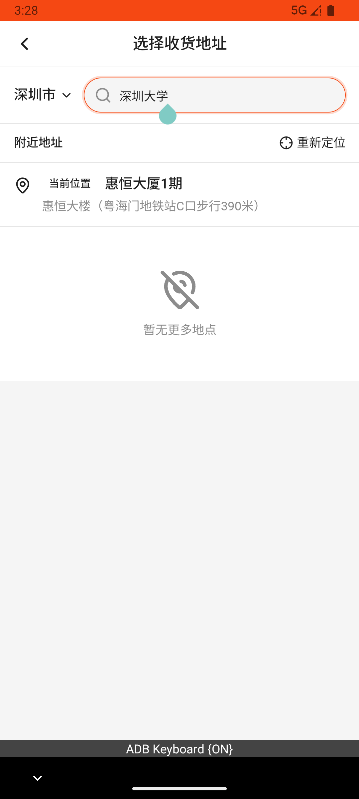
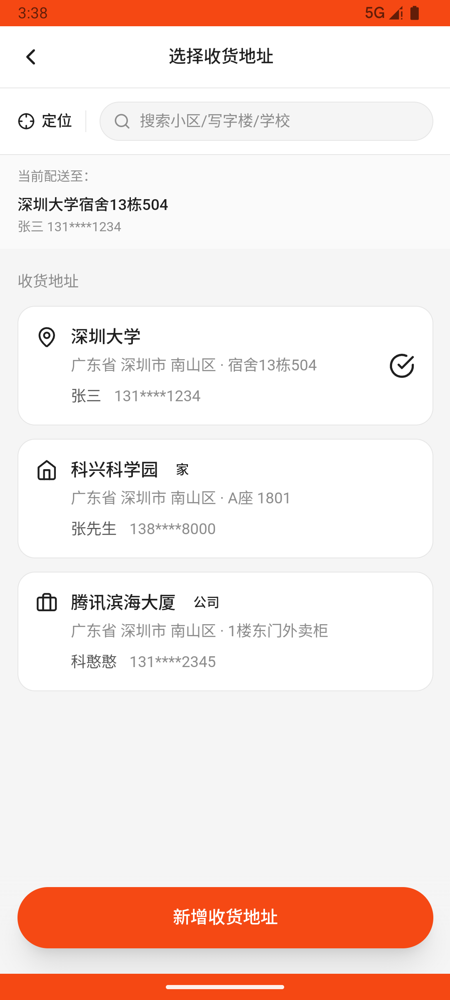

# checkout_v013_edit_address_unit_and_label  ❌

- **Brand**: `wogoumarket`
- **Class**: `WogoumarketCheckoutV013EditAddressUnitAndLabelTask`
- **Pass@3**: **0/3**  (score = 0.00)
- **Elapsed**: 1673s (~27.9 min)
- **Model**: `doubao-seed-2-0-pro-260215`
- **Raw log**: [./raw_logs/WogoumarketCheckoutV013EditAddressUnitAndLabelTask.log](./raw_logs/WogoumarketCheckoutV013EditAddressUnitAndLabelTask.log)
- **Generated**: 2026-07-10T17:40:15+08:00

## Task Goal

> 结算购物车里商品时编辑深圳大学那条收货地址将门牌号改为图书馆外卖点并添加标签学校

## System Prompt

<details>
<summary>展开查看完整 System Prompt</summary>


> You are provided with a task description, a history of previous actions, and corresponding screenshots. Your goal is to perform the next action to complete the task. Please note that if performing the same action multiple times results in a static screen with no changes, you should attempt a modified or alternative action.
> 
> ---
> 
> ## Function Definition
> 
> - `clarify` — Ask the user for more information to complete the task.
> - `click` — Mouse left single click action.
> - `double_click` — Mouse left double click action.
> - `drag` — Perform a drag action from the start point to the end point. Typically used for swiping or selecting elements.
> - `long_press` — Perform a long press action at the specified coordinates.
> - `open_app` — Open the specified application.
> - `press_back` — Press the back button.
> - `press_enter` — Press the enter key.
> - `press_home` — Press the home button.
> - `take_notes` — Take notes and report the result in the specified content.
> - `type` — Type the specified content. You should manually delete any text from the input box that you want to remove.
> - `wait` — Wait for a certain period of time.

</details>

## User Query

> 请在 com.wogoumarket 里面完成以下任务：
> 结算购物车里商品时编辑深圳大学那条收货地址将门牌号改为图书馆外卖点并添加标签学校

## Attempts

| # | Outcome | Steps | Terminated | Reason | Start → End |
|---|---------|-------|------------|--------|-------------|
| 1 | ⏰ timeout | 50 | max_steps | 地址门牌号已改为「图书馆外卖点」: 预期门牌号为「图书馆外卖点」，实际为「宿舍13栋504」; 地址标签已设为「学校」: 预期标签为「学校」，实际为「nil」 | 2026-07-10 15:10:10 → 2026-07-10 15:20:30 |
| 2 | ❌ failed | 46 | answer | 地址门牌号已改为「图书馆外卖点」: 预期门牌号为「图书馆外卖点」，实际为「宿舍13栋504」; 地址标签已设为「学校」: 预期标签为「学校」，实际为「nil」 | 2026-07-10 15:20:30 → 2026-07-10 15:28:34 |
| 3 | ❌ failed | 49 | answer | 地址门牌号已改为「图书馆外卖点」: 预期门牌号为「图书馆外卖点」，实际为「宿舍13栋504」; 地址标签已设为「学校」: 预期标签为「学校」，实际为「nil」 | 2026-07-10 15:28:34 → 2026-07-10 15:38:03 |

## Failure Details

### Episode 1 — ⏰ timeout

- steps_used: `50`
- terminated_reason: `max_steps`
- reason:

  ```
  地址门牌号已改为「图书馆外卖点」: 预期门牌号为「图书馆外卖点」，实际为「宿舍13栋504」; 地址标签已设为「学校」: 预期标签为「学校」，实际为「nil」
  ```
- death shot: 
  - state: [`./screenshots/WogoumarketCheckoutV013EditAddressUnitAndLabelTask/episode_001/step_050.json`](./screenshots/WogoumarketCheckoutV013EditAddressUnitAndLabelTask/episode_001/step_050.json)
  - digest: [`episode_digest.md`](./screenshots/WogoumarketCheckoutV013EditAddressUnitAndLabelTask/episode_001/episode_digest.md)

### Episode 2 — ❌ failed

- steps_used: `46`
- terminated_reason: `answer`
- reason:

  ```
  地址门牌号已改为「图书馆外卖点」: 预期门牌号为「图书馆外卖点」，实际为「宿舍13栋504」; 地址标签已设为「学校」: 预期标签为「学校」，实际为「nil」
  ```
- death shot: 
  - state: [`./screenshots/WogoumarketCheckoutV013EditAddressUnitAndLabelTask/episode_002/step_046.json`](./screenshots/WogoumarketCheckoutV013EditAddressUnitAndLabelTask/episode_002/step_046.json)
  - digest: [`episode_digest.md`](./screenshots/WogoumarketCheckoutV013EditAddressUnitAndLabelTask/episode_002/episode_digest.md)

### Episode 3 — ❌ failed

- steps_used: `49`
- terminated_reason: `answer`
- reason:

  ```
  地址门牌号已改为「图书馆外卖点」: 预期门牌号为「图书馆外卖点」，实际为「宿舍13栋504」; 地址标签已设为「学校」: 预期标签为「学校」，实际为「nil」
  ```
- death shot: 
  - state: [`./screenshots/WogoumarketCheckoutV013EditAddressUnitAndLabelTask/episode_003/step_049.json`](./screenshots/WogoumarketCheckoutV013EditAddressUnitAndLabelTask/episode_003/step_049.json)
  - digest: [`episode_digest.md`](./screenshots/WogoumarketCheckoutV013EditAddressUnitAndLabelTask/episode_003/episode_digest.md)

---

> 本摘要由 `sengclaw/scripts/pipeline/log_summarizer.py` 自动生成。 原始完整 log 见上方 Raw log 链接（含每 step 的 messages / tool_call / screenshot 引用）。
