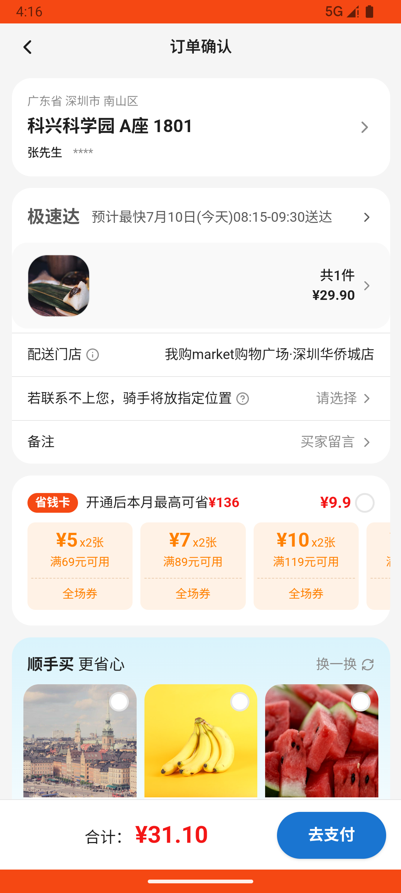

# order_v004_cancel_and_reorder_zongzi  ❌

- **Brand**: `wogoumarket`
- **Class**: `WogoumarketOrderV004CancelAndReorderZongziTask`
- **Pass@3**: **0/3**  (score = 0.00)
- **Elapsed**: 834s (~13.9 min)
- **Model**: `doubao-seed-2-0-pro-260215`
- **Raw log**: [./raw_logs/WogoumarketOrderV004CancelAndReorderZongziTask.log](./raw_logs/WogoumarketOrderV004CancelAndReorderZongziTask.log)
- **Generated**: 2026-07-10T17:40:15+08:00

## Task Goal

> 在首页粽子尝鲜专区加购"五芳斋 鲜肉粽 100g×4只"1袋，选"腾讯滨海大厦"地址下单不支付，取消后重新加购1袋并选"科兴科学园"地址下单完成支付

> 🔴 **基建重试记录**：本 task 发生 1 次基建重试（原因：ep2:adb），重试后仍全部失败，**建议排查 infra 而非 Agent 能力**。

## Attempts

| # | Outcome | Steps | Terminated | Reason | Start → End |
|---|---------|-------|------------|--------|-------------|
| 1 | 💥 error | 0 | exception | exception: 500 Internal Server Error for url: http://localhost:6800/task/init \\| detail: init_task('WogoumarketOrderV004CancelAndReorder... | 2026-07-10 16:02:01 → 2026-07-10 16:03:39 |
| 2 | ❌ failed | 37 | answer | 存在已取消订单（地址=腾讯滨海大厦）: 未找到地址为腾讯滨海大厦的已取消订单; 存在已支付订单（地址=科兴科学园）: 未找到地址为科兴科学园的已支付订单 | 2026-07-10 16:03:39 → 2026-07-10 16:03:44 |
| 3 | 💥 error | 0 | exception | exception: 500 Internal Server Error for url: http://localhost:6800/task/init \\| detail: init_task('WogoumarketOrderV004CancelAndReorder... | 2026-07-10 16:03:44 → 2026-07-10 16:05:22 |

## Failure Details

### Episode 1 — 💥 error

- steps_used: `0`
- terminated_reason: `exception`
- reason:

  ```
  exception: 500 Internal Server Error for url: http://localhost:6800/task/init | detail: init_task('WogoumarketOrderV004CancelAndReorderZongziTask') failed: Task 'WogoumarketOrderV004CancelAndReorderZongziTask' failed during initialize_task(): Command 'adb -s emulator-5554 shell settings put global wogoumarket_api_endpoint http://10.0.2.2:11601' timed out after 5 seconds
  ```

### Episode 2 — ❌ failed

- steps_used: `37`
- terminated_reason: `answer`
- reason:

  ```
  存在已取消订单（地址=腾讯滨海大厦）: 未找到地址为腾讯滨海大厦的已取消订单; 存在已支付订单（地址=科兴科学园）: 未找到地址为科兴科学园的已支付订单
  ```
- death shot: 
  - state: [`./screenshots/WogoumarketOrderV004CancelAndReorderZongziTask/episode_002/step_037.json`](./screenshots/WogoumarketOrderV004CancelAndReorderZongziTask/episode_002/step_037.json)
  - digest: [`episode_digest.md`](./screenshots/WogoumarketOrderV004CancelAndReorderZongziTask/episode_002/episode_digest.md)

### Episode 3 — 💥 error

- steps_used: `0`
- terminated_reason: `exception`
- reason:

  ```
  exception: 500 Internal Server Error for url: http://localhost:6800/task/init | detail: init_task('WogoumarketOrderV004CancelAndReorderZongziTask') failed: Task 'WogoumarketOrderV004CancelAndReorderZongziTask' failed during initialize_task()
  ```

---

> 本摘要由 `sengclaw/scripts/pipeline/log_summarizer.py` 自动生成。 原始完整 log 见上方 Raw log 链接（含每 step 的 messages / tool_call / screenshot 引用）。
