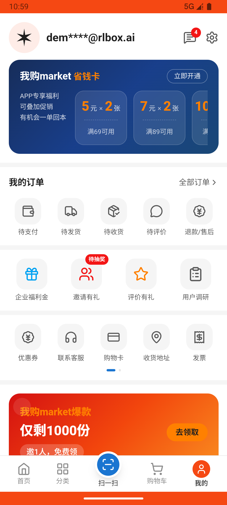
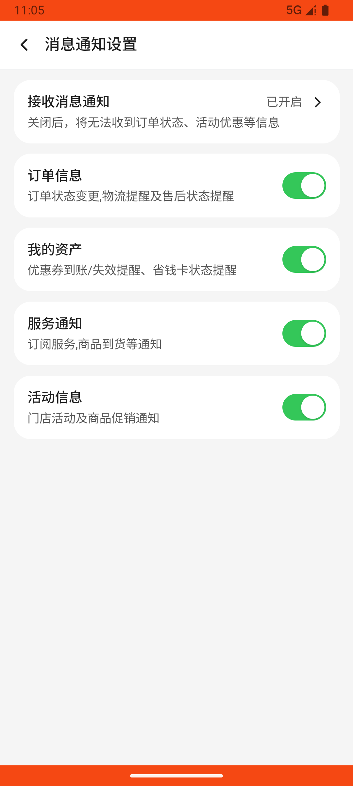

# account_v004_toggle_activity_notification_off  ❌

- **Brand**: `wogoumarket`
- **Class**: `WogoumarketAccountV004ToggleActivityNotificationOffTask`
- **Pass@3**: **0/3**  (score = 0.00)
- **Elapsed**: 425s (~7.1 min)
- **Model**: `doubao-seed-2-0-pro-260215`
- **Raw log**: [./raw_logs/WogoumarketAccountV004ToggleActivityNotificationOffTask.log](./raw_logs/WogoumarketAccountV004ToggleActivityNotificationOffTask.log)
- **Generated**: 2026-07-11T16:11:52+08:00

## Task Goal

> 最近活动推送太多了，帮我把消息通知设置里的"活动信息"关掉

## System Prompt

<details>
<summary>展开查看完整 System Prompt</summary>


> You are provided with a task description, a history of previous actions, and corresponding screenshots. Your goal is to perform the next action to complete the task. Please note that if performing the same action multiple times results in a static screen with no changes, you should attempt a modified or alternative action.
> 
> ---
> 
> ## Function Definition
> 
> - `clarify` — Ask the user for more information to complete the task.
> - `click` — Mouse left single click action.
> - `double_click` — Mouse left double click action.
> - `drag` — Perform a drag action from the start point to the end point. Typically used for swiping or selecting elements.
> - `long_press` — Perform a long press action at the specified coordinates.
> - `open_app` — Open the specified application.
> - `press_back` — Press the back button.
> - `press_enter` — Press the enter key.
> - `press_home` — Press the home button.
> - `take_notes` — Take notes and report the result in the specified content.
> - `type` — Type the specified content. You should manually delete any text from the input box that you want to remove.
> - `wait` — Wait for a certain period of time.

</details>

## User Query

> 请在 com.wogoumarket 里面完成以下任务：
> 最近活动推送太多了，帮我把消息通知设置里的"活动信息"关掉

> 🔴 **基建重试记录**：本 task 发生 1 次基建重试（原因：ep1:adb + fullrerun_after_incremental），重试后仍全部失败，**建议排查 infra 而非 Agent 能力**。

## Attempts

| # | Outcome | Steps | Terminated | Reason | Start → End |
|---|---------|-------|------------|--------|-------------|
| 1 | 💥 error | 0 | exception | exception: 500 Internal Server Error for url: http://localhost:6800/step \\| detail: Internal server error: Command '['adb', 'devices']' ... | 2026-07-11 10:59:12 → 2026-07-11 10:59:48 |
| 2 | ❌ failed | 23 | answer | 用户设置已更新（存在会话级用户副本）: 未找到会话级用户副本，通知设置可能未成功修改 | 2026-07-11 10:59:48 → 2026-07-11 11:04:00 |
| 3 | 💥 error | 0 | exception | exception: 500 Internal Server Error for url: http://localhost:6800/step \\| detail: Internal server error: Command '['adb', 'devices']' ... | 2026-07-11 11:04:00 → 2026-07-11 11:06:17 |

## Failure Details

### Episode 1 — 💥 error

- steps_used: `0`
- terminated_reason: `exception`
- reason:

  ```
  exception: 500 Internal Server Error for url: http://localhost:6800/step | detail: Internal server error: Command '['adb', 'devices']' timed out after 5 seconds
  ```
- death shot: 
  - state: [`./screenshots/WogoumarketAccountV004ToggleActivityNotificationOffTask/episode_001/step_002.json`](./screenshots/WogoumarketAccountV004ToggleActivityNotificationOffTask/episode_001/step_002.json)
  - digest: [`episode_digest.md`](./screenshots/WogoumarketAccountV004ToggleActivityNotificationOffTask/episode_001/episode_digest.md)

### Episode 2 — ❌ failed

- steps_used: `23`
- terminated_reason: `answer`
- reason:

  ```
  用户设置已更新（存在会话级用户副本）: 未找到会话级用户副本，通知设置可能未成功修改
  ```
- death shot: 
  - state: [`./screenshots/WogoumarketAccountV004ToggleActivityNotificationOffTask/episode_002/step_023.json`](./screenshots/WogoumarketAccountV004ToggleActivityNotificationOffTask/episode_002/step_023.json)
  - digest: [`episode_digest.md`](./screenshots/WogoumarketAccountV004ToggleActivityNotificationOffTask/episode_002/episode_digest.md)

### Episode 3 — 💥 error

- steps_used: `0`
- terminated_reason: `exception`
- reason:

  ```
  exception: 500 Internal Server Error for url: http://localhost:6800/step | detail: Internal server error: Command '['adb', 'devices']' timed out after 5 seconds
  ```
- death shot: 
  - state: [`./screenshots/WogoumarketAccountV004ToggleActivityNotificationOffTask/episode_003/step_009.json`](./screenshots/WogoumarketAccountV004ToggleActivityNotificationOffTask/episode_003/step_009.json)
  - digest: [`episode_digest.md`](./screenshots/WogoumarketAccountV004ToggleActivityNotificationOffTask/episode_003/episode_digest.md)

---

> 本摘要由 `sengclaw/scripts/pipeline/log_summarizer.py` 自动生成。 原始完整 log 见上方 Raw log 链接（含每 step 的 messages / tool_call / screenshot 引用）。
