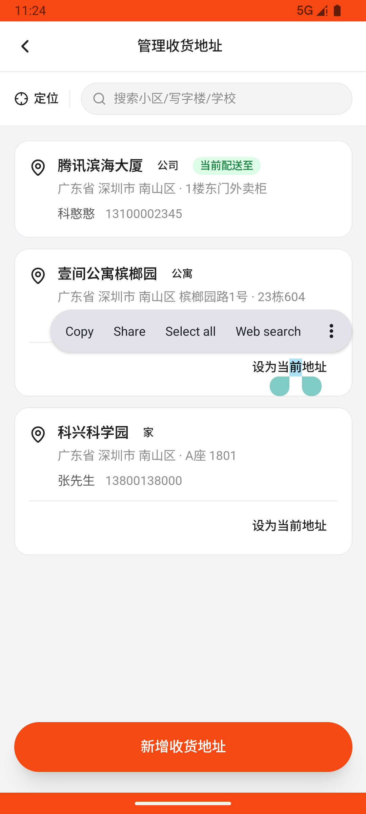
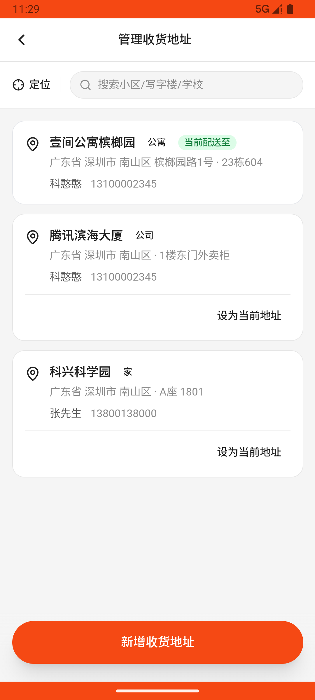
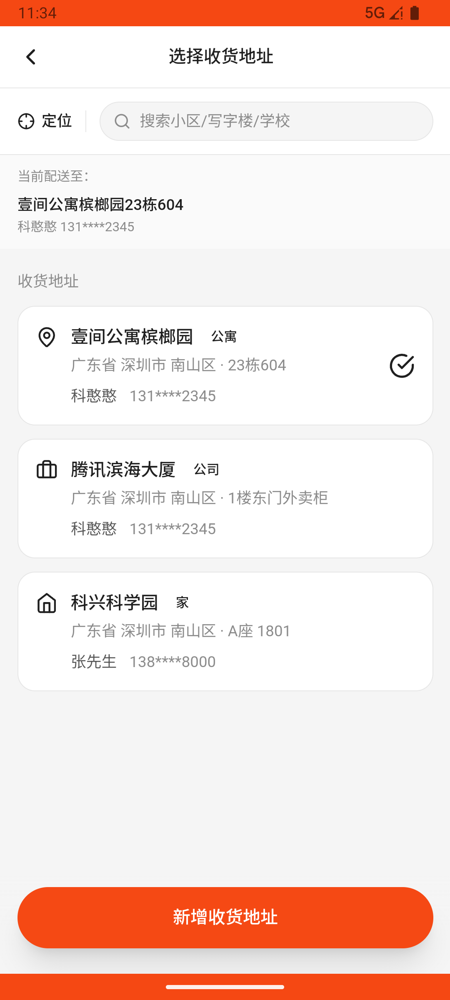

# account_v005_delete_binlangyuan_address  ❌

- **Brand**: `wogoumarket`
- **Class**: `WogoumarketAccountV005DeleteBinlangyuanAddressTask`
- **Pass@3**: **0/3**  (score = 0.00)
- **Elapsed**: 836s (~13.9 min)
- **Model**: `doubao-seed-2-0-pro-260215`
- **Raw log**: [./raw_logs/WogoumarketAccountV005DeleteBinlangyuanAddressTask.log](./raw_logs/WogoumarketAccountV005DeleteBinlangyuanAddressTask.log)
- **Generated**: 2026-07-11T16:11:52+08:00

## Task Goal

> 壹间公寓·槟榔园23栋604那个地址我已经不住了，删掉吧

## System Prompt

<details>
<summary>展开查看完整 System Prompt</summary>


> You are provided with a task description, a history of previous actions, and corresponding screenshots. Your goal is to perform the next action to complete the task. Please note that if performing the same action multiple times results in a static screen with no changes, you should attempt a modified or alternative action.
> 
> ---
> 
> ## Function Definition
> 
> - `clarify` — Ask the user for more information to complete the task.
> - `click` — Mouse left single click action.
> - `double_click` — Mouse left double click action.
> - `drag` — Perform a drag action from the start point to the end point. Typically used for swiping or selecting elements.
> - `long_press` — Perform a long press action at the specified coordinates.
> - `open_app` — Open the specified application.
> - `press_back` — Press the back button.
> - `press_enter` — Press the enter key.
> - `press_home` — Press the home button.
> - `take_notes` — Take notes and report the result in the specified content.
> - `type` — Type the specified content. You should manually delete any text from the input box that you want to remove.
> - `wait` — Wait for a certain period of time.

</details>

## User Query

> 请在 com.wogoumarket 里面完成以下任务：
> 壹间公寓·槟榔园23栋604那个地址我已经不住了，删掉吧

> 🔴 **基建重试记录**：本 task 发生 1 次基建重试（原因：ep2:adb, ep3:adb + fullrerun_after_incremental），重试后仍全部失败，**建议排查 infra 而非 Agent 能力**。

## Attempts

| # | Outcome | Steps | Terminated | Reason | Start → End |
|---|---------|-------|------------|--------|-------------|
| 1 | ❌ failed | 24 | answer | 壹间公寓槟榔园地址已被删除: 壹间公寓槟榔园地址仍然存在（剩余 1 条），应已删除 | 2026-07-11 11:20:09 → 2026-07-11 11:24:34 |
| 2 | ❌ failed | 21 | answer | 壹间公寓槟榔园地址已被删除: 壹间公寓槟榔园地址仍然存在（剩余 1 条），应已删除 | 2026-07-11 11:24:34 → 2026-07-11 11:29:10 |
| 3 | ❌ failed | 27 | answer | 壹间公寓槟榔园地址已被删除: 壹间公寓槟榔园地址仍然存在（剩余 1 条），应已删除 | 2026-07-11 11:29:10 → 2026-07-11 11:34:04 |

## Failure Details

### Episode 1 — ❌ failed

- steps_used: `24`
- terminated_reason: `answer`
- reason:

  ```
  壹间公寓槟榔园地址已被删除: 壹间公寓槟榔园地址仍然存在（剩余 1 条），应已删除
  ```
- death shot: 
  - state: [`./screenshots/WogoumarketAccountV005DeleteBinlangyuanAddressTask/episode_001/step_024.json`](./screenshots/WogoumarketAccountV005DeleteBinlangyuanAddressTask/episode_001/step_024.json)
  - digest: [`episode_digest.md`](./screenshots/WogoumarketAccountV005DeleteBinlangyuanAddressTask/episode_001/episode_digest.md)

### Episode 2 — ❌ failed

- steps_used: `21`
- terminated_reason: `answer`
- reason:

  ```
  壹间公寓槟榔园地址已被删除: 壹间公寓槟榔园地址仍然存在（剩余 1 条），应已删除
  ```
- death shot: 
  - state: [`./screenshots/WogoumarketAccountV005DeleteBinlangyuanAddressTask/episode_002/step_021.json`](./screenshots/WogoumarketAccountV005DeleteBinlangyuanAddressTask/episode_002/step_021.json)
  - digest: [`episode_digest.md`](./screenshots/WogoumarketAccountV005DeleteBinlangyuanAddressTask/episode_002/episode_digest.md)

### Episode 3 — ❌ failed

- steps_used: `27`
- terminated_reason: `answer`
- reason:

  ```
  壹间公寓槟榔园地址已被删除: 壹间公寓槟榔园地址仍然存在（剩余 1 条），应已删除
  ```
- death shot: 
  - state: [`./screenshots/WogoumarketAccountV005DeleteBinlangyuanAddressTask/episode_003/step_027.json`](./screenshots/WogoumarketAccountV005DeleteBinlangyuanAddressTask/episode_003/step_027.json)
  - digest: [`episode_digest.md`](./screenshots/WogoumarketAccountV005DeleteBinlangyuanAddressTask/episode_003/episode_digest.md)

---

> 本摘要由 `sengclaw/scripts/pipeline/log_summarizer.py` 自动生成。 原始完整 log 见上方 Raw log 链接（含每 step 的 messages / tool_call / screenshot 引用）。
