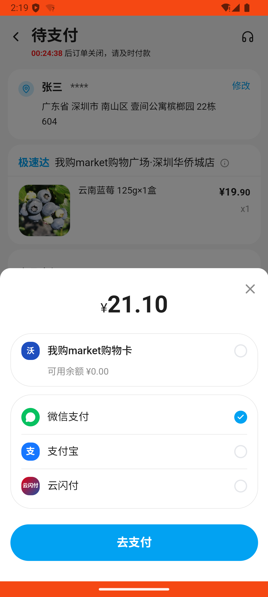

# order_v005_pending_order_change_address  ❌

- **Brand**: `wogoumarket`
- **Class**: `WogoumarketOrderV005PendingOrderChangeAddressTask`
- **Pass@3**: **0/3**  (score = 0.00)
- **Elapsed**: 877s (~14.6 min)
- **Model**: `doubao-seed-2-0-pro-260215`
- **Raw log**: [./raw_logs/WogoumarketOrderV005PendingOrderChangeAddressTask.log](./raw_logs/WogoumarketOrderV005PendingOrderChangeAddressTask.log)
- **Generated**: 2026-07-13T14:53:16+08:00

## Task Goal

> 在待支付订单中将壹间公寓槟榔园的收货地址门牌号改为22栋604，将手机号改为18300001234，并添加使用一个自定义的标签（公寓），然后完成支付

## System Prompt

<details>
<summary>展开查看完整 System Prompt</summary>


> You are provided with a task description, a history of previous actions, and corresponding screenshots. Your goal is to perform the next action to complete the task. Please note that if performing the same action multiple times results in a static screen with no changes, you should attempt a modified or alternative action.
> 
> ---
> 
> ## Function Definition
> 
> - `clarify` — Ask the user for more information to complete the task.
> - `click` — Mouse left single click action.
> - `double_click` — Mouse left double click action.
> - `drag` — Perform a drag action from the start point to the end point. Typically used for swiping or selecting elements.
> - `long_press` — Perform a long press action at the specified coordinates.
> - `open_app` — Open the specified application.
> - `press_back` — Press the back button.
> - `press_enter` — Press the enter key.
> - `press_home` — Press the home button.
> - `take_notes` — Take notes and report the result in the specified content.
> - `type` — Type the specified content. You should manually delete any text from the input box that you want to remove.
> - `wait` — Wait for a certain period of time.

</details>

## User Query

> 请在 com.wogoumarket 里面完成以下任务：
> 在待支付订单中将壹间公寓槟榔园的收货地址门牌号改为22栋604，将手机号改为18300001234，并添加使用一个自定义的标签（公寓），然后完成支付

## Attempts

| # | Outcome | Steps | Terminated | Reason | Start → End |
|---|---------|-------|------------|--------|-------------|
| 1 | ❌ failed | 28 | answer | 订单已完成支付: 预期订单状态「paid」，实际「pending」 | 2026-07-13 14:04:33 → 2026-07-13 14:09:16 |
| 2 | ❌ failed | 26 | answer | 订单已完成支付: 预期订单状态「paid」，实际「pending」 | 2026-07-13 14:09:16 → 2026-07-13 14:13:41 |
| 3 | ❌ failed | 28 | answer | 订单已完成支付: 预期订单状态「paid」，实际「pending」 | 2026-07-13 14:13:41 → 2026-07-13 14:19:10 |

## Failure Details

### Episode 1 — ❌ failed

- steps_used: `28`
- terminated_reason: `answer`
- reason:

  ```
  订单已完成支付: 预期订单状态「paid」，实际「pending」
  ```
- death shot: 
  - state: [`./screenshots/WogoumarketOrderV005PendingOrderChangeAddressTask/episode_001/step_028.json`](./screenshots/WogoumarketOrderV005PendingOrderChangeAddressTask/episode_001/step_028.json)
  - digest: [`episode_digest.md`](./screenshots/WogoumarketOrderV005PendingOrderChangeAddressTask/episode_001/episode_digest.md)

### Episode 2 — ❌ failed

- steps_used: `26`
- terminated_reason: `answer`
- reason:

  ```
  订单已完成支付: 预期订单状态「paid」，实际「pending」
  ```
- death shot: 
  - state: [`./screenshots/WogoumarketOrderV005PendingOrderChangeAddressTask/episode_002/step_026.json`](./screenshots/WogoumarketOrderV005PendingOrderChangeAddressTask/episode_002/step_026.json)
  - digest: [`episode_digest.md`](./screenshots/WogoumarketOrderV005PendingOrderChangeAddressTask/episode_002/episode_digest.md)

### Episode 3 — ❌ failed

- steps_used: `28`
- terminated_reason: `answer`
- reason:

  ```
  订单已完成支付: 预期订单状态「paid」，实际「pending」
  ```
- death shot: 
  - state: [`./screenshots/WogoumarketOrderV005PendingOrderChangeAddressTask/episode_003/step_028.json`](./screenshots/WogoumarketOrderV005PendingOrderChangeAddressTask/episode_003/step_028.json)
  - digest: [`episode_digest.md`](./screenshots/WogoumarketOrderV005PendingOrderChangeAddressTask/episode_003/episode_digest.md)

---

> 本摘要由 `sengclaw/scripts/pipeline/log_summarizer.py` 自动生成。 原始完整 log 见上方 Raw log 链接（含每 step 的 messages / tool_call / screenshot 引用）。
