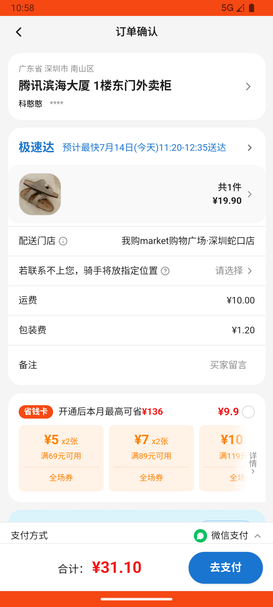
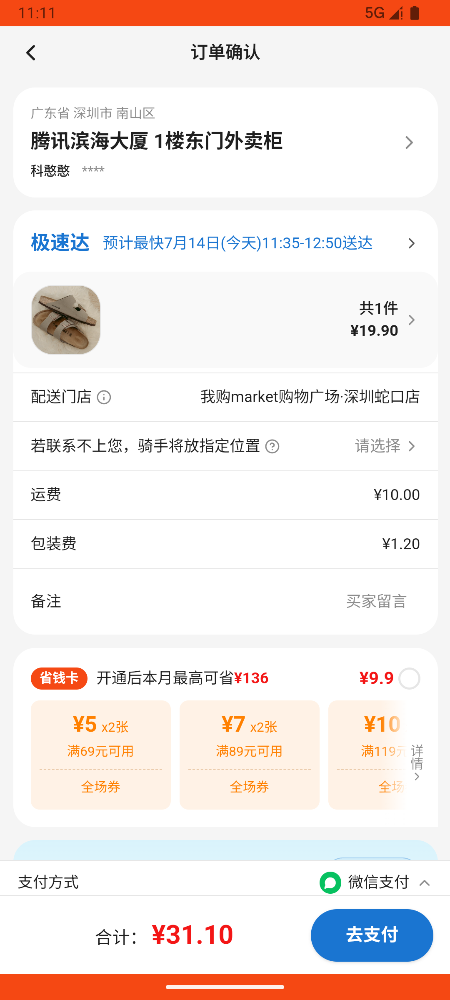

# common_v006_kitchen_add_clear_storage_slipper_delete_checkout  ❌

- **Brand**: `wogoumarket`
- **Class**: `WogoumarketCommonV006KitchenAddClearStorageSlipperDeleteCheckoutTask`
- **Pass@3**: **0/3**  (score = 0.00)
- **Elapsed**: 1263s (~21.1 min)
- **Model**: `doubao-seed-2-0-pro-260215`
- **Raw log**: [./raw_logs/WogoumarketCommonV006KitchenAddClearStorageSlipperDeleteCheckoutTask.log](./raw_logs/WogoumarketCommonV006KitchenAddClearStorageSlipperDeleteCheckoutTask.log)
- **Generated**: 2026-07-14T15:54:20+08:00

## Task Goal

> 使用我购Market（com.wogoumarket）应用完成以下任务：在「家居百货_厨房用品」分类下分别加购1份"乐扣乐扣 保鲜盒 3件套 耐热玻璃"和"张小泉 菜刀 家用切片刀 不锈钢"，然后进入购物车清空购物车，再进入「家居百货_收纳」分类下加购1包"惠宜 一次性雨衣 加厚 3件装"，切换到「家居百货_拖鞋」分类下加购1双"小贝壳男凉拖鞋 夏季防滑"（42-43码），进入购物车将"惠宜 一次性雨衣 加厚 3件装"删除，然后结算并完成支付

## System Prompt

<details>
<summary>展开查看完整 System Prompt</summary>


> You are provided with a task description, a history of previous actions, and corresponding screenshots. Your goal is to perform the next action to complete the task. Please note that if performing the same action multiple times results in a static screen with no changes, you should attempt a modified or alternative action.
> 
> ---
> 
> ## Function Definition
> 
> - `clarify` — Ask the user for more information to complete the task.
> - `click` — Mouse left single click action.
> - `double_click` — Mouse left double click action.
> - `drag` — Perform a drag action from the start point to the end point. Typically used for swiping or selecting elements.
> - `long_press` — Perform a long press action at the specified coordinates.
> - `open_app` — Open the specified application.
> - `press_back` — Press the back button.
> - `press_enter` — Press the enter key.
> - `press_home` — Press the home button.
> - `take_notes` — Take notes and report the result in the specified content.
> - `type` — Type the specified content. You should manually delete any text from the input box that you want to remove.
> - `wait` — Wait for a certain period of time.

</details>

## User Query

> 请在 com.wogoumarket 里面完成以下任务：
> 使用我购Market（com.wogoumarket）应用完成以下任务：在「家居百货_厨房用品」分类下分别加购1份"乐扣乐扣 保鲜盒 3件套 耐热玻璃"和"张小泉 菜刀 家用切片刀 不锈钢"，然后进入购物车清空购物车，再进入「家居百货_收纳」分类下加购1包"惠宜 一次性雨衣 加厚 3件装"，切换到「家居百货_拖鞋」分类下加购1双"小贝壳男凉拖鞋 夏季防滑"（42-43码），进入购物车将"惠宜 一次性雨衣 加厚 3件装"删除，然后结算并完成支付

## Attempts

| # | Outcome | Steps | Terminated | Reason | Start → End |
|---|---------|-------|------------|--------|-------------|
| 1 | ❌ failed | 41 | answer | 存在已支付订单: 未找到订单 | 2026-07-14 10:50:39 → 2026-07-14 10:58:05 |
| 2 | ❌ failed | 37 | answer | 存在已支付订单: 未找到订单 | 2026-07-14 10:58:05 → 2026-07-14 11:04:31 |
| 3 | ❌ failed | 44 | answer | 存在已支付订单: 未找到订单 | 2026-07-14 11:04:31 → 2026-07-14 11:11:41 |

## Failure Details

### Episode 1 — ❌ failed

- steps_used: `41`
- terminated_reason: `answer`
- reason:

  ```
  存在已支付订单: 未找到订单
  ```
- death shot: 
  - state: [`./screenshots/WogoumarketCommonV006KitchenAddClearStorageSlipperDeleteCheckoutTask/episode_001/step_041.json`](./screenshots/WogoumarketCommonV006KitchenAddClearStorageSlipperDeleteCheckoutTask/episode_001/step_041.json)
  - digest: [`episode_digest.md`](./screenshots/WogoumarketCommonV006KitchenAddClearStorageSlipperDeleteCheckoutTask/episode_001/episode_digest.md)

### Episode 2 — ❌ failed

- steps_used: `37`
- terminated_reason: `answer`
- reason:

  ```
  存在已支付订单: 未找到订单
  ```
- death shot: 
  - state: [`./screenshots/WogoumarketCommonV006KitchenAddClearStorageSlipperDeleteCheckoutTask/episode_002/step_037.json`](./screenshots/WogoumarketCommonV006KitchenAddClearStorageSlipperDeleteCheckoutTask/episode_002/step_037.json)
  - digest: [`episode_digest.md`](./screenshots/WogoumarketCommonV006KitchenAddClearStorageSlipperDeleteCheckoutTask/episode_002/episode_digest.md)

### Episode 3 — ❌ failed

- steps_used: `44`
- terminated_reason: `answer`
- reason:

  ```
  存在已支付订单: 未找到订单
  ```
- death shot: 
  - state: [`./screenshots/WogoumarketCommonV006KitchenAddClearStorageSlipperDeleteCheckoutTask/episode_003/step_044.json`](./screenshots/WogoumarketCommonV006KitchenAddClearStorageSlipperDeleteCheckoutTask/episode_003/step_044.json)
  - digest: [`episode_digest.md`](./screenshots/WogoumarketCommonV006KitchenAddClearStorageSlipperDeleteCheckoutTask/episode_003/episode_digest.md)

---

> 本摘要由 `sengclaw/scripts/pipeline/log_summarizer.py` 自动生成。 原始完整 log 见上方 Raw log 链接（含每 step 的 messages / tool_call / screenshot 引用）。
