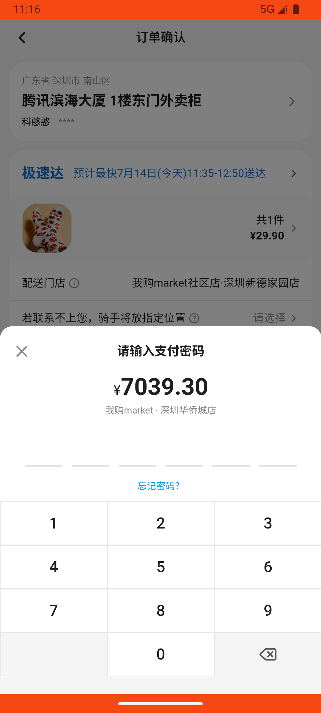
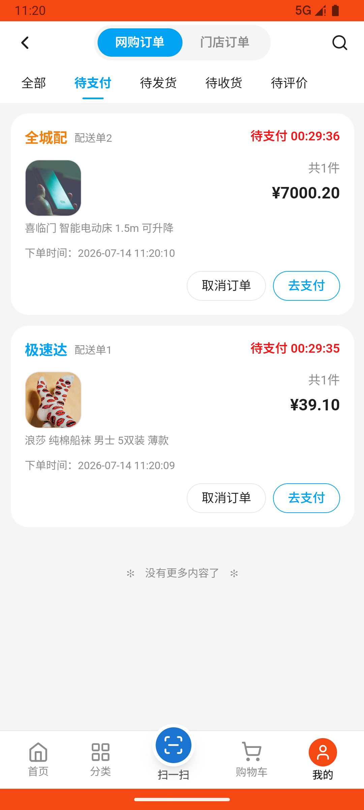
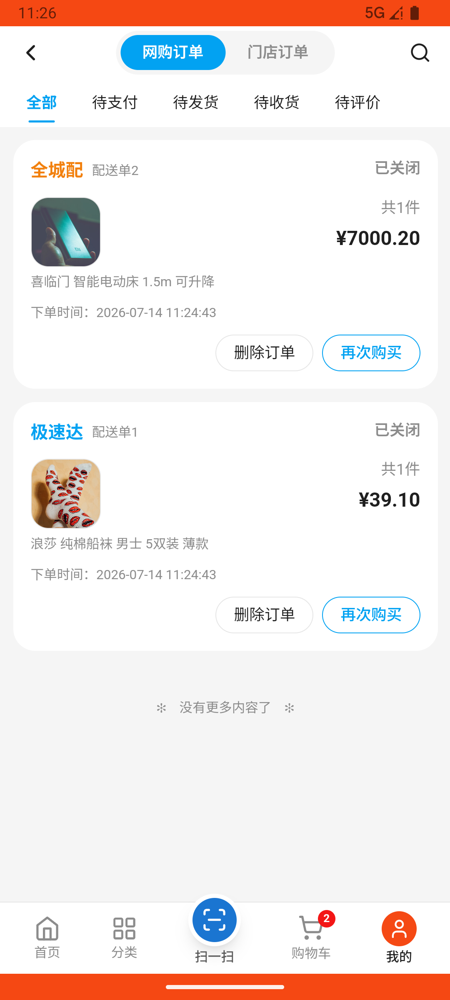

# common_v007_bedding_expensive_clothing_cheapest_checkout_cancel  ❌

- **Brand**: `wogoumarket`
- **Class**: `WogoumarketCommonV007BeddingExpensiveClothingCheapestCheckoutCancelTask`
- **Pass@3**: **0/3**  (score = 0.00)
- **Elapsed**: 860s (~14.3 min)
- **Model**: `doubao-seed-2-0-pro-260215`
- **Raw log**: [./raw_logs/WogoumarketCommonV007BeddingExpensiveClothingCheapestCheckoutCancelTask.log](./raw_logs/WogoumarketCommonV007BeddingExpensiveClothingCheapestCheckoutCancelTask.log)
- **Generated**: 2026-07-14T15:54:20+08:00

## Task Goal

> 使用我购Market（com.wogoumarket）应用完成以下任务：在「床品服饰_床品」分类下找到价格最贵的商品并将其加购1件，切换到「床品服饰_服饰」分类下找到价格最低的商品将其加购1件，进入购物车完成结算和支付操作，在待收货订单页面将该订单取消

## System Prompt

<details>
<summary>展开查看完整 System Prompt</summary>


> You are provided with a task description, a history of previous actions, and corresponding screenshots. Your goal is to perform the next action to complete the task. Please note that if performing the same action multiple times results in a static screen with no changes, you should attempt a modified or alternative action.
> 
> ---
> 
> ## Function Definition
> 
> - `clarify` — Ask the user for more information to complete the task.
> - `click` — Mouse left single click action.
> - `double_click` — Mouse left double click action.
> - `drag` — Perform a drag action from the start point to the end point. Typically used for swiping or selecting elements.
> - `long_press` — Perform a long press action at the specified coordinates.
> - `open_app` — Open the specified application.
> - `press_back` — Press the back button.
> - `press_enter` — Press the enter key.
> - `press_home` — Press the home button.
> - `take_notes` — Take notes and report the result in the specified content.
> - `type` — Type the specified content. You should manually delete any text from the input box that you want to remove.
> - `wait` — Wait for a certain period of time.

</details>

## User Query

> 请在 com.wogoumarket 里面完成以下任务：
> 使用我购Market（com.wogoumarket）应用完成以下任务：在「床品服饰_床品」分类下找到价格最贵的商品并将其加购1件，切换到「床品服饰_服饰」分类下找到价格最低的商品将其加购1件，进入购物车完成结算和支付操作，在待收货订单页面将该订单取消

## Attempts

| # | Outcome | Steps | Terminated | Reason | Start → End |
|---|---------|-------|------------|--------|-------------|
| 1 | ❌ failed | 22 | answer | 存在已取消的订单: 未找到订单 | 2026-07-14 11:12:23 → 2026-07-14 11:16:16 |
| 2 | ❌ failed | 24 | answer | 存在已取消的订单: 预期订单状态为 cancelled，实际为 pending; 订单包含服饰分类下最便宜商品（浪莎船袜）: 订单未包含最便宜商品：浪莎 纯棉船袜 男士 5双装 薄款; 订单已被取消（cancelled_at 非空）: cancelled_at 为 nil，... | 2026-07-14 11:16:16 → 2026-07-14 11:20:34 |
| 3 | ❌ failed | 39 | answer | 订单包含服饰分类下最便宜商品（浪莎船袜）: 订单未包含最便宜商品：浪莎 纯棉船袜 男士 5双装 薄款 | 2026-07-14 11:20:34 → 2026-07-14 11:26:42 |

## Failure Details

### Episode 1 — ❌ failed

- steps_used: `22`
- terminated_reason: `answer`
- reason:

  ```
  存在已取消的订单: 未找到订单
  ```
- death shot: 
  - state: [`./screenshots/WogoumarketCommonV007BeddingExpensiveClothingCheapestCheckoutCancelTask/episode_001/step_022.json`](./screenshots/WogoumarketCommonV007BeddingExpensiveClothingCheapestCheckoutCancelTask/episode_001/step_022.json)
  - digest: [`episode_digest.md`](./screenshots/WogoumarketCommonV007BeddingExpensiveClothingCheapestCheckoutCancelTask/episode_001/episode_digest.md)

### Episode 2 — ❌ failed

- steps_used: `24`
- terminated_reason: `answer`
- reason:

  ```
  存在已取消的订单: 预期订单状态为 cancelled，实际为 pending; 订单包含服饰分类下最便宜商品（浪莎船袜）: 订单未包含最便宜商品：浪莎 纯棉船袜 男士 5双装 薄款; 订单已被取消（cancelled_at 非空）: cancelled_at 为 nil，订单未被取消
  ```
- death shot: 
  - state: [`./screenshots/WogoumarketCommonV007BeddingExpensiveClothingCheapestCheckoutCancelTask/episode_002/step_024.json`](./screenshots/WogoumarketCommonV007BeddingExpensiveClothingCheapestCheckoutCancelTask/episode_002/step_024.json)
  - digest: [`episode_digest.md`](./screenshots/WogoumarketCommonV007BeddingExpensiveClothingCheapestCheckoutCancelTask/episode_002/episode_digest.md)

### Episode 3 — ❌ failed

- steps_used: `39`
- terminated_reason: `answer`
- reason:

  ```
  订单包含服饰分类下最便宜商品（浪莎船袜）: 订单未包含最便宜商品：浪莎 纯棉船袜 男士 5双装 薄款
  ```
- death shot: 
  - state: [`./screenshots/WogoumarketCommonV007BeddingExpensiveClothingCheapestCheckoutCancelTask/episode_003/step_039.json`](./screenshots/WogoumarketCommonV007BeddingExpensiveClothingCheapestCheckoutCancelTask/episode_003/step_039.json)
  - digest: [`episode_digest.md`](./screenshots/WogoumarketCommonV007BeddingExpensiveClothingCheapestCheckoutCancelTask/episode_003/episode_digest.md)

---

> 本摘要由 `sengclaw/scripts/pipeline/log_summarizer.py` 自动生成。 原始完整 log 见上方 Raw log 链接（含每 step 的 messages / tool_call / screenshot 引用）。
