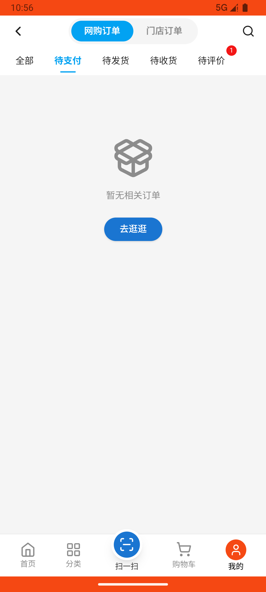
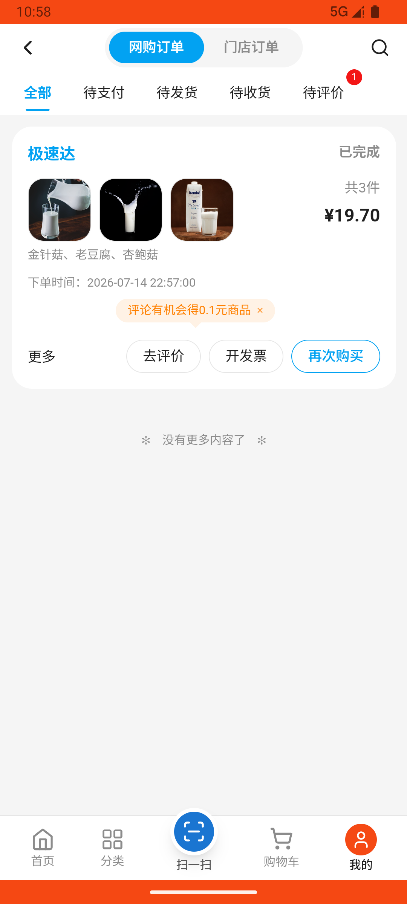

# order_v030_seafood_thumbs_up_review  ⚠️

- **Brand**: `wogoumarket`
- **Class**: `WogoumarketOrderV030SeafoodThumbsUpReviewTask`
- **Pass@3**: **1/3**  (score = 1.00)
- **Elapsed**: 437s (~7.3 min)
- **Model**: `doubao-seed-2-0-pro-260215`
- **Raw log**: [./raw_logs/WogoumarketOrderV030SeafoodThumbsUpReviewTask.log](./raw_logs/WogoumarketOrderV030SeafoodThumbsUpReviewTask.log)
- **Generated**: 2026-07-15T00:10:17+08:00

## Task Goal

> 使用我购Market（com.wogoumarket）应用完成以下任务：这次买的海鲜（虾、梭子蟹、三文鱼）品质好、很新鲜，给我一键点赞，然后提交

## System Prompt

<details>
<summary>展开查看完整 System Prompt</summary>


> You are provided with a task description, a history of previous actions, and corresponding screenshots. Your goal is to perform the next action to complete the task. Please note that if performing the same action multiple times results in a static screen with no changes, you should attempt a modified or alternative action.
> 
> ---
> 
> ## Function Definition
> 
> - `clarify` — Ask the user for more information to complete the task.
> - `click` — Mouse left single click action.
> - `double_click` — Mouse left double click action.
> - `drag` — Perform a drag action from the start point to the end point. Typically used for swiping or selecting elements.
> - `long_press` — Perform a long press action at the specified coordinates.
> - `open_app` — Open the specified application.
> - `press_back` — Press the back button.
> - `press_enter` — Press the enter key.
> - `press_home` — Press the home button.
> - `take_notes` — Take notes and report the result in the specified content.
> - `type` — Type the specified content. You should manually delete any text from the input box that you want to remove.
> - `wait` — Wait for a certain period of time.

</details>

## User Query

> 请在 com.wogoumarket 里面完成以下任务：
> 使用我购Market（com.wogoumarket）应用完成以下任务：这次买的海鲜（虾、梭子蟹、三文鱼）品质好、很新鲜，给我一键点赞，然后提交

## Attempts

| # | Outcome | Steps | Terminated | Reason | Start → End |
|---|---------|-------|------------|--------|-------------|
| 1 | ❌ failed | 12 | answer | 订单已完成评价: 预期订单状态为 completed，实际为 delivered; 基围虾收到好评: 未找到基围虾的评价; 梭子蟹收到好评: 未找到梭子蟹的评价; 三文鱼收到好评: 未找到三文鱼的评价 | 2026-07-14 22:54:58 → 2026-07-14 22:56:55 |
| 2 | ❌ failed | 8 | answer | 订单已完成评价: 预期订单状态为 completed，实际为 delivered; 基围虾收到好评: 未找到基围虾的评价; 梭子蟹收到好评: 未找到梭子蟹的评价; 三文鱼收到好评: 未找到三文鱼的评价 | 2026-07-14 22:56:55 → 2026-07-14 22:58:37 |
| 3 | ✅ passed | 16 | answer | – | 2026-07-14 22:58:37 → 2026-07-14 23:02:15 |

## Failure Details

### Episode 1 — ❌ failed

- steps_used: `12`
- terminated_reason: `answer`
- reason:

  ```
  订单已完成评价: 预期订单状态为 completed，实际为 delivered; 基围虾收到好评: 未找到基围虾的评价; 梭子蟹收到好评: 未找到梭子蟹的评价; 三文鱼收到好评: 未找到三文鱼的评价
  ```
- death shot: 
  - state: [`./screenshots/WogoumarketOrderV030SeafoodThumbsUpReviewTask/episode_001/step_012.json`](./screenshots/WogoumarketOrderV030SeafoodThumbsUpReviewTask/episode_001/step_012.json)
  - digest: [`episode_digest.md`](./screenshots/WogoumarketOrderV030SeafoodThumbsUpReviewTask/episode_001/episode_digest.md)

### Episode 2 — ❌ failed

- steps_used: `8`
- terminated_reason: `answer`
- reason:

  ```
  订单已完成评价: 预期订单状态为 completed，实际为 delivered; 基围虾收到好评: 未找到基围虾的评价; 梭子蟹收到好评: 未找到梭子蟹的评价; 三文鱼收到好评: 未找到三文鱼的评价
  ```
- death shot: 
  - state: [`./screenshots/WogoumarketOrderV030SeafoodThumbsUpReviewTask/episode_002/step_008.json`](./screenshots/WogoumarketOrderV030SeafoodThumbsUpReviewTask/episode_002/step_008.json)
  - digest: [`episode_digest.md`](./screenshots/WogoumarketOrderV030SeafoodThumbsUpReviewTask/episode_002/episode_digest.md)

---

> 本摘要由 `sengclaw/scripts/pipeline/log_summarizer.py` 自动生成。 原始完整 log 见上方 Raw log 链接（含每 step 的 messages / tool_call / screenshot 引用）。
