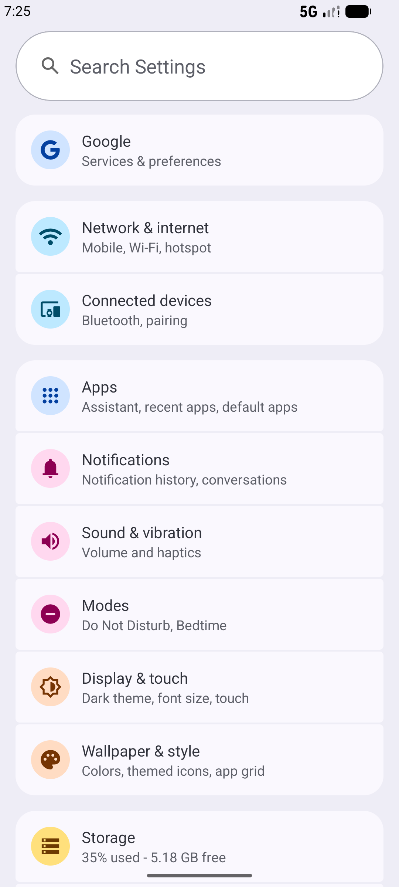
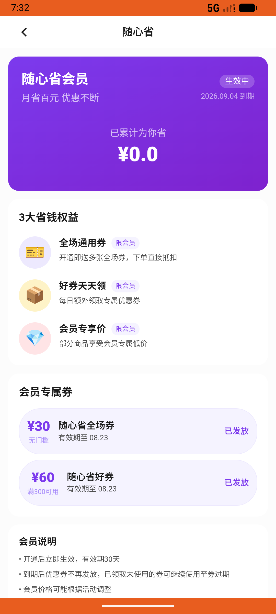

# notification_v015_pay_saving_card_from_expiry_notification  ❌

- **Brand**: `wogoumarket`
- **Class**: `WogoumarketNotificationV015PaySavingCardFromExpiryNotificationTask`
- **Pass@3**: **0/3**  (score = 0.00)
- **Elapsed**: 479s (~8.0 min)
- **Model**: `doubao-seed-evolving`
- **Raw log**: [./raw_logs/WogoumarketNotificationV015PaySavingCardFromExpiryNotificationTask.log](./raw_logs/WogoumarketNotificationV015PaySavingCardFromExpiryNotificationTask.log)
- **Generated**: 2026-08-04T20:17:52+08:00

## Task Goal

> 刚看到消息提醒说我有个省钱卡待支付订单快超时了，帮我先去首页右上角的消息图标进入通知中心，找到「订单信息」里那条待支付提醒，点进去把省钱卡订单付了，使用微信支付，无需向我确认

## System Prompt

<details>
<summary>展开查看完整 System Prompt</summary>


> You are provided with a task description, a history of previous actions, and corresponding screenshots. Your goal is to perform the next action to complete the task. Please note that if performing the same action multiple times results in a static screen with no changes, you should attempt a modified or alternative action.
> 
> ---
> 
> ## Function Definition
> 
> - `clarify` — Ask the user for more information to complete the task.
> - `click` — Mouse left single click action.
> - `double_click` — Mouse left double click action.
> - `drag` — Perform a drag action from the start point to the end point. Typically used for swiping or selecting elements.
> - `long_press` — Perform a long press action at the specified coordinates.
> - `open_app` — Open the specified application.
> - `press_back` — Press the back button.
> - `press_enter` — Press the enter key.
> - `press_home` — Press the home button.
> - `take_notes` — Take notes and report the result in the specified content.
> - `type` — Type the specified content. You should manually delete any text from the input box that you want to remove.
> - `wait` — Wait for a certain period of time.

</details>

## User Query

> 请在 com.wogoumarket 里面完成以下任务：
> 刚看到消息提醒说我有个省钱卡待支付订单快超时了，帮我先去首页右上角的消息图标进入通知中心，找到「订单信息」里那条待支付提醒，点进去把省钱卡订单付了，使用微信支付，无需向我确认

## Attempts

| # | Outcome | Steps | Terminated | Reason | Start → End |
|---|---------|-------|------------|--------|-------------|
| 1 | ❌ failed | 9 | answer | 催付通知已阅读: 催付通知未被阅读; 省钱卡订单已支付: 未找到已支付的省钱卡订单; 省钱卡已开通: 省钱卡未被开通，未找到 SavingCardPurchase 记录 | 2026-08-04 19:24:22 → 2026-08-04 19:25:29 |
| 2 | ❌ failed | 15 | answer | 催付通知已阅读: 催付通知未被阅读; 省钱卡订单已支付: 未找到已支付的省钱卡订单; 省钱卡已开通: 省钱卡未被开通，未找到 SavingCardPurchase 记录 | 2026-08-04 19:25:29 → 2026-08-04 19:27:40 |
| 3 | ❌ failed | 38 | answer | 催付通知已阅读: 催付通知未被阅读; 省钱卡订单已支付: 未找到已支付的省钱卡订单; 省钱卡已开通: 省钱卡未被开通，未找到 SavingCardPurchase 记录 | 2026-08-04 19:27:40 → 2026-08-04 19:32:21 |

## Failure Details

### Episode 1 — ❌ failed

- steps_used: `9`
- terminated_reason: `answer`
- reason:

  ```
  催付通知已阅读: 催付通知未被阅读; 省钱卡订单已支付: 未找到已支付的省钱卡订单; 省钱卡已开通: 省钱卡未被开通，未找到 SavingCardPurchase 记录
  ```
- death shot: 
  - state: [`./screenshots/WogoumarketNotificationV015PaySavingCardFromExpiryNotificationTask/episode_001/step_009.json`](./screenshots/WogoumarketNotificationV015PaySavingCardFromExpiryNotificationTask/episode_001/step_009.json)
  - digest: [`episode_digest.md`](./digests/WogoumarketNotificationV015PaySavingCardFromExpiryNotificationTask/episode_001/episode_digest.md)

### Episode 2 — ❌ failed

- steps_used: `15`
- terminated_reason: `answer`
- reason:

  ```
  催付通知已阅读: 催付通知未被阅读; 省钱卡订单已支付: 未找到已支付的省钱卡订单; 省钱卡已开通: 省钱卡未被开通，未找到 SavingCardPurchase 记录
  ```
- death shot: 
  - state: [`./screenshots/WogoumarketNotificationV015PaySavingCardFromExpiryNotificationTask/episode_002/step_015.json`](./screenshots/WogoumarketNotificationV015PaySavingCardFromExpiryNotificationTask/episode_002/step_015.json)
  - digest: [`episode_digest.md`](./digests/WogoumarketNotificationV015PaySavingCardFromExpiryNotificationTask/episode_002/episode_digest.md)

### Episode 3 — ❌ failed

- steps_used: `38`
- terminated_reason: `answer`
- reason:

  ```
  催付通知已阅读: 催付通知未被阅读; 省钱卡订单已支付: 未找到已支付的省钱卡订单; 省钱卡已开通: 省钱卡未被开通，未找到 SavingCardPurchase 记录
  ```
- death shot: 
  - state: [`./screenshots/WogoumarketNotificationV015PaySavingCardFromExpiryNotificationTask/episode_003/step_038.json`](./screenshots/WogoumarketNotificationV015PaySavingCardFromExpiryNotificationTask/episode_003/step_038.json)
  - digest: [`episode_digest.md`](./digests/WogoumarketNotificationV015PaySavingCardFromExpiryNotificationTask/episode_003/episode_digest.md)

---

> 本摘要由 `sengclaw/scripts/pipeline/log_summarizer.py` 自动生成。 原始完整 log 见上方 Raw log 链接（含每 step 的 messages / tool_call / screenshot 引用）。
