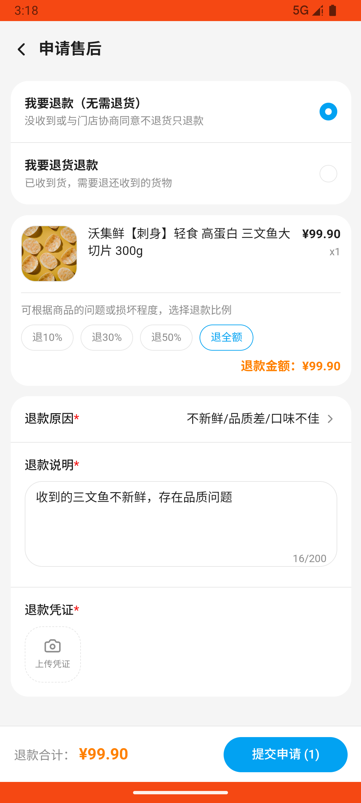
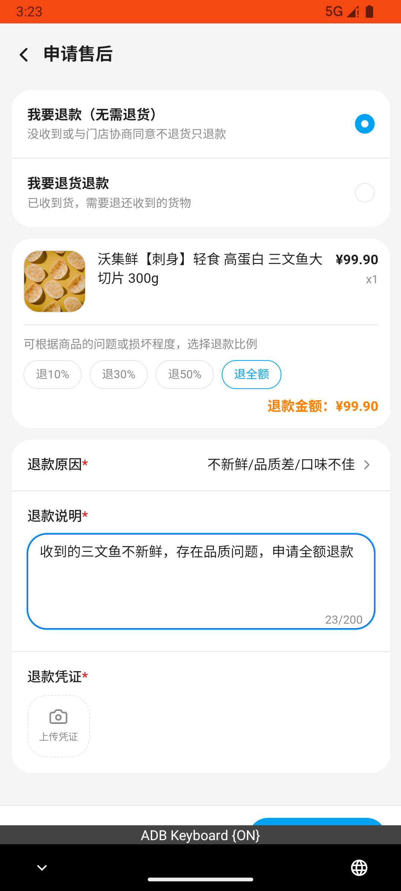
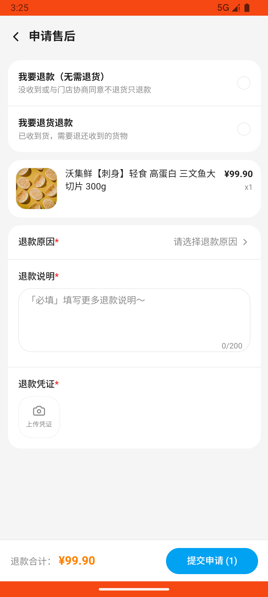

# order_v011_confirm_then_partial_refund  ❌

- **Brand**: `wogoumarket`
- **Class**: `WogoumarketOrderV011ConfirmThenPartialRefundTask`
- **Pass@3**: **0/3**  (score = 0.00)
- **Elapsed**: 653s (~10.9 min)
- **Model**: `doubao-seed-2-0-pro-260215`
- **Raw log**: [./raw_logs/WogoumarketOrderV011ConfirmThenPartialRefundTask.log](./raw_logs/WogoumarketOrderV011ConfirmThenPartialRefundTask.log)
- **Generated**: 2026-07-14T17:38:02+08:00
- **Note**: backfilled from /tmp/pass_at_3_full_<ts>/ on 2026-05-02

## Task Goal

> 使用我购Market（com.wogoumarket）应用完成以下任务：刚收到那个有两样东西的订单，我点击确认收货了，但是我现在看到三文鱼有点不新鲜，帮我把三文鱼那个商品申请退款

## System Prompt

<details>
<summary>展开查看完整 System Prompt</summary>


> You are provided with a task description, a history of previous actions, and corresponding screenshots. Your goal is to perform the next action to complete the task. Please note that if performing the same action multiple times results in a static screen with no changes, you should attempt a modified or alternative action.
> 
> ---
> 
> ## Function Definition
> 
> - `clarify` — Ask the user for more information to complete the task.
> - `click` — Mouse left single click action.
> - `double_click` — Mouse left double click action.
> - `drag` — Perform a drag action from the start point to the end point. Typically used for swiping or selecting elements.
> - `long_press` — Perform a long press action at the specified coordinates.
> - `open_app` — Open the specified application.
> - `press_back` — Press the back button.
> - `press_enter` — Press the enter key.
> - `press_home` — Press the home button.
> - `take_notes` — Take notes and report the result in the specified content.
> - `type` — Type the specified content. You should manually delete any text from the input box that you want to remove.
> - `wait` — Wait for a certain period of time.

</details>

## User Query

> 请在 com.wogoumarket 里面完成以下任务：
> 使用我购Market（com.wogoumarket）应用完成以下任务：刚收到那个有两样东西的订单，我点击确认收货了，但是我现在看到三文鱼有点不新鲜，帮我把三文鱼那个商品申请退款

## Attempts

| # | Outcome | Steps | Terminated | Reason | Start → End |
|---|---------|-------|------------|--------|-------------|
| 1 | ❌ failed | 17 | answer | 订单已确认收货: 订单状态为 shipping，应为 delivered | 2026-07-14 15:14:35 → 2026-07-14 15:18:26 |
| 2 | ❌ failed | 21 | answer | 存在退款申请: 未找到退款申请 | 2026-07-14 15:18:26 → 2026-07-14 15:23:15 |
| 3 | ❌ failed | 9 | answer | 订单已确认收货: 订单状态为 shipping，应为 delivered | 2026-07-14 15:23:15 → 2026-07-14 15:25:27 |

## Failure Details

### Episode 1 — ❌ failed

- steps_used: `17`
- terminated_reason: `answer`
- reason:

  ```
  订单已确认收货: 订单状态为 shipping，应为 delivered
  ```

- state: [`./death_shots/WogoumarketOrderV011ConfirmThenPartialRefundTask/episode_001/step_017.json`](./death_shots/WogoumarketOrderV011ConfirmThenPartialRefundTask/episode_001/step_017.json)
- digest: [`episode_digest.md`](./episode_digests/WogoumarketOrderV011ConfirmThenPartialRefundTask/episode_001/episode_digest.md)

### Episode 2 — ❌ failed

- steps_used: `21`
- terminated_reason: `answer`
- reason:

  ```
  存在退款申请: 未找到退款申请
  ```

- state: [`./death_shots/WogoumarketOrderV011ConfirmThenPartialRefundTask/episode_002/step_021.json`](./death_shots/WogoumarketOrderV011ConfirmThenPartialRefundTask/episode_002/step_021.json)
- digest: [`episode_digest.md`](./episode_digests/WogoumarketOrderV011ConfirmThenPartialRefundTask/episode_002/episode_digest.md)

### Episode 3 — ❌ failed

- steps_used: `9`
- terminated_reason: `answer`
- reason:

  ```
  订单已确认收货: 订单状态为 shipping，应为 delivered
  ```

- state: [`./death_shots/WogoumarketOrderV011ConfirmThenPartialRefundTask/episode_003/step_009.json`](./death_shots/WogoumarketOrderV011ConfirmThenPartialRefundTask/episode_003/step_009.json)
- digest: [`episode_digest.md`](./episode_digests/WogoumarketOrderV011ConfirmThenPartialRefundTask/episode_003/episode_digest.md)

---

> 本摘要由 `sengclaw/scripts/pipeline/log_summarizer.py` 自动生成。 原始完整 log 见上方 Raw log 链接（含每 step 的 messages / tool_call / screenshot 引用）。
