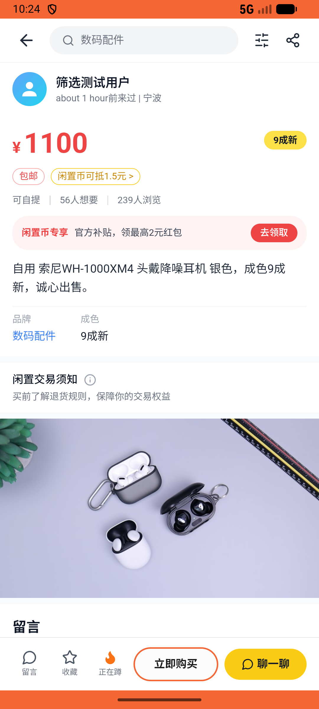
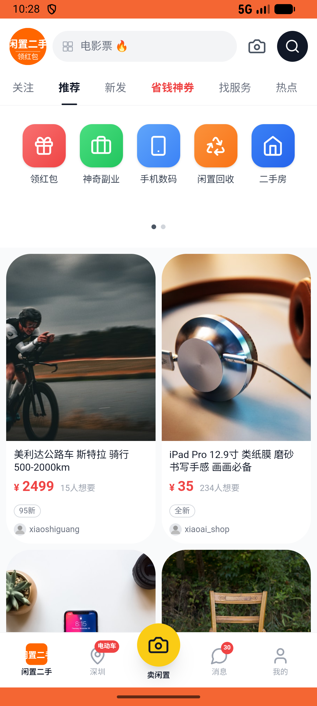

# like/v002_like_validator  ❌

- **Brand**: `xianzhiershouwang`
- **Class**: `XianzhiershouwangLikeV002LikeValidatorTask`
- **Pass@3**: **0/3**  (score = 0.00)
- **Elapsed**: 1501s (~25.0 min)
- **Model**: `doubao-seed-2-0-pro-260215`
- **Raw log**: [./raw_logs/XianzhiershouwangLikeV002LikeValidatorTask.log](./raw_logs/XianzhiershouwangLikeV002LikeValidatorTask.log)
- **Generated**: 2026-05-14T15:47:00+08:00

## Task Goal

> 【当前账户档案】账号：zhangsan@example.com；昵称：张三；默认收货地址（JSON）：{"recipient": "张三", "phone": "13800138000", "address": "上海市 上海市 浦东新区 陆家嘴环路1000号"}。请基于以上档案完成下列任务：以张三的身份，在首页找到「自用 索尼WH-1000XM4 头戴降噪耳机 银色」帖子，进入详情页点击「蹲一蹲」按钮，在弹窗中将期望价格设为900元并确认

## Attempts

| # | Outcome | Steps | Terminated | Reason | Start → End |
|---|---------|-------|------------|--------|-------------|
| 1 | ❌ failed | 10 | answer | – | – |
| 2 | ❌ failed | 10 | answer | – | – |
| 3 | ❌ failed | 17 | answer | – | – |
| 4 | ❌ failed | 2 | unknown | – | – |
| 5 | ❌ failed | 0 | exception_avd_bypass | outer_exception_then_bypass: 500 Server Error: Internal Server Error for url: http://localhost:6800/task/init \|\| avd_bypass_verify pass... | – |
| 6 | ❌ failed | 0 | exception_avd_bypass | outer_exception_then_bypass: 404 Client Error: Not Found for url: http://localhost:6800/task/init \|\| avd_bypass_verify passed=False err... | – |

## Failure Details

### Episode 1 — ❌ failed

- steps_used: `10`
- terminated_reason: `answer`
- death shot: 
  - state: [`./death_shots/XianzhiershouwangLikeV002LikeValidatorTask/episode_001/step_010.json`](./death_shots/XianzhiershouwangLikeV002LikeValidatorTask/episode_001/step_010.json)

### Episode 2 — ❌ failed

- steps_used: `10`
- terminated_reason: `answer`
- death shot: 
  - state: [`./death_shots/XianzhiershouwangLikeV002LikeValidatorTask/episode_002/step_010.json`](./death_shots/XianzhiershouwangLikeV002LikeValidatorTask/episode_002/step_010.json)

### Episode 3 — ❌ failed

- steps_used: `17`
- terminated_reason: `answer`
- death shot: 
  - state: [`./death_shots/XianzhiershouwangLikeV002LikeValidatorTask/episode_003/step_017.json`](./death_shots/XianzhiershouwangLikeV002LikeValidatorTask/episode_003/step_017.json)

### Episode 4 — ❌ failed

- steps_used: `2`
- terminated_reason: `unknown`
- death shot: 
  - state: [`./death_shots/XianzhiershouwangLikeV002LikeValidatorTask/episode_004/step_001.json`](./death_shots/XianzhiershouwangLikeV002LikeValidatorTask/episode_004/step_001.json)

### Episode 5 — ❌ failed

- steps_used: `0`
- terminated_reason: `exception_avd_bypass`
- reason:

  ```
  outer_exception_then_bypass: 500 Server Error: Internal Server Error for url: http://localhost:6800/task/init || avd_bypass_verify passed=False errors=['张三蹲蹲了「索尼WH-1000XM4」帖子: 未找到张三对索尼耳机帖子的蹲一蹲记录']
  ```

### Episode 6 — ❌ failed

- steps_used: `0`
- terminated_reason: `exception_avd_bypass`
- reason:

  ```
  outer_exception_then_bypass: 404 Client Error: Not Found for url: http://localhost:6800/task/init || avd_bypass_verify passed=False errors=['张三蹲蹲了「索尼WH-1000XM4」帖子: 未找到张三对索尼耳机帖子的蹲一蹲记录']
  ```

---

> 本摘要由 `sengclaw/scripts/pipeline/log_summarizer.py` 自动生成。 原始完整 log 见上方 Raw log 链接（含每 step 的 messages / tool_call / screenshot 引用）。
