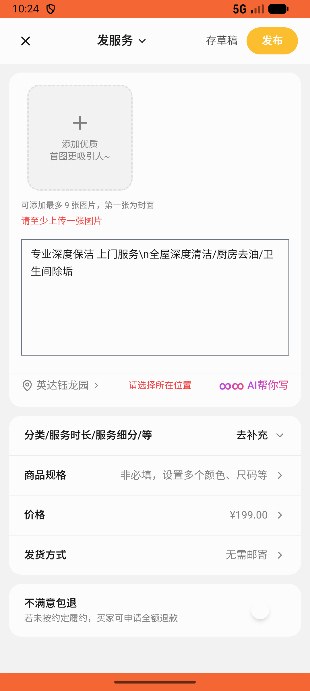
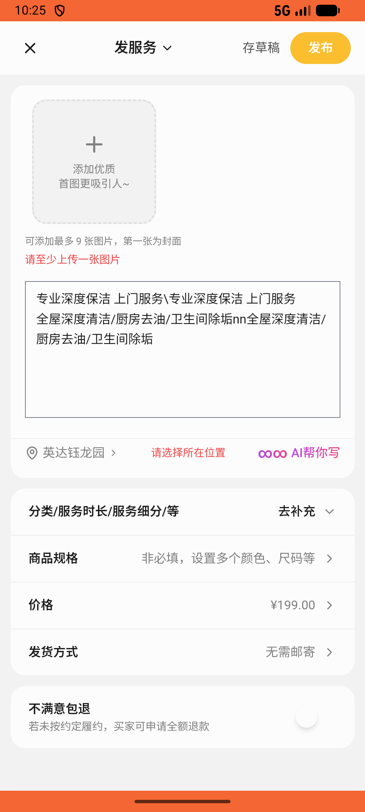
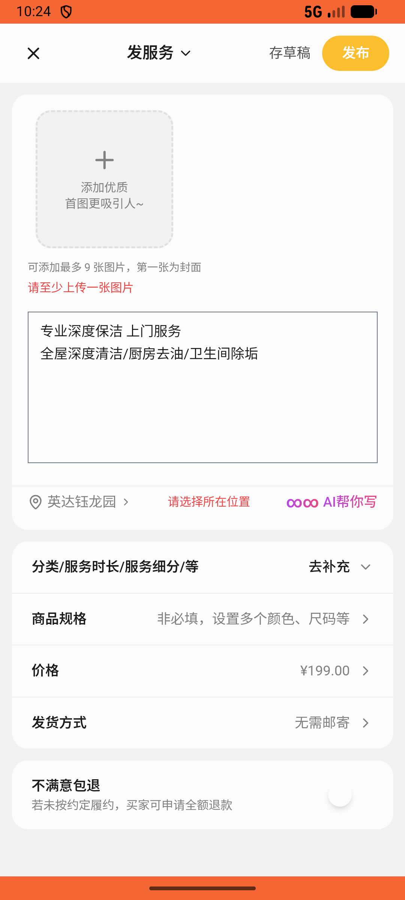

# recycle/v003_recycle_validator  ❌

- **Brand**: `xianzhiershouwang`
- **Class**: `XianzhiershouwangRecycleV003RecycleValidatorTask`
- **Pass@3**: **0/3**  (score = 0.00)
- **Elapsed**: 1757s (~29.3 min)
- **Model**: `doubao-seed-2-0-pro-260215`
- **Raw log**: [./raw_logs/XianzhiershouwangRecycleV003RecycleValidatorTask.log](./raw_logs/XianzhiershouwangRecycleV003RecycleValidatorTask.log)
- **Generated**: 2026-05-21T01:02:57+08:00

## Task Goal

> 【当前账户档案】账号：zhangsan@example.com；昵称：张三；默认收货地址（JSON）：{"recipient": "张三", "phone": "13800138000", "address": "上海市 上海市 浦东新区 陆家嘴环路1000号"}。请基于以上档案完成下列任务：以张三的身份，进入「卖闲置」→「发服务」，发布标题为「专业深度保洁 上门服务」的家政帖子，描述包含全屋深度清洁/厨房去油/卫生间除垢，定价199元，服务地点北京

## Attempts

| # | Outcome | Steps | Terminated | Reason | Start → End |
|---|---------|-------|------------|--------|-------------|
| 1 | ❌ failed | 25 | answer | – | – |
| 2 | ❌ failed | 30 | answer | – | – |
| 3 | ❌ failed | 26 | answer | – | – |
| 4 | ❌ failed | 1 | unknown | – | – |
| 5 | ❌ failed | 1 | unknown | – | – |
| 6 | ❌ failed | 1 | unknown | – | – |

## Failure Details

### Episode 1 — ❌ failed

- steps_used: `25`
- terminated_reason: `answer`
- death shot: 
  - state: [`./death_shots/XianzhiershouwangRecycleV003RecycleValidatorTask/episode_001/step_025.json`](./death_shots/XianzhiershouwangRecycleV003RecycleValidatorTask/episode_001/step_025.json)

### Episode 2 — ❌ failed

- steps_used: `30`
- terminated_reason: `answer`
- death shot: 
  - state: [`./death_shots/XianzhiershouwangRecycleV003RecycleValidatorTask/episode_002/step_030.json`](./death_shots/XianzhiershouwangRecycleV003RecycleValidatorTask/episode_002/step_030.json)

### Episode 3 — ❌ failed

- steps_used: `26`
- terminated_reason: `answer`
- death shot: 
  - state: [`./death_shots/XianzhiershouwangRecycleV003RecycleValidatorTask/episode_003/step_026.json`](./death_shots/XianzhiershouwangRecycleV003RecycleValidatorTask/episode_003/step_026.json)

### Episode 4 — ❌ failed

- steps_used: `1`
- terminated_reason: `unknown`
- death shot: 
  - state: [`./death_shots/XianzhiershouwangRecycleV003RecycleValidatorTask/episode_004/step_000_init.json`](./death_shots/XianzhiershouwangRecycleV003RecycleValidatorTask/episode_004/step_000_init.json)

### Episode 5 — ❌ failed

- steps_used: `1`
- terminated_reason: `unknown`
- death shot: 
  - state: [`./death_shots/XianzhiershouwangRecycleV003RecycleValidatorTask/episode_005/step_000_init.json`](./death_shots/XianzhiershouwangRecycleV003RecycleValidatorTask/episode_005/step_000_init.json)

### Episode 6 — ❌ failed

- steps_used: `1`
- terminated_reason: `unknown`
- death shot: 
  - state: [`./death_shots/XianzhiershouwangRecycleV003RecycleValidatorTask/episode_006/step_000_init.json`](./death_shots/XianzhiershouwangRecycleV003RecycleValidatorTask/episode_006/step_000_init.json)

---

> 本摘要由 `sengclaw/scripts/pipeline/log_summarizer.py` 自动生成。 原始完整 log 见上方 Raw log 链接（含每 step 的 messages / tool_call / screenshot 引用）。
