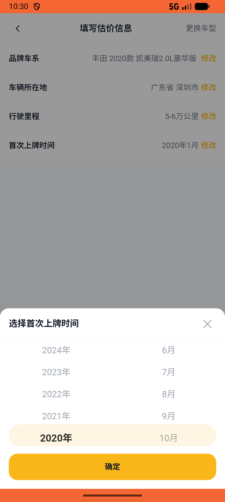
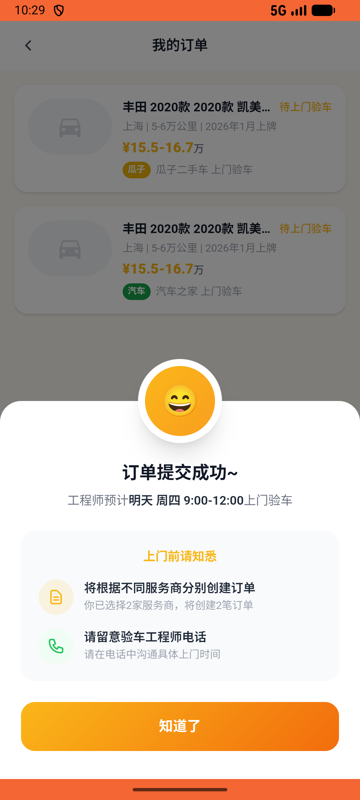

# recycle/v012_recycle_validator  ⚠️

- **Brand**: `xianzhiershouwang`
- **Class**: `XianzhiershouwangRecycleV012RecycleValidatorTask`
- **Pass@3**: **1/3**  (score = 1.00)
- **Elapsed**: 1548s (~25.8 min)
- **Model**: `doubao-seed-2-0-pro-260215`
- **Raw log**: [./raw_logs/XianzhiershouwangRecycleV012RecycleValidatorTask.log](./raw_logs/XianzhiershouwangRecycleV012RecycleValidatorTask.log)
- **Generated**: 2026-05-21T01:30:39+08:00

## Task Goal

> 【当前账户档案】账号：zhangsan@example.com；昵称：张三；默认收货地址（JSON）：{"recipient": "张三", "phone": "13800138000", "address": "上海市 上海市 浦东新区 陆家嘴环路1000号"}。请基于以上档案完成下列任务：以张三的身份，进入「闲置回收」的二手车估价，选择品牌丰田→车系凯美瑞→年份2020→里程5万公里→上牌时间2020年3月，选择预约时间后提交订单

## Attempts

| # | Outcome | Steps | Terminated | Reason | Start → End |
|---|---------|-------|------------|--------|-------------|
| 1 | ⏰ timeout | 50 | max_steps | – | – |
| 2 | ❌ failed | 38 | answer | – | – |
| 3 | ✅ passed | 50 | answer | – | – |

## Failure Details

### Episode 1 — ⏰ timeout

- steps_used: `50`
- terminated_reason: `max_steps`
- death shot: 
  - state: [`./death_shots/XianzhiershouwangRecycleV012RecycleValidatorTask/episode_001/step_050.json`](./death_shots/XianzhiershouwangRecycleV012RecycleValidatorTask/episode_001/step_050.json)

### Episode 2 — ❌ failed

- steps_used: `38`
- terminated_reason: `answer`
- death shot: 
  - state: [`./death_shots/XianzhiershouwangRecycleV012RecycleValidatorTask/episode_002/step_038.json`](./death_shots/XianzhiershouwangRecycleV012RecycleValidatorTask/episode_002/step_038.json)

---

> 本摘要由 `sengclaw/scripts/pipeline/log_summarizer.py` 自动生成。 原始完整 log 见上方 Raw log 链接（含每 step 的 messages / tool_call / screenshot 引用）。
