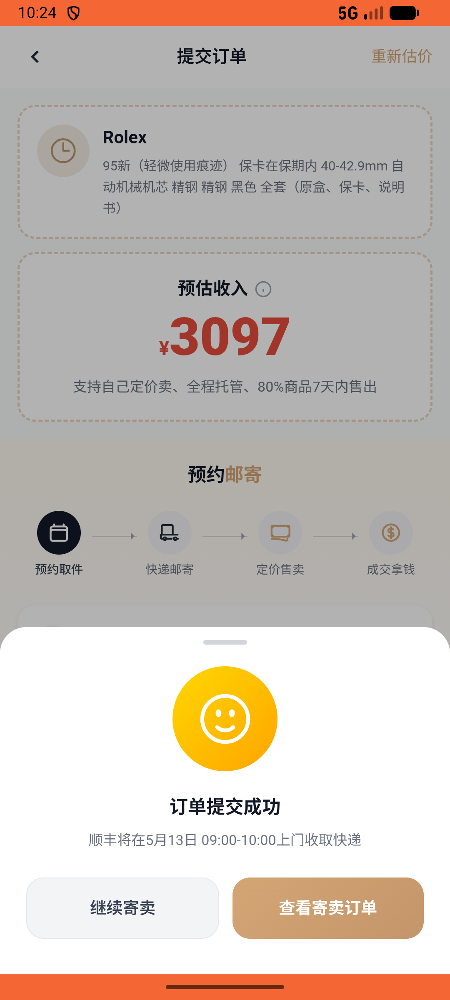

# recycle/v016_recycle_validator  ❌

- **Brand**: `xianzhiershouwang`
- **Class**: `XianzhiershouwangRecycleV016RecycleValidatorTask`
- **Pass@3**: **0/3**  (score = 0.00)
- **Elapsed**: 809s (~13.5 min)
- **Model**: `doubao-seed-2-0-pro-260215`
- **Raw log**: [./raw_logs/XianzhiershouwangRecycleV016RecycleValidatorTask.log](./raw_logs/XianzhiershouwangRecycleV016RecycleValidatorTask.log)
- **Generated**: 2026-05-21T01:58:20+08:00

## Task Goal

> 【当前账户档案】账号：zhangsan@example.com；昵称：张三；默认收货地址（JSON）：{"recipient": "张三", "phone": "13800138000", "address": "上海市 上海市 浦东新区 陆家嘴环路1000号"}。请基于以上档案完成下列任务：以张三的身份，进入「闲置回收」→「奢品寄卖」，选择腕表分类→品牌劳力士→系列Submariner，回答问卷选择95新/保卡在保期内/40-42.9mm/自动机械机芯/精钢表带/精钢表壳/黑色表盘/全套包装，查看报价后选择预约取件时间并提交订单

## Attempts

| # | Outcome | Steps | Terminated | Reason | Start → End |
|---|---------|-------|------------|--------|-------------|
| 1 | ❌ failed | 40 | answer | – | – |
| 2 | ❌ failed | 24 | answer | – | – |
| 3 | ❌ failed | 24 | answer | – | – |

## Failure Details

### Episode 1 — ❌ failed

- steps_used: `40`
- terminated_reason: `answer`
- death shot: 
  - state: [`./death_shots/XianzhiershouwangRecycleV016RecycleValidatorTask/episode_001/step_040.json`](./death_shots/XianzhiershouwangRecycleV016RecycleValidatorTask/episode_001/step_040.json)

### Episode 2 — ❌ failed

- steps_used: `24`
- terminated_reason: `answer`
- death shot: 
  - state: [`./death_shots/XianzhiershouwangRecycleV016RecycleValidatorTask/episode_002/step_024.json`](./death_shots/XianzhiershouwangRecycleV016RecycleValidatorTask/episode_002/step_024.json)

### Episode 3 — ❌ failed

- steps_used: `24`
- terminated_reason: `answer`
- death shot: 
  - state: [`./death_shots/XianzhiershouwangRecycleV016RecycleValidatorTask/episode_003/step_024.json`](./death_shots/XianzhiershouwangRecycleV016RecycleValidatorTask/episode_003/step_024.json)

---

> 本摘要由 `sengclaw/scripts/pipeline/log_summarizer.py` 自动生成。 原始完整 log 见上方 Raw log 链接（含每 step 的 messages / tool_call / screenshot 引用）。
