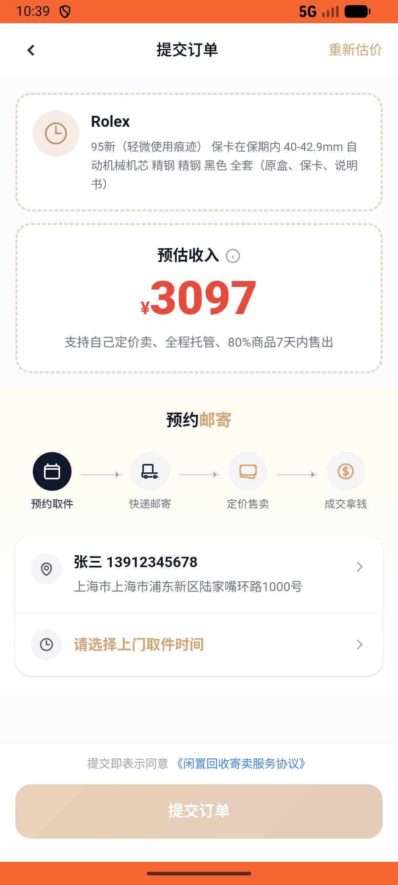

# recycle/v016_recycle_validator  ❌

- **Brand**: `xianzhiershouwang`
- **Class**: `XianzhiershouwangRecycleV016RecycleValidatorTask`
- **Pass@3**: **0/3**  (score = 0.00)
- **Elapsed**: 596s (~9.9 min)
- **Model**: `doubao-seed-2-0-lite-260428`
- **Raw log**: [./raw_logs/XianzhiershouwangRecycleV016RecycleValidatorTask.log](./raw_logs/XianzhiershouwangRecycleV016RecycleValidatorTask.log)
- **Generated**: 2026-05-22T01:01:08+08:00

## Task Goal

> 当前App：【闲置二手网】。

## Attempts

| # | Outcome | Steps | Terminated | Reason | Start → End |
|---|---------|-------|------------|--------|-------------|
| 1 | ❌ failed | 36 | answer | – | 2026-05-22 00:51:12 → 2026-05-22 00:58:44 |
| 2 | ❌ failed | 5 | answer | – | 2026-05-22 00:58:44 → 2026-05-22 00:59:31 |
| 3 | ❌ failed | 8 | answer | – | 2026-05-22 00:59:31 → 2026-05-22 01:01:08 |

## Failure Details

### Episode 1 — ❌ failed

- steps_used: `36`
- terminated_reason: `answer`
- death shot: 
  - state: [`./death_shots/XianzhiershouwangRecycleV016RecycleValidatorTask/episode_001/step_036.json`](./death_shots/XianzhiershouwangRecycleV016RecycleValidatorTask/episode_001/step_036.json)

### Episode 2 — ❌ failed

- steps_used: `5`
- terminated_reason: `answer`
- death shot: 
  - state: [`./death_shots/XianzhiershouwangRecycleV016RecycleValidatorTask/episode_002/step_005.json`](./death_shots/XianzhiershouwangRecycleV016RecycleValidatorTask/episode_002/step_005.json)

### Episode 3 — ❌ failed

- steps_used: `8`
- terminated_reason: `answer`
- death shot: 
  - state: [`./death_shots/XianzhiershouwangRecycleV016RecycleValidatorTask/episode_003/step_008.json`](./death_shots/XianzhiershouwangRecycleV016RecycleValidatorTask/episode_003/step_008.json)

---

> 本摘要由 `sengclaw/scripts/pipeline/log_summarizer.py` 自动生成。 原始完整 log 见上方 Raw log 链接（含每 step 的 messages / tool_call / screenshot 引用）。
