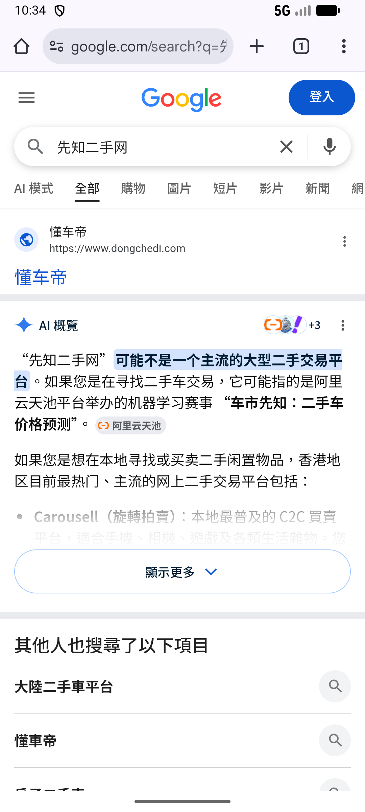

# order/v002_order_validator  ❌

- **Brand**: `xianzhiershouwang`
- **Class**: `XianzhiershouwangOrderV002OrderValidatorTask`
- **Pass@3**: **0/3**  (score = 0.00)
- **Elapsed**: 296s (~4.9 min)
- **Model**: `doubao-seed-2-0-lite-260428`
- **Raw log**: [./raw_logs/XianzhiershouwangOrderV002OrderValidatorTask.log](./raw_logs/XianzhiershouwangOrderV002OrderValidatorTask.log)
- **Generated**: 2026-05-23T06:59:26+08:00

## Task Goal

> 【当前账户档案】账号：zhangsan@example.com；昵称：张三；默认收货地址（JSON）：{"recipient": "张三", "phone": "13800138000", "address": "上海市 上海市 浦东新区 陆家嘴环路1000号"}。请基于以上档案完成下列任务：那个iPhone 16 Pro Max全新未拆封的帮我下单，微信付

## Attempts

| # | Outcome | Steps | Terminated | Reason | Start → End |
|---|---------|-------|------------|--------|-------------|
| 1 | ❌ failed | 6 | answer | – | 2026-05-23 06:54:30 → 2026-05-23 06:55:24 |
| 2 | ❌ failed | 9 | answer | – | 2026-05-23 06:55:24 → 2026-05-23 06:56:41 |
| 3 | ❌ failed | 19 | answer | – | 2026-05-23 06:56:41 → 2026-05-23 06:59:26 |

## Failure Details

### Episode 1 — ❌ failed

- steps_used: `6`
- terminated_reason: `answer`
- death shot: 
  - state: [`./death_shots/XianzhiershouwangOrderV002OrderValidatorTask/episode_001/step_006.json`](./death_shots/XianzhiershouwangOrderV002OrderValidatorTask/episode_001/step_006.json)
  - digest: [`episode_digest.md`](./death_shots/XianzhiershouwangOrderV002OrderValidatorTask/episode_001/episode_digest.md)

### Episode 2 — ❌ failed

- steps_used: `9`
- terminated_reason: `answer`
- death shot: 
  - state: [`./death_shots/XianzhiershouwangOrderV002OrderValidatorTask/episode_002/step_009.json`](./death_shots/XianzhiershouwangOrderV002OrderValidatorTask/episode_002/step_009.json)
  - digest: [`episode_digest.md`](./death_shots/XianzhiershouwangOrderV002OrderValidatorTask/episode_002/episode_digest.md)

### Episode 3 — ❌ failed

- steps_used: `19`
- terminated_reason: `answer`
- death shot: 
  - state: [`./death_shots/XianzhiershouwangOrderV002OrderValidatorTask/episode_003/step_019.json`](./death_shots/XianzhiershouwangOrderV002OrderValidatorTask/episode_003/step_019.json)
  - digest: [`episode_digest.md`](./death_shots/XianzhiershouwangOrderV002OrderValidatorTask/episode_003/episode_digest.md)

---

> 本摘要由 `sengclaw/scripts/pipeline/log_summarizer.py` 自动生成。 原始完整 log 见上方 Raw log 链接（含每 step 的 messages / tool_call / screenshot 引用）。
