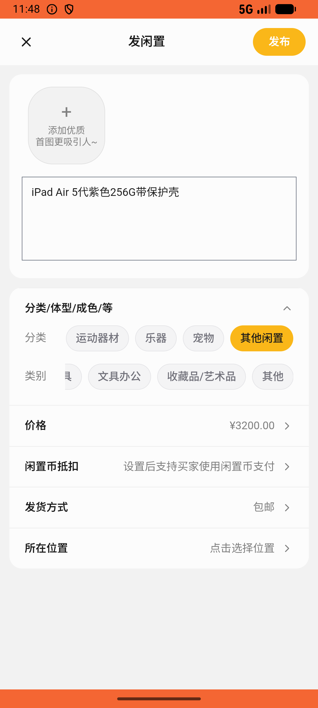
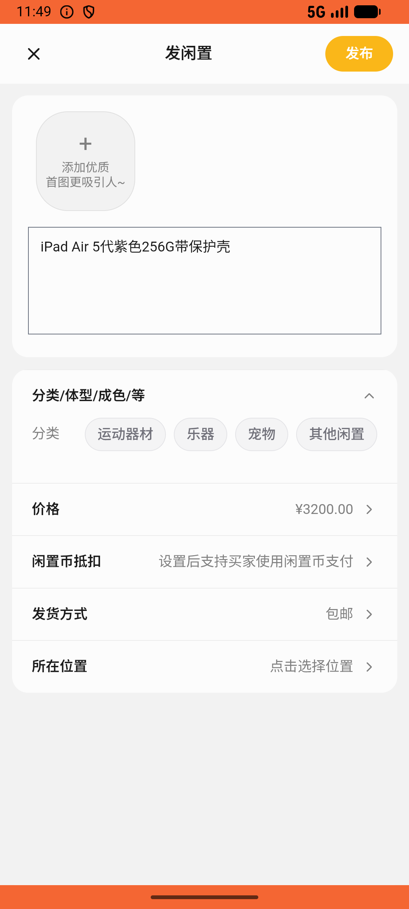

# post/v002_post_validator  ⚠️

- **Brand**: `xianzhiershouwang`
- **Class**: `XianzhiershouwangPostV002PostValidatorTask`
- **Pass@3**: **1/3**  (score = 1.00)
- **Elapsed**: 1209s (~20.1 min)
- **Model**: `doubao-seed-2-0-lite-260428`
- **Raw log**: [./raw_logs/XianzhiershouwangPostV002PostValidatorTask.log](./raw_logs/XianzhiershouwangPostV002PostValidatorTask.log)
- **Generated**: 2026-05-26T03:55:06+08:00

## Task Goal

> 【当前账户档案】账号：zhangsan@example.com；昵称：张三；默认收货地址（JSON）：{"recipient": "张三", "phone": "13800138000", "address": "上海市 上海市 浦东新区 陆家嘴环路1000号"}。请基于以上档案打开 com.xianzhiershouwang 并完成以下任务：帮我发个帖子出iPad Air 5代紫色256G带保护壳的，卖3200，分类电子产品

## Attempts

| # | Outcome | Steps | Terminated | Reason | Start → End |
|---|---------|-------|------------|--------|-------------|
| 1 | ⏰ timeout | 50 | max_steps | – | 2026-05-26 03:34:57 → 2026-05-26 03:40:59 |
| 2 | ✅ passed | 45 | answer | – | 2026-05-26 03:41:30 → 2026-05-26 03:47:54 |
| 3 | ⏰ timeout | 50 | max_steps | – | 2026-05-26 03:48:25 → 2026-05-26 03:55:06 |

## Failure Details

### Episode 1 — ⏰ timeout

- steps_used: `50`
- terminated_reason: `max_steps`
- death shot: 
  - state: [`./death_shots/XianzhiershouwangPostV002PostValidatorTask/episode_001/step_050.json`](./death_shots/XianzhiershouwangPostV002PostValidatorTask/episode_001/step_050.json)
  - digest: [`episode_digest.md`](./death_shots/XianzhiershouwangPostV002PostValidatorTask/episode_001/episode_digest.md)

### Episode 3 — ⏰ timeout

- steps_used: `50`
- terminated_reason: `max_steps`
- death shot: 
  - state: [`./death_shots/XianzhiershouwangPostV002PostValidatorTask/episode_003/step_050.json`](./death_shots/XianzhiershouwangPostV002PostValidatorTask/episode_003/step_050.json)
  - digest: [`episode_digest.md`](./death_shots/XianzhiershouwangPostV002PostValidatorTask/episode_003/episode_digest.md)

---

> 本摘要由 `sengclaw/scripts/pipeline/log_summarizer.py` 自动生成。 原始完整 log 见上方 Raw log 链接（含每 step 的 messages / tool_call / screenshot 引用）。
