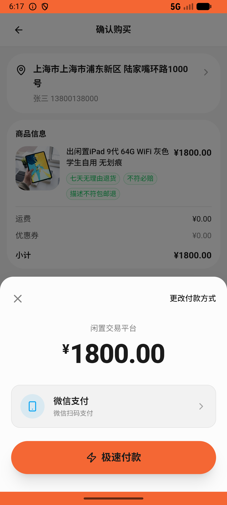
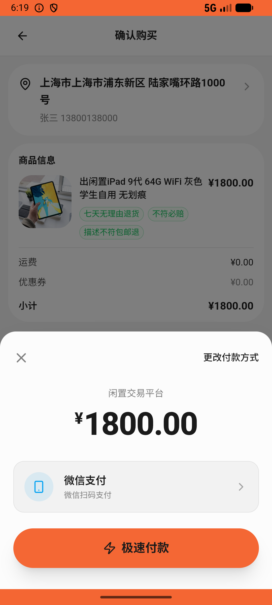

# order/v006_order_validator  ❌

- **Brand**: `xianzhiershouwang`
- **Class**: `XianzhiershouwangOrderV006OrderValidatorTask`
- **Pass@3**: **0/3**  (score = 0.00)
- **Elapsed**: 318s (~5.3 min)
- **Model**: `doubao-seed-2-0-lite-260428`
- **Raw log**: [./raw_logs/XianzhiershouwangOrderV006OrderValidatorTask.log](./raw_logs/XianzhiershouwangOrderV006OrderValidatorTask.log)
- **Generated**: 2026-05-26T18:20:44+08:00

## Task Goal

> 【当前账户档案】账号：zhangsan@example.com；昵称：张三；默认收货地址（JSON）：{"recipient": "张三", "phone": "13800138000", "address": "上海市 上海市 浦东新区 陆家嘴环路1000号"}。请基于以上档案打开 com.xianzhiershouwang 并完成以下任务：那个闲置iPad 9代64G灰色学生自用的帮我买了，微信付

## Attempts

| # | Outcome | Steps | Terminated | Reason | Start → End |
|---|---------|-------|------------|--------|-------------|
| 1 | ❌ failed | 12 | answer | – | 2026-05-26 18:15:26 → 2026-05-26 18:17:18 |
| 2 | ❌ failed | 12 | answer | – | 2026-05-26 18:17:18 → 2026-05-26 18:19:11 |
| 3 | ❌ failed | 10 | answer | – | 2026-05-26 18:19:11 → 2026-05-26 18:20:44 |

## Failure Details

### Episode 1 — ❌ failed

- steps_used: `12`
- terminated_reason: `answer`
- death shot: 
  - state: [`./death_shots/XianzhiershouwangOrderV006OrderValidatorTask/episode_001/step_012.json`](./death_shots/XianzhiershouwangOrderV006OrderValidatorTask/episode_001/step_012.json)
  - digest: [`episode_digest.md`](./death_shots/XianzhiershouwangOrderV006OrderValidatorTask/episode_001/episode_digest.md)

### Episode 2 — ❌ failed

- steps_used: `12`
- terminated_reason: `answer`
- death shot: 
  - state: [`./death_shots/XianzhiershouwangOrderV006OrderValidatorTask/episode_002/step_012.json`](./death_shots/XianzhiershouwangOrderV006OrderValidatorTask/episode_002/step_012.json)
  - digest: [`episode_digest.md`](./death_shots/XianzhiershouwangOrderV006OrderValidatorTask/episode_002/episode_digest.md)

### Episode 3 — ❌ failed

- steps_used: `10`
- terminated_reason: `answer`
- death shot: 
  - state: [`./death_shots/XianzhiershouwangOrderV006OrderValidatorTask/episode_003/step_010.json`](./death_shots/XianzhiershouwangOrderV006OrderValidatorTask/episode_003/step_010.json)
  - digest: [`episode_digest.md`](./death_shots/XianzhiershouwangOrderV006OrderValidatorTask/episode_003/episode_digest.md)

---

> 本摘要由 `sengclaw/scripts/pipeline/log_summarizer.py` 自动生成。 原始完整 log 见上方 Raw log 链接（含每 step 的 messages / tool_call / screenshot 引用）。
