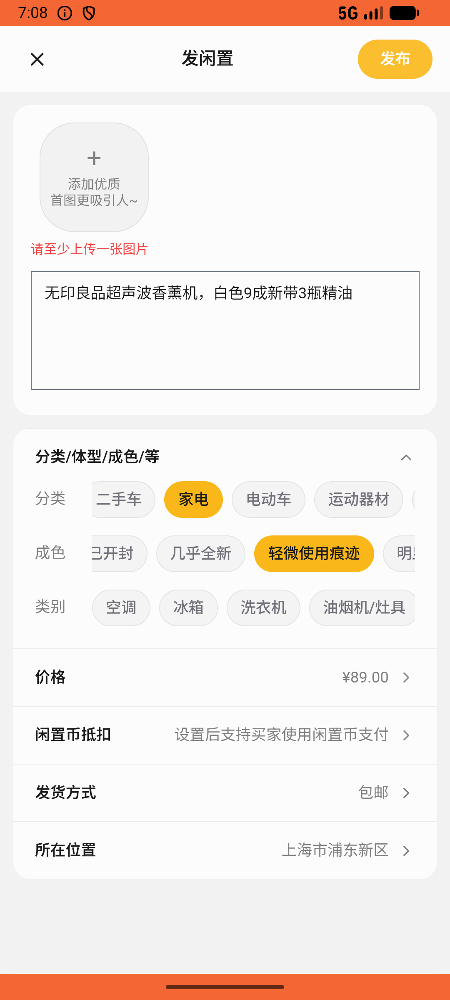

# post/v008_post_validator  ⚠️

- **Brand**: `xianzhiershouwang`
- **Class**: `XianzhiershouwangPostV008PostValidatorTask`
- **Pass@3**: **2/3**  (score = 1.00)
- **Elapsed**: 568s (~9.5 min)
- **Model**: `doubao-seed-2-0-lite-260428`
- **Raw log**: [./raw_logs/XianzhiershouwangPostV008PostValidatorTask.log](./raw_logs/XianzhiershouwangPostV008PostValidatorTask.log)
- **Generated**: 2026-05-26T19:15:28+08:00

## Task Goal

> 【当前账户档案】账号：zhangsan@example.com；昵称：张三；默认收货地址（JSON）：{"recipient": "张三", "phone": "13800138000", "address": "上海市 上海市 浦东新区 陆家嘴环路1000号"}。请基于以上档案打开 com.xianzhiershouwang 并完成以下任务：帮我发个帖子出无印良品超声波香薰机，白色9成新带3瓶精油，卖89包邮，分类家电

## Attempts

| # | Outcome | Steps | Terminated | Reason | Start → End |
|---|---------|-------|------------|--------|-------------|
| 1 | ❌ failed | 24 | answer | – | 2026-05-26 19:06:00 → 2026-05-26 19:09:04 |
| 2 | ✅ passed | 26 | answer | – | 2026-05-26 19:09:04 → 2026-05-26 19:12:07 |
| 3 | ✅ passed | 27 | answer | – | 2026-05-26 19:12:07 → 2026-05-26 19:15:28 |

## Failure Details

### Episode 1 — ❌ failed

- steps_used: `24`
- terminated_reason: `answer`
- death shot: 
  - state: [`./death_shots/XianzhiershouwangPostV008PostValidatorTask/episode_001/step_024.json`](./death_shots/XianzhiershouwangPostV008PostValidatorTask/episode_001/step_024.json)
  - digest: [`episode_digest.md`](./death_shots/XianzhiershouwangPostV008PostValidatorTask/episode_001/episode_digest.md)

---

> 本摘要由 `sengclaw/scripts/pipeline/log_summarizer.py` 自动生成。 原始完整 log 见上方 Raw log 链接（含每 step 的 messages / tool_call / screenshot 引用）。
